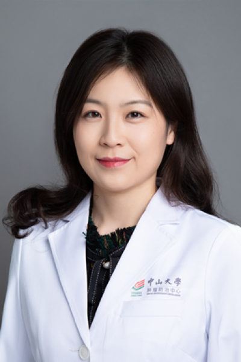

<!-- AUTO-GENERATED-BY: work/generate_obsidian_profiles.py -->

<!-- TEMPLATE: D:\workspace\信息收集整理\医生画像仓库\模板\医生画像模板.md -->

# 周婷

## 基础信息

| 字段 | 内容 |
|---|---|
| 姓名 | 周婷 |
| 医院 | 中山大学肿瘤防治中心 |
| 科室 | 内科 |
| 职称/身份 | 副主任医师，硕士生导师 |
| 来源链接 | [官网原文](https://www.sysucc.org.cn/node/1520) |
| 采集日期 | 2026-08-10 |

## 简介/擅长

晚期肺癌、鼻咽癌的化疗、靶向治疗、免疫治疗及新药临床研究 职称：副主任医师，硕士生导师 专业方向：晚期肺癌、鼻咽癌的化疗、靶向治疗、免疫治疗及新药临床研究 学术兼职： 广东省抗癌协会化疗专业委员会青委会委员 广东省临床医学会真实世界研究专业委员会青年委员 加载更多 职称：副主任医师，硕士生导师 专业方向：晚期肺癌、鼻咽癌的化疗、靶向治疗、免疫治疗及新药临床研究 学术兼职： 广东省抗癌协会化疗专业委员会青委会委员 广东省临床医学会真实世界研究专业委员会青年委员 更新日期：2022年5月16日

## 可包装亮点

- 副主任医师，硕士生导师 晚期肺癌、鼻咽癌的化疗、靶向治疗、免疫治疗及新药临床研究 职称：副主任医师，硕士生导师 专业方向：晚期肺癌、鼻咽癌的化疗、靶向治疗、免疫治疗及新药临床研究 学术兼职： 广东省抗癌协会化疗专业委员会青委会委员 广东省临床医学会真实世界研究专业委员会青年委员 职称：副主任医师，硕士生导师 专业方向：晚期肺癌、鼻咽癌的化疗、靶向治疗、免疫…

## 重点疾病/人群标签

- 慢性病：
- 肿瘤：肿瘤、癌、化疗、靶向、鼻咽癌、肺癌、免疫
- 生殖疾病：
- 免疫/风湿：肿瘤、癌、化疗、靶向、鼻咽癌、肺癌、免疫
- 术后恢复/康复：
- 疑难重症：

## 证据摘录

> 只摘录官网公开信息中的短句或关键字段，不复制大段原文。

- 官网身份字段：副主任医师，硕士生导师
- 官网简介/擅长：晚期肺癌、鼻咽癌的化疗、靶向治疗、免疫治疗及新药临床研究 职称：副主任医师，硕士生导师 专业方向：晚期肺癌、鼻咽癌的化疗、靶向治疗、免疫治疗及新药临床研究 学术兼职： 广东省抗癌协会化疗专业委员会青委会委员 广东省临床医学会真实世界研究专业委员会青年委员 加载更多 职称：副主任医师，硕士生导师 专业方向：晚期肺癌、鼻咽癌的化疗、靶向治疗、免疫治疗及新药临床研究 学术兼职： 广东省抗癌协会化疗专业委员会青委会委员 广东省临床医学会真实世…
- 官网亮眼经历线索：副主任医师，硕士生导师 晚期肺癌、鼻咽癌的化疗、靶向治疗、免疫治疗及新药临床研究 职称：副主任医师，硕士生导师 专业方向：晚期肺癌、鼻咽癌的化疗、靶向治疗、免疫治疗及新药临床研究 学术兼职： 广东省抗癌协会化疗专业委员会青委会委员 广东省临床医学会真实世界研究专业委员会青年委员 职称：副主任医师，硕士生导师 专业方向：晚期肺癌、鼻咽癌的化疗、靶向治疗、免疫治疗及新药临床研究 学术兼职： 广东省抗癌协会化疗专业委员会青委会委员 广东省临…
- 异常提示：亮眼经历含导航文本，已清洗
- 来源链接：https://www.sysucc.org.cn/node/1520

## BD 画像摘要

周婷医生可作为肿瘤、免疫/风湿/感染方向的基础画像候选。后续 BD 使用应继续以官网来源和人工复核为准，不添加疗效承诺或无来源包装。

## 合规边界

- 仅使用医院官网、官方公众号、官方小程序等公开渠道。
- 不采集私人电话、私人微信、家庭住址、患者隐私或非公开排班信息。
- 不写“保证治愈”“疗效第一”“包治疑难杂症”等无法由官网证明的表述。
