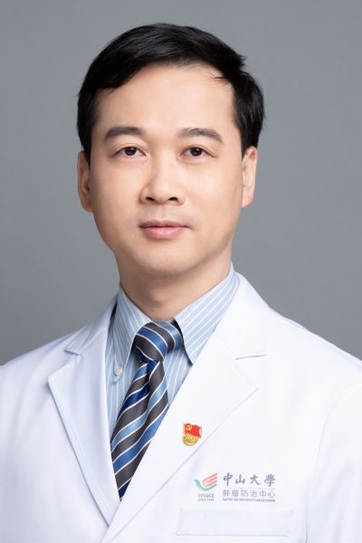

<!-- AUTO-GENERATED-BY: work/generate_obsidian_profiles.py -->

# 周建华

## 基础信息

| 字段 | 内容 |
|---|---|
| 医院 | 中山大学肿瘤防治中心 |
| 姓名 | 周建华 |
| 科室 | 超声科 |
| 职称/身份 | 超声心电科主任 职称：教授、主任医师、博士生导师 |
| 重点优先级 | 高 |
| 来源类型 | 医院官网 |
| 来源链接 | [官网原文](https://www.sysucc.org.cn/node/3894) |
| 采集日期 | 2026-08-10 |
| 复核状态 | 待人工复核 |
| 异常提示 |  |

## 简介/擅长

擅长甲状腺、乳腺、淋巴结、血管瘤等肿瘤的微创治疗；肝脏、乳腺、甲状腺等系统肿瘤的超声诊断。 2001 年中山医科大学本科毕业后一直在中山大学肿瘤防治中心超声科工作， 美国 杰弗逊大学医学院和 斯坦福大学医学院访问学者，亚洲肿瘤消融协会甲状腺良性结节消融指南专家组成员。 教育部新世纪优秀人才、广州市珠江科技新星、广东省杰出青年医学人才、中山大学肿瘤防治中心首批优秀青年人才 。从事肿瘤超声诊断与介入治疗 20 余年，完成超声引导下的各种肿瘤介入诊断与微创消融治疗近万例。 在甲状腺、乳腺、淋巴结、血管瘤等肿瘤微创介入消融治疗方面具有丰富经验。 作为两名中国专家之一参加了亚洲肿瘤消融协会甲状腺良性结节消融治疗指南的编写。 教育学习经历 1996年9月—2001年6月 中山医科大学 本科 2001年9月—2005年12月 中山大学硕士研究生 导师：吴沛宏教授 2006年9月—2009年6月 中山大学博士研究生 导师：吴沛宏教授 2009年9月—2010年8月 美国杰弗逊大学医学院 指导老师：刘吉斌教授 2014年11月—2015年12月 美国斯坦福大学 指导老师：Juergen Willmann 工作简历 2001年7月——20...

## 详情正文摘录

临床专家 面包屑 首页 / 临床科室 / 平台科室 / 超声科 / 临床专家 周建华 职务：超声心电科主任 职称：教授、主任医师、博士生导师 专长 擅长甲状腺、乳腺、淋巴结、血管瘤等肿瘤的微创治疗；肝脏、乳腺、甲状腺等系统肿瘤的超声诊断。 职称： 教授、主任医师、博士生导师 职务： 超声心电科主任 专长： 擅长甲状腺、乳腺、淋巴结、血管瘤等肿瘤的微创治疗；肝脏、乳腺、甲状腺等系统肿瘤的超声诊断。 2001 年中山医科大学本科毕业后一直在中山大学肿瘤防治中心超声科工作， 美国 杰弗逊大学医学院和 斯坦福大学医学院访问学者，亚洲肿瘤消融协会甲状腺良性结节消融指南专家组成员。 教育部新世纪优秀人才、广州市珠江科技新星、广东省杰出青年医学人才、中山大学肿瘤防治中心首批优秀青年人才 。从事肿瘤超声诊断与介入治疗 20 余年，完成超声引导下的各种肿瘤介入诊断与微创消融治疗近万例。 在甲状腺、乳腺、淋巴结、血管瘤等肿瘤微创介入消融治疗方面具有丰富经验。 作为两名中国专家之一参加了亚洲肿瘤消融协会甲状腺良性结节消融治疗指南的编写。 教育学习经历 1996年9月—2001年6月 中山医科大学 本科 2001年9月—2005年12月 中山大学硕士研究生 导师：吴沛宏教授 2006年9月—2009年6月 中山大学博士研究生 导师：吴沛宏教授 2009年9月—2010年8月 美国杰弗逊大学医学院 指导老师：刘吉斌教授 2014年11月—2015年12月 美国斯坦福大学 指导老师：Juergen Willmann 工作简历 2001年7月——2006年12月 中山大学肿瘤防治中心 医师 2007年1月——2010年12月 中山大学肿瘤防治中心 主治医师 2011年1月——2017年12月 中山大学肿瘤防治中心 副主任医师 2018年1月起 中山大学肿瘤防治中心 主任医师/教授 研究方向： 主要从事肿瘤治疗疗效超声评价的基础和临床研究，获国自然国际合作重点项目、国际重点研发计划课题、国自然面上和青年等 6 项国家级项目资助，总科研经费近 500 万 元，肝脏超声造影方面的研究成果被 2016 年…

## 重点关注范围

- 肿瘤

## 重点疾病标签

- 肿瘤
- 癌
- 瘤
- 化疗
- 靶向

## 亮眼经历线索

- 超声心电科主任 职称：教授、主任医师、博士生导师 2001 年中山医科大学本科毕业后一直在中山大学肿瘤防治中心超声科工作， 美国 杰弗逊大学医学院和 斯坦福大学医学院访问学者，亚洲肿瘤消融协会甲状腺良性结节消融指南专家组成员。
- 教育部新世纪优秀人才、广州市珠江科技新星、广东省杰出青年医学人才、中山大学肿瘤防治中心首批优秀青年人才 。
- 作为两名中国专家之一参加了亚洲肿瘤消融协会甲状腺良性结节消融治疗指南的编写。

## 异常提示

## 合规边界

- 本画像仅整理统一总底表中的医院官网公开字段。
- 不包含患者评价、排名、第三方来源内容或疗效承诺。
- 官网未展示的信息保持空白，后续如需补充须回到底表官方来源字段。
