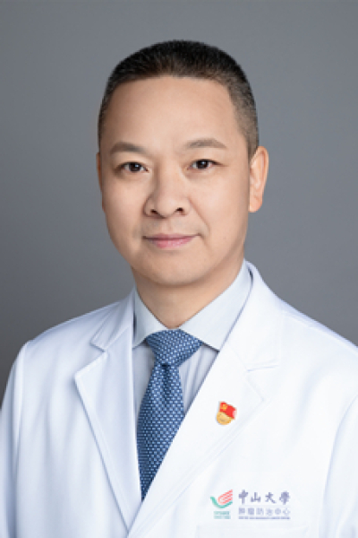

<!-- AUTO-GENERATED-BY: work/generate_obsidian_profiles.py -->

<!-- TEMPLATE: D:\workspace\信息收集整理\医生画像仓库\模板\医生画像模板.md -->

# 唐军

## 基础信息

| 字段 | 内容 |
|---|---|
| 姓名 | 唐军 |
| 医院 | 中山大学肿瘤防治中心 |
| 科室 | 乳腺科 |
| 职称/身份 | 乳腺科主任及支部书记 职称：教授、主任医师、博士生导师 |
| 来源链接 | [官网原文](https://www.sysucc.org.cn/node/3738) |
| 采集日期 | 2026-08-10 |

## 简介/擅长

乳腺癌综合治疗，整形保乳与重建。

## 教育与进修经历

- 2004年中山大学肿瘤医院胸部肿瘤外科研究生毕业并留院工作，一直从事乳腺癌临床工作。
- 2013年5月-2014年12月到美国MD Anderson Cancer Center作访问学者，在Dr Mien-Chie Hung实验室从事乳腺癌基础研究，并随整形科乳腺整形专家Kronowitz学习乳腺癌术后整形与重建。

## 科研项目与成果

- 2004年中山大学肿瘤医院胸部肿瘤外科研究生毕业并留院工作，一直从事乳腺癌临床工作。
- 2013年5月-2014年12月到美国MD Anderson Cancer Center作访问学者，在Dr Mien-Chie Hung实验室从事乳腺癌基础研究，并随整形科乳腺整形专家Kronowitz学习乳腺癌术后整形与重建。

## 可包装亮点

- 乳腺科主任及支部书记 职称：教授、主任医师、博士生导师 唐军 职务：乳腺科主任及支部书记 职称：教授、主任医师、博士生导师 专长 乳腺癌综合治疗，整形保乳与重建。
- 一、一般情况 唐军，肿瘤学博士，中山大学肿瘤防治中心乳腺科教授，主任医师，博士生导师,科室主任及支部书记。
- 广东省杰出青年医学人才，广东省医师协会“羊城好医生”。

## 重点疾病/人群标签

- 慢性病：
- 肿瘤：肿瘤、癌、放疗、乳腺癌、术后、康复、疼痛
- 生殖疾病：
- 免疫/风湿：
- 术后恢复/康复：肿瘤、癌、放疗、乳腺癌、术后、康复、疼痛
- 疑难重症：

## 证据摘录

> 只摘录官网公开信息中的短句或关键字段，不复制大段原文。

- 官网身份字段：乳腺科主任及支部书记 职称：教授、主任医师、博士生导师
- 官网简介/擅长：乳腺癌综合治疗，整形保乳与重建。
- 官网亮眼经历线索：乳腺科主任及支部书记 职称：教授、主任医师、博士生导师 唐军 职务：乳腺科主任及支部书记 职称：教授、主任医师、博士生导师 专长 乳腺癌综合治疗，整形保乳与重建。 一、一般情况 唐军，肿瘤学博士，中山大学肿瘤防治中心乳腺科教授，主任医师，博士生导师,科室主任及支部书记。 广东省杰出青年医学人才，广东省医师协会“羊城好医生”。
- 异常提示：亮眼经历含导航文本，已清洗
- 来源链接：https://www.sysucc.org.cn/node/3738

## BD 画像摘要

唐军医生可作为肿瘤、术后恢复/康复方向的基础画像候选。后续 BD 使用应继续以官网来源和人工复核为准，不添加疗效承诺或无来源包装。

## 合规边界

- 仅使用医院官网、官方公众号、官方小程序等公开渠道。
- 不采集私人电话、私人微信、家庭住址、患者隐私或非公开排班信息。
- 不写“保证治愈”“疗效第一”“包治疑难杂症”等无法由官网证明的表述。
