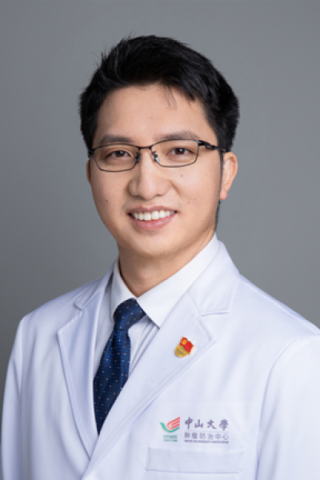

<!-- AUTO-GENERATED-BY: work/generate_obsidian_profiles.py -->

# 唐林泉

## 基础信息

| 字段 | 内容 |
|---|---|
| 医院 | 中山大学肿瘤防治中心 |
| 姓名 | 唐林泉 |
| 科室 | 鼻咽科 |
| 职称/身份 | 鼻咽科副主任 职称：教授、主任医师、博士生导师 |
| 重点优先级 | 高 |
| 来源类型 | 医院官网 |
| 来源链接 | [官网原文](https://www.sysucc.org.cn/node/1650) |
| 采集日期 | 2026-08-10 |
| 复核状态 | 待人工复核 |
| 异常提示 |  |

## 简介/擅长

早期鼻咽癌筛查早诊及治疗；局部区域晚期鼻咽癌放化综合治疗；复发转移鼻咽癌化学治疗、靶向治疗、SBRT放疗及免疫治疗；基于人工智能的鼻咽癌的辅助诊断、疗效预测及推广运用。 唐林泉，国家优青，国家科技部重点研发青年项目首席科学家，中山大学肿瘤防治中心主任医师，博士生导师。2010 年毕业于南昌大学医学院临床医学系（本科），2015年获得中山大学肿瘤学博士学位（硕博连读）。毕业后作为中山大学引进人才调入鼻咽癌科工作。先后荣获广东省杰出青年基金获得者（2018），广东省特支计划青年拔尖人才（2018）和国家优秀青年科学基金（2022）及国家科技部重点研发青年科学家项目（2022）等人才基金项目的支持。主要围绕鼻咽癌的精准诊疗（放化疗及免疫治疗）及促转移机制开展系列研究，以通讯或第一作者在Lancet oncology、J Clin oncol（2篇）、Cell Res、J Natl Cancer Inst、Eur J Cancer、Cell Death Differ、Int J Radiat oncol Biol Physr、J Immunother Cancer等国际权威杂志上发表SCI论文50余篇。主持和参加多项鼻咽癌前瞻...

## 详情正文摘录

临床专家 面包屑 首页 / 临床科室 / 放疗系列 / 鼻咽科 / 临床专家 唐林泉 职务：鼻咽科副主任 职称：教授、主任医师、博士生导师 专长 早期鼻咽癌筛查早诊及治疗；局部区域晚期鼻咽癌放化综合治疗；复发转移鼻咽癌化学治疗、靶向治疗、SBRT放疗及免疫治疗；基于人工智能的鼻咽癌的辅助诊断、疗效预测及推广运用。 唐林泉，国家优青，国家科技部重点研发青年项目首席科学家，中山大学肿瘤防治中心主任医师，博士生导师。2010 年毕业于南昌大学医学院临床医学系（本科），2015年获得中山大学肿瘤学博士学位（硕博连读）。毕业后作为中山大学引进人才调入鼻咽癌科工作。先后荣获广东省杰出青年基金获得者（2018），广东省特支计划青年拔尖人才（2018）和国家优秀青年科学基金（2022）及国家科技部重点研发青年科学家项目（2022）等人才基金项目的支持。主要围绕鼻咽癌的精准诊疗（放化疗及免疫治疗）及促转移机制开展系列研究，以通讯或第一作者在Lancet oncology、J Clin oncol（2篇）、Cell Res、J Natl Cancer Inst、Eur J Cancer、Cell Death Differ、Int J Radiat oncol Biol Physr、J Immunother Cancer等国际权威杂志上发表SCI论文50余篇。主持和参加多项鼻咽癌前瞻性临床试验，5项研究成果被国际指南采纳，推动了鼻咽癌治疗国际指南的修订。 社会任职： 中国肿瘤放射治疗联盟放射免疫青年委员会常委，中国抗癌协会肿瘤微环境专业委员会秘书，中国抗癌协会肿瘤标志委员会青年委员，广东省临床医学学会鼻咽癌精准治疗专业委员会常委，广东省抗癌协会鼻咽癌专业青年委员会常委、中国医药教育协会头颈肿瘤专业委员会委员、广东省抗癌协会肿瘤标志委员会大会秘书，担任CCR, Oncogene, Cell Death Differ等知名杂志审稿人。 专家门诊时间： 周一下午、周三下午 专业特长： 早期鼻咽癌筛查早诊及治疗；局部区域晚期鼻咽癌放化综合治疗；复发转移鼻咽癌化学治疗、靶向治疗、SBRT放疗及免疫治…

## 重点关注范围

- 肿瘤
- 免疫/风湿/感染

## 重点疾病标签

- 肿瘤
- 癌
- 放疗
- 化疗
- 靶向
- 鼻咽癌
- 免疫

## 亮眼经历线索

- 鼻咽科副主任 职称：教授、主任医师、博士生导师 唐林泉，国家优青，国家科技部重点研发青年项目首席科学家，中山大学肿瘤防治中心主任医师，博士生导师。
- 毕业后作为中山大学引进人才调入鼻咽癌科工作。
- 先后荣获广东省杰出青年基金获得者（2018），广东省特支计划青年拔尖人才（2018）和国家优秀青年科学基金（2022）及国家科技部重点研发青年科学家项目（2022）等人才基金项目的支持。

## 异常提示

## 合规边界

- 本画像仅整理统一总底表中的医院官网公开字段。
- 不包含患者评价、排名、第三方来源内容或疗效承诺。
- 官网未展示的信息保持空白，后续如需补充须回到底表官方来源字段。
