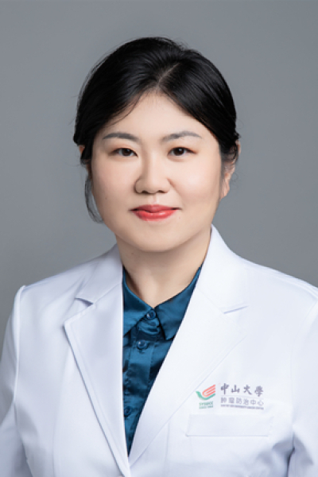

<!-- AUTO-GENERATED-BY: work/generate_obsidian_profiles.py -->

# 夏奕

## 基础信息

| 字段 | 内容 |
|---|---|
| 医院 | 中山大学肿瘤防治中心 |
| 姓名 | 夏奕 |
| 科室 | 内科 |
| 职称/身份 | 主任医师、博士生导师 |
| 重点优先级 | 高 |
| 来源类型 | 医院官网 |
| 来源链接 | [官网原文](https://www.sysucc.org.cn/node/1492) |
| 采集日期 | 2026-08-10 |
| 复核状态 | 待人工复核 |
| 异常提示 |  |

## 简介/擅长

淋巴瘤、头颈肿瘤的化学治疗及靶向治疗

## 详情正文摘录

2009年获得中山大学肿瘤学博士学位，常年从事淋巴瘤及头颈肿瘤的内科治疗，具有丰富的临床经验。以第一/共同第一作者发表高水平收录论文十余篇，主持国家自然科学青年基金、广东省科学技术研究基金各一项 。 加载更多 姓名：夏奕 职称：主任医师、博士生导师

## 重点关注范围

- 肿瘤

## 重点疾病标签

- 肿瘤
- 淋巴瘤
- 靶向

## 亮眼经历线索

- 主任医师、博士生导师 以第一/共同第一作者发表高水平收录论文十余篇，主持国家自然科学青年基金、广东省科学技术研究基金各一项 。
- 加载更多 姓名：夏奕 职称：主任医师、博士生导师

## 异常提示

## 合规边界

- 本画像仅整理统一总底表中的医院官网公开字段。
- 不包含患者评价、排名、第三方来源内容或疗效承诺。
- 官网未展示的信息保持空白，后续如需补充须回到底表官方来源字段。
