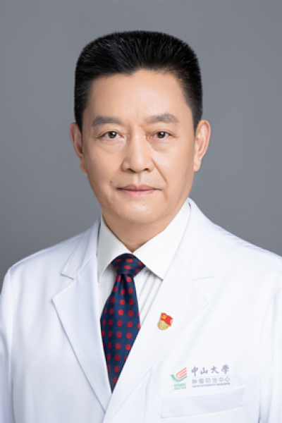

<!-- AUTO-GENERATED-BY: work/generate_obsidian_profiles.py -->

# 夏建川

## 基础信息

| 字段 | 内容 |
|---|---|
| 医院 | 中山大学肿瘤防治中心 |
| 姓名 | 夏建川 |
| 科室 | 生物治疗中心 |
| 职称/身份 | 科主任导师 职称：教授、医学博士、博士生导师 |
| 重点优先级 | 高 |
| 来源类型 | 医院官网 |
| 来源链接 | [官网原文](https://www.sysucc.org.cn/node/3781) |
| 采集日期 | 2026-08-10 |
| 复核状态 | 待人工复核 |
| 异常提示 |  |

## 简介/擅长

特别擅长肿瘤的免疫细胞治疗。 夏建川，教授、医学博士、博士生导师，哈佛大学Dana-Farber肿瘤研究所博士后，享受国务院政府特殊津贴，现任中山大学附属肿瘤医院生物治疗中心主任，体细胞治疗与保健研究中心主任，亚太医学生物免疫学会主任委员，中国细胞治疗质量控制和研究专业委员会主任委员，中国生物治疗临床应用专业委员会副主任委员，中国医药生物技术协会常务理事，中国细胞学会常务理事，广东省细胞生物学学会理事长，广东省抗癌协会生物治疗专业委员会主任委员，国家食品和药品监督管理局新药评审专家，国家华南肿瘤学重点实验室免疫与遗传研究课题组组长。美国《Cancer Letter》杂志编委,《癌症》杂志常务编委，国家自然基金和广东省自然基金重点项目评审专家。 夏建川教授 1998年毕业于哈尔滨医科大学，获医学博士学位；1998-2000年在中山大学附属肿瘤医院从事肿瘤学博士后研究工作；2000-2003年在哈佛大学Dana-Farber肿瘤研究所从事肿瘤的免疫治疗和肿瘤疫苗的研究。在此期间，首次证实DC/肿瘤融合细胞疫苗能诱导自发性乳腺癌转基因小鼠产生抗肿瘤免疫应答，为DC/肿瘤融合细胞疫苗在临床治疗肿瘤中的应用奠定了基础，研究成果发...

## 详情正文摘录

临床专家 面包屑 首页 / 临床科室 / 内科系列 / 生物治疗中心 / 临床专家 夏建川 职务：科主任导师 职称：教授、医学博士、博士生导师 专长 特别擅长肿瘤的免疫细胞治疗。 夏建川，教授、医学博士、博士生导师，哈佛大学Dana-Farber肿瘤研究所博士后，享受国务院政府特殊津贴，现任中山大学附属肿瘤医院生物治疗中心主任，体细胞治疗与保健研究中心主任，亚太医学生物免疫学会主任委员，中国细胞治疗质量控制和研究专业委员会主任委员，中国生物治疗临床应用专业委员会副主任委员，中国医药生物技术协会常务理事，中国细胞学会常务理事，广东省细胞生物学学会理事长，广东省抗癌协会生物治疗专业委员会主任委员，国家食品和药品监督管理局新药评审专家，国家华南肿瘤学重点实验室免疫与遗传研究课题组组长。美国《Cancer Letter》杂志编委,《癌症》杂志常务编委，国家自然基金和广东省自然基金重点项目评审专家。 夏建川教授 1998年毕业于哈尔滨医科大学，获医学博士学位；1998-2000年在中山大学附属肿瘤医院从事肿瘤学博士后研究工作；2000-2003年在哈佛大学Dana-Farber肿瘤研究所从事肿瘤的免疫治疗和肿瘤疫苗的研究。在此期间，首次证实DC/肿瘤融合细胞疫苗能诱导自发性乳腺癌转基因小鼠产生抗肿瘤免疫应答，为DC/肿瘤融合细胞疫苗在临床治疗肿瘤中的应用奠定了基础，研究成果发表在美国免疫学专业杂志（The Journal of Immunology 2003 and 2004）。2003年12月回国，利用在国外学到的先进分子生物学和肿瘤免疫学技术，积极开展肿瘤病因学和免疫治疗的基础与临床应用研究。在鼻咽癌、肺癌、乳腺癌、胃癌、肠癌、肝癌和肾癌等恶性肿瘤的发病机制，以及肿瘤微环境、肿瘤干细胞、免疫细胞相互作用和免疫细胞治疗的临床应用等方面做出了突破性工作。在国内率先建立了肿瘤体细胞制备技术操作规范、肿瘤体细胞临床应用安全检测标准和体细胞免疫治疗临床应用规范，为我国制定了第一个“自体免疫细胞（T细胞、NK细胞）治疗技术管理规范”,使体细胞免疫治疗向规范道路上迈出了重要的一步，为我国…

## 重点关注范围

- 肿瘤
- 免疫/风湿/感染

## 重点疾病标签

- 肿瘤
- 癌
- 放疗
- 化疗
- 靶向
- 鼻咽癌
- 肺癌
- 肝癌
- 胃癌
- 肠癌
- 乳腺癌
- 免疫
- 免疫功能

## 亮眼经历线索

- 科主任导师 职称：教授、医学博士、博士生导师 夏建川，教授、医学博士、博士生导师，哈佛大学Dana-Farber肿瘤研究所博士后，享受国务院政府特殊津贴，现任中山大学附属肿瘤医院生物治疗中心主任，体细胞治疗与保健研究中心主任，亚太医学生物免疫学会主任委员，中国细胞治疗质量控制和研究专业委员会主任委员，中国生物治疗临床应用专业委员会副主任委员，中国医药生物技…
- 美国《Cancer Letter》杂志编委,《癌症》杂志常务编委，国家自然基金和广东省自然基金重点项目评审专家。
- 在此期间，首次证实DC/肿瘤融合细胞疫苗能诱导自发性乳腺癌转基因小鼠产生抗肿瘤免疫应答，为DC/肿瘤融合细胞疫苗在临床治疗肿瘤中的应用奠定了基础，研究成果发表在美国...

## 异常提示

## 合规边界

- 本画像仅整理统一总底表中的医院官网公开字段。
- 不包含患者评价、排名、第三方来源内容或疗效承诺。
- 官网未展示的信息保持空白，后续如需补充须回到底表官方来源字段。
