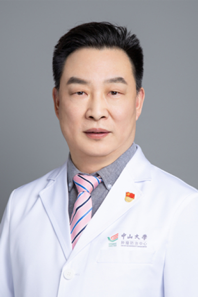

<!-- AUTO-GENERATED-BY: work/generate_obsidian_profiles.py -->

<!-- TEMPLATE: D:\workspace\信息收集整理\医生画像仓库\模板\医生画像模板.md -->

# 夏忠军

## 基础信息

| 字段 | 内容 |
|---|---|
| 姓名 | 夏忠军 |
| 医院 | 中山大学肿瘤防治中心 |
| 科室 | 血液肿瘤科 |
| 职称/身份 | 血液病区区长 职称：主诊教授、副主任医师 |
| 来源链接 | [官网原文](https://www.sysucc.org.cn/node/3795) |
| 采集日期 | 2026-08-10 |

## 简介/擅长

专注多发性骨髓瘤、恶性淋巴瘤等血液系统肿瘤疾病的诊断和化学治疗、靶向治疗、免疫治疗及开展多项多中心的抗癌药物临床研究

## 教育与进修经历

- 毕业后在中山大学附属第三医院从事血液肿瘤疾病的诊治和研究工作。

## 科研项目与成果

- 夏忠军教授同时也积极参与中国多发性骨髓瘤联盟的研讨，每年在广东省定期举办全国范围内的多发性骨髓瘤高峰论坛和国家级继续教育项目，至今已举办4届，积极推广和规范多发性骨髓瘤的规范化诊疗，参与全球、国内等多项多中心新药的血液肿瘤的各期临床研究。

## 可包装亮点

- 血液病区区长 职称：主诊教授、副主任医师 夏忠军 职务：血液病区区长 职称：主诊教授、副主任医师 专长 专注多发性骨髓瘤、恶性淋巴瘤等血液系统肿瘤疾病的诊断和化学治疗、靶向治疗、免疫治疗及开展多项多中心的抗癌药物临床研究 一、基本情况 职称：主诊教授、副主任医师 门诊时间：周一上午特需（二楼）门诊、周二上午，周四上午 专业特长：专注多发性骨髓瘤、恶性淋巴瘤…
- 曾赴欧洲、美国等著名的肿瘤中心学习和访问交流。
- 多次参加欧洲血液学年会和美国血液学年会。

## 重点疾病/人群标签

- 慢性病：
- 肿瘤：肿瘤、癌、瘤、淋巴瘤、化疗、靶向、免疫、康复、姑息
- 生殖疾病：
- 免疫/风湿：肿瘤、癌、瘤、淋巴瘤、化疗、靶向、免疫、康复、姑息
- 术后恢复/康复：肿瘤、癌、瘤、淋巴瘤、化疗、靶向、免疫、康复、姑息
- 疑难重症：

## 证据摘录

> 只摘录官网公开信息中的短句或关键字段，不复制大段原文。

- 官网身份字段：血液病区区长 职称：主诊教授、副主任医师
- 官网简介/擅长：专注多发性骨髓瘤、恶性淋巴瘤等血液系统肿瘤疾病的诊断和化学治疗、靶向治疗、免疫治疗及开展多项多中心的抗癌药物临床研究
- 官网亮眼经历线索：血液病区区长 职称：主诊教授、副主任医师 夏忠军 职务：血液病区区长 职称：主诊教授、副主任医师 专长 专注多发性骨髓瘤、恶性淋巴瘤等血液系统肿瘤疾病的诊断和化学治疗、靶向治疗、免疫治疗及开展多项多中心的抗癌药物临床研究 一、基本情况 职称：主诊教授、副主任医师 门诊时间：周一上午特需（二楼）门诊、周二上午，周四上午 专业特长：专注多发性骨髓瘤、恶性淋巴瘤等血液系统肿瘤疾病的诊断和化学治疗、靶向治疗、免疫治疗及开展多项多中心的抗癌药物…
- 异常提示：亮眼经历含导航文本，已清洗
- 来源链接：https://www.sysucc.org.cn/node/3795

## BD 画像摘要

夏忠军医生可作为肿瘤、免疫/风湿/感染、术后恢复/康复方向的基础画像候选。后续 BD 使用应继续以官网来源和人工复核为准，不添加疗效承诺或无来源包装。

## 合规边界

- 仅使用医院官网、官方公众号、官方小程序等公开渠道。
- 不采集私人电话、私人微信、家庭住址、患者隐私或非公开排班信息。
- 不写“保证治愈”“疗效第一”“包治疑难杂症”等无法由官网证明的表述。
