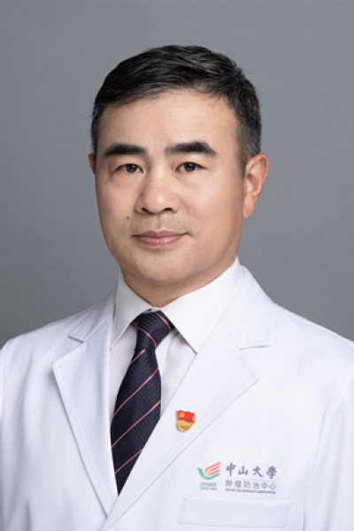

<!-- AUTO-GENERATED-BY: work/generate_obsidian_profiles.py -->

# 夏良平

## 基础信息

| 字段 | 内容 |
|---|---|
| 医院 | 中山大学肿瘤防治中心 |
| 姓名 | 夏良平 |
| 科室 | 综合科 |
| 职称/身份 | 综合科主任 职称：肿瘤学博士，主任医师，博士生导师 |
| 重点优先级 | 高 |
| 来源类型 | 医院官网 |
| 来源链接 | [官网原文](https://www.sysucc.org.cn/node/3763) |
| 采集日期 | 2026-08-10 |
| 复核状态 | 待人工复核 |
| 异常提示 |  |

## 简介/擅长

主要从事肿瘤综合治疗；肠癌、肺癌、乳腺癌等常见肿瘤的内科治疗（尤其是靶向治疗）；VIP病人保健和管理。 夏良平，男，1969年8月9日出生，安徽省怀宁县人。肿瘤学博士，主任医师，博士生导师，中山大学肿瘤防治中心综合科科室主任。主要从事肿瘤综合治疗；肠癌、肺癌、乳腺癌等常见肿瘤的内科治疗（尤其是靶向治疗）；VIP病人保健和管理。至今发表科研论文146篇，其中第一作者/通讯作者95篇（包括56篇高水平论文），包括J Clin Invest；Nat Commun；Clin Cancer Res；J Immunother Cancer；Mol Ther；JNCCN；Int J Cancer；Aging；J Transl Med；Sci Rep等杂志。主持14项科研基金，包括3项国家自然科学基金。 另外，承担全院“静脉输液港植入术”，至今有近1000例植入术经验，并成功举办四期“静脉输液港植入术和护理技术培训班”的广东省继续教育项目和一届“海峡两岸输液港技术论坛”。 学习工作经历： 1989～1994 安徽医科大学医学系 1994～1996 安徽医科大学第一附属医院外科 1996～1999 中山大学附属第一医院（硕士生） 199...

## 详情正文摘录

临床专家 面包屑 首页 / 临床科室 / 内科系列 / 综合科 / 临床专家 夏良平 职务：综合科主任 职称：肿瘤学博士，主任医师，博士生导师 专长 主要从事肿瘤综合治疗；肠癌、肺癌、乳腺癌等常见肿瘤的内科治疗（尤其是靶向治疗）；VIP病人保健和管理。 夏良平，男，1969年8月9日出生，安徽省怀宁县人。肿瘤学博士，主任医师，博士生导师，中山大学肿瘤防治中心综合科科室主任。主要从事肿瘤综合治疗；肠癌、肺癌、乳腺癌等常见肿瘤的内科治疗（尤其是靶向治疗）；VIP病人保健和管理。至今发表科研论文146篇，其中第一作者/通讯作者95篇（包括56篇高水平论文），包括J Clin Invest；Nat Commun；Clin Cancer Res；J Immunother Cancer；Mol Ther；JNCCN；Int J Cancer；Aging；J Transl Med；Sci Rep等杂志。主持14项科研基金，包括3项国家自然科学基金。 另外，承担全院“静脉输液港植入术”，至今有近1000例植入术经验，并成功举办四期“静脉输液港植入术和护理技术培训班”的广东省继续教育项目和一届“海峡两岸输液港技术论坛”。 学习工作经历： 1989～1994 安徽医科大学医学系 1994～1996 安徽医科大学第一附属医院外科 1996～1999 中山大学附属第一医院（硕士生） 1999～2002 中山大学附属肿瘤医院（博士生） 2002～ 中山大学附属肿瘤医院综合科 社会任职 1.广东省健康管理学会肿瘤防治专业委员会，主任委员 2.广东省健康管理学会干细胞与再生医学专委会，副主任委员 3.广东省抗癌协会靶向与个体化治疗专业委员会，常委 4.广东省抗癌协会化疗专业委员会，委员 加载更多 夏良平，男，1969年8月9日出生，安徽省怀宁县人。肿瘤学博士，主任医师，博士生导师，中山大学肿瘤防治中心综合科科室主任。主要从事肿瘤综合治疗；肠癌、肺癌、乳腺癌等常见肿瘤的内科治疗（尤其是靶向治疗）；VIP病人保健和管理。至今发表科研论文146篇，其中第一作者/通讯作者95篇（包括56篇高水平论文），包…

## 重点关注范围

- 慢性病
- 肿瘤
- 术后恢复/康复

## 重点疾病标签

- 糖尿病
- 肿瘤
- 癌
- 化疗
- 靶向
- 鼻咽癌
- 肺癌
- 肠癌
- 乳腺癌
- 创面

## 亮眼经历线索

- 综合科主任 职称：肿瘤学博士，主任医师，博士生导师 肿瘤学博士，主任医师，博士生导师，中山大学肿瘤防治中心综合科科室主任。
- 至今发表科研论文146篇，其中第一作者/通讯作者95篇（包括56篇高水平论文），包括J Clin Invest；
- 主持14项科研基金，包括3项国家自然科学基金。

## 异常提示

## 合规边界

- 本画像仅整理统一总底表中的医院官网公开字段。
- 不包含患者评价、排名、第三方来源内容或疗效承诺。
- 官网未展示的信息保持空白，后续如需补充须回到底表官方来源字段。
