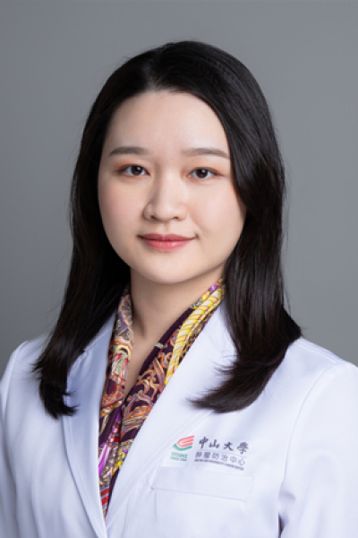

<!-- AUTO-GENERATED-BY: work/generate_obsidian_profiles.py -->

<!-- TEMPLATE: D:\workspace\信息收集整理\医生画像仓库\模板\医生画像模板.md -->

# 夏雯

## 基础信息

| 字段 | 内容 |
|---|---|
| 姓名 | 夏雯 |
| 医院 | 中山大学肿瘤防治中心 |
| 科室 | 内科 |
| 职称/身份 | 主任医师、医学博士、硕士生导师 |
| 来源链接 | [官网原文](https://www.sysucc.org.cn/node/1506) |
| 采集日期 | 2026-08-10 |

## 简介/擅长

乳腺癌个体化治疗及全程管理（化疗、内分泌、靶向治疗），乳腺肿瘤遗传咨询，乳腺疾病筛查

## 教育与进修经历

- 临床专家 面包屑 首页 / 临床科室 / 内科系列 / 内科 / 临床专家 夏雯 职称：主任医师、医学博士、硕士生导师 专长 乳腺癌个体化治疗及全程管理（化疗、内分泌、靶向治疗），乳腺肿瘤遗传咨询，乳腺疾病筛查 职称： 主任医师、医学博士、硕士生导师 专长： 乳腺癌个体化治疗及全程管理（化疗、内分泌、靶向治疗），乳腺肿瘤遗传咨询，乳腺疾病筛查 出诊时间： 星期一下午、星期三下午 学习与工作经历 博士毕业于北京协和医学院（清华大学医学部）。
- 加载更多 职称： 主任医师、医学博士、硕士生导师 专长： 乳腺癌个体化治疗及全程管理（化疗、内分泌、靶向治疗），乳腺肿瘤遗传咨询，乳腺疾病筛查 出诊时间： 星期一下午、星期三下午 学习与工作经历 博士毕业于北京协和医学院（清华大学医学部）。

## 科研项目与成果

- 主持中山大学5010项目，作为SUB-I参与多项国际及国内多中心临床研究。

## 可包装亮点

- 主任医师、医学博士、硕士生导师 夏雯 职称：主任医师、医学博士、硕士生导师 专长 乳腺癌个体化治疗及全程管理（化疗、内分泌、靶向治疗），乳腺肿瘤遗传咨询，乳腺疾病筛查 职称： 主任医师、医学博士、硕士生导师 专长： 乳腺癌个体化治疗及全程管理（化疗、内分泌、靶向治疗），乳腺肿瘤遗传咨询，乳腺疾病筛查 出诊时间： 星期一下午、星期三下午 学习与工作经历 博士…
- 于美国Case Western Reserve University附属University Hospital，Cleveland及法国Pitie-Salpetrere，Paris交流学习。
- 中国研究型医院乳腺癌专业委员会青委会委员，广东省胸部疾病协会乳腺病防治专委会常委，广东省胸部肿瘤防治研究会乳腺癌专委会委员，广州市抗癌协会乳腺癌专委会委员。

## 重点疾病/人群标签

- 慢性病：
- 肿瘤：肿瘤、癌、化疗、靶向、乳腺癌
- 生殖疾病：
- 免疫/风湿：
- 术后恢复/康复：
- 疑难重症：

## 证据摘录

> 只摘录官网公开信息中的短句或关键字段，不复制大段原文。

- 官网身份字段：主任医师、医学博士、硕士生导师
- 官网简介/擅长：乳腺癌个体化治疗及全程管理（化疗、内分泌、靶向治疗），乳腺肿瘤遗传咨询，乳腺疾病筛查
- 官网亮眼经历线索：主任医师、医学博士、硕士生导师 夏雯 职称：主任医师、医学博士、硕士生导师 专长 乳腺癌个体化治疗及全程管理（化疗、内分泌、靶向治疗），乳腺肿瘤遗传咨询，乳腺疾病筛查 职称： 主任医师、医学博士、硕士生导师 专长： 乳腺癌个体化治疗及全程管理（化疗、内分泌、靶向治疗），乳腺肿瘤遗传咨询，乳腺疾病筛查 出诊时间： 星期一下午、星期三下午 学习与工作经历 博士毕业于北京协和医学院（清华大学医学部）。 于美国Case Western Res…
- 异常提示：亮眼经历含导航文本，已清洗
- 来源链接：https://www.sysucc.org.cn/node/1506

## BD 画像摘要

夏雯医生可作为肿瘤方向的基础画像候选。后续 BD 使用应继续以官网来源和人工复核为准，不添加疗效承诺或无来源包装。

## 合规边界

- 仅使用医院官网、官方公众号、官方小程序等公开渠道。
- 不采集私人电话、私人微信、家庭住址、患者隐私或非公开排班信息。
- 不写“保证治愈”“疗效第一”“包治疑难杂症”等无法由官网证明的表述。
