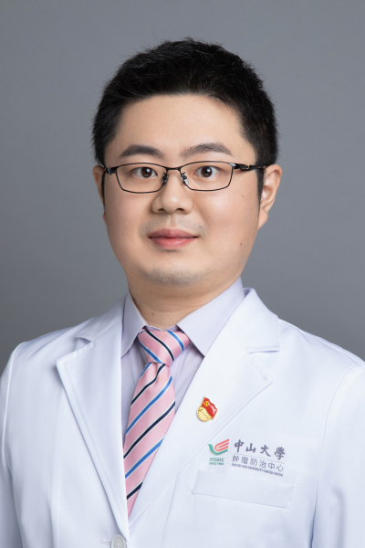

<!-- AUTO-GENERATED-BY: work/generate_obsidian_profiles.py -->

# 姜武

## 基础信息

| 字段 | 内容 |
|---|---|
| 医院 | 中山大学肿瘤防治中心 |
| 姓名 | 姜武 |
| 科室 | 结直肠科 |
| 职称/身份 | 主任医师 |
| 重点优先级 | 高 |
| 来源类型 | 医院官网 |
| 来源链接 | [官网原文](https://www.sysucc.org.cn/node/3688) |
| 采集日期 | 2026-08-10 |
| 复核状态 | 待人工复核 |
| 异常提示 |  |

## 简介/擅长

结直肠癌综合治疗（直肠癌保肛、年轻肠癌保功能、转移性肠癌转化治疗） 医学博士，硕士生导师。主要研究方向包括遗传性及年轻肠癌诊治与功能保全，肿瘤相关人工智能与多组学研究。主持包括国家自然科学基金面上项目，广东省基础与应用基础研究基金等科研项目多项。以第一/通讯作者在Lancet oncology；EBioMedicine; J Immunother Cancer; J Natl Cancer Inst等高影响力杂志发表论文20余篇。 担任中国抗癌协会遗传性肿瘤专委会委员兼秘书长、中国医师协会结直肠肿瘤专委会医工融合与智能医学学组成员、广东省抗癌协会遗传性肿瘤专委会副主任委员、广东省抗癌协会大肠癌专业委员会委员等。 更新时间：2026.2.25

## 详情正文摘录

职称：主任医师 专长 结直肠癌综合治疗（直肠癌保肛、年轻肠癌保功能、转移性肠癌转化治疗）。 职称： 主任医师 擅长： 结直肠癌综合治疗（直肠癌保肛、年轻肠癌保功能、转移性肠癌转化治疗） 医学博士，硕士生导师。主要研究方向包括遗传性及年轻肠癌诊治与功能保全，肿瘤相关人工智能与多组学研究。主持包括国家自然科学基金面上项目，广东省基础与应用基础研究基金等科研项目多项。以第一/通讯作者在Lancet oncology；EBioMedicine; J Immunother Cancer; J Natl Cancer Inst等高影响力杂志发表论文20余篇。 担任中国抗癌协会遗传性肿瘤专委会委员兼秘书长、中国医师协会结直肠肿瘤专委会医工融合与智能医学学组成员、广东省抗癌协会遗传性肿瘤专委会副主任委员、广东省抗癌协会大肠癌专业委员会委员等。 更新时间：2026.2.25

## 重点关注范围

- 肿瘤
- 疑难重症

## 重点疾病标签

- 肿瘤
- 癌
- 肠癌
- 转化治疗

## 亮眼经历线索

- 主任医师 结直肠癌综合治疗（直肠癌保肛、年轻肠癌保功能、转移性肠癌转化治疗） 医学博士，硕士生导师。
- 主持包括国家自然科学基金面上项目，广东省基础与应用基础研究基金等科研项目多项。
- J Natl Cancer Inst等高影响力杂志发表论文20余篇。

## 异常提示

## 合规边界

- 本画像仅整理统一总底表中的医院官网公开字段。
- 不包含患者评价、排名、第三方来源内容或疗效承诺。
- 官网未展示的信息保持空白，后续如需补充须回到底表官方来源字段。
