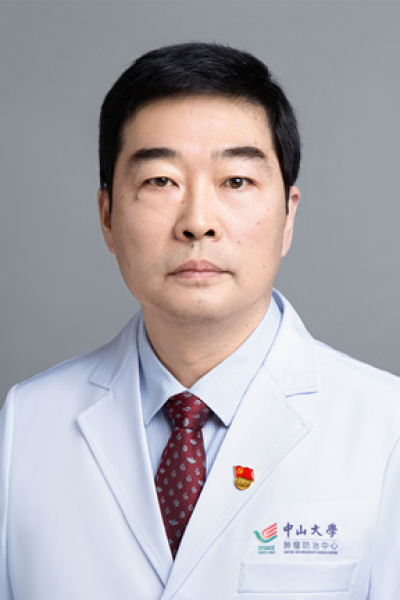

<!-- AUTO-GENERATED-BY: work/generate_obsidian_profiles.py -->

# 娄宁

## 基础信息

| 字段 | 内容 |
|---|---|
| 医院 | 中山大学肿瘤防治中心 |
| 姓名 | 娄宁 |
| 科室 | 重症医学科 |
| 职称/身份 | ICU副主任 职称：主任医师、硕士导师 |
| 重点优先级 | 高 |
| 来源类型 | 医院官网 |
| 来源链接 | [官网原文](https://www.sysucc.org.cn/node/3809) |
| 采集日期 | 2026-08-10 |
| 复核状态 | 待人工复核 |
| 异常提示 |  |

## 简介/擅长

心血管病、肾脏病；肿瘤患者的支持治疗。 主要学历： 1987年9月—1993年7月：第一军医大学，临床医学专业（6年制），医学学士学位 1993年9月—1996年7月：第一军医大学，医学硕士学位(心血管分子生物学) 1998年9月—2001年7月：中南大学湘雅医院，临床医学博士学位（内科学心血管） 工作经历： 1996年07月—1997年07月：第一军医大学药理教研室，助教 2001年07月—2001年09月：广州医学院第二附属医院心内科， 主治医师 2001年09月—2004年04月：中山大学附属第一医院肾内科，博士后，主治医师 2004年7月至今：中山大学附属肿瘤医院ICU主治医师、副主任医师 加载更多 主要研究方向 ：重症医学——心血管病、肾脏病；肿瘤患者的支持治疗。 主要学历 ： 1987年9月—1993年7月：第一军医大学，临床医学专业（6年制），医学学士学位 1993年9月—1996年7月：第一军医大学，医学硕士学位(心血管分子生物学) 1998年9月—2001年7月：中南大学湘雅医院，临床医学博士学位（内科学心血管） 工作经历： 1996年07月—1997年07月：第一军医大学药理教研室，助教 2001年...

## 详情正文摘录

职务：ICU副主任 职称：主任医师、硕士导师 专长：心血管病、肾脏病；肿瘤患者的支持治疗。 主要学历： 1987年9月—1993年7月：第一军医大学，临床医学专业（6年制），医学学士学位 1993年9月—1996年7月：第一军医大学，医学硕士学位(心血管分子生物学) 1998年9月—2001年7月：中南大学湘雅医院，临床医学博士学位（内科学心血管） 工作经历： 1996年07月—1997年07月：第一军医大学药理教研室，助教 2001年07月—2001年09月：广州医学院第二附属医院心内科， 主治医师 2001年09月—2004年04月：中山大学附属第一医院肾内科，博士后，主治医师 2004年7月至今：中山大学附属肿瘤医院ICU主治医师、副主任医师 加载更多 主要研究方向 ：重症医学——心血管病、肾脏病；肿瘤患者的支持治疗。 主要学历 ： 1987年9月—1993年7月：第一军医大学，临床医学专业（6年制），医学学士学位 1993年9月—1996年7月：第一军医大学，医学硕士学位(心血管分子生物学) 1998年9月—2001年7月：中南大学湘雅医院，临床医学博士学位（内科学心血管） 工作经历： 1996年07月—1997年07月：第一军医大学药理教研室，助教 2001年07月—2001年09月：广州医学院第二附属医院心内科， 主治医师 2001年09月—2004年04月：中山大学附属第一医院肾内科，博士后，主治医师 2004年7月至今：中山大学附属肿瘤医院ICU主治医师、副主任医师 承担的科研课题： 1．【云芝多糖诱导巨噬细胞GPx基因表达及其调控机制的研究】 国家自然科学基金青年基金 2．【Smad7在糖尿病肾病肾脏纤维化中的防治】 国家自然科学基金 3．【新药西米特酸的开发研究】 国家新药基金 4．【基于Response-to-Retention假说探索云芝多糖B防治动脉粥样硬化的机制】 广东省自然科学基金 5．【云芝多糖B防治放射性肺纤维化的应用研究】 广东省科技计划项目 发…

## 重点关注范围

- 慢性病
- 肿瘤
- 免疫/风湿/感染
- 疑难重症

## 重点疾病标签

- 糖尿病
- 动脉粥样硬化
- 肿瘤
- 癌
- 免疫
- 重症

## 亮眼经历线索

- ICU副主任 职称：主任医师、硕士导师 主要学历： 1987年9月—1993年7月：第一军医大学，临床医学专业（6年制），医学学士学位 1993年9月—1996年7月：第一军医大学，医学硕士学位(心血管分子生物学) 1998年9月—2001年7月：中南大学湘雅医院，临床医学博士学位（内科学心血管） 工作经历： 1996年07月—1997年07月：第一军医大…
- 主要学历 ： 1987年9月—1993年7月：第一军医大学，临床医学专业（6年制），医学学士学位 1993年9月—1996年7月：第一军医大学，医学硕士学位(心血管分子生...

## 异常提示

## 合规边界

- 本画像仅整理统一总底表中的医院官网公开字段。
- 不包含患者评价、排名、第三方来源内容或疗效承诺。
- 官网未展示的信息保持空白，后续如需补充须回到底表官方来源字段。
