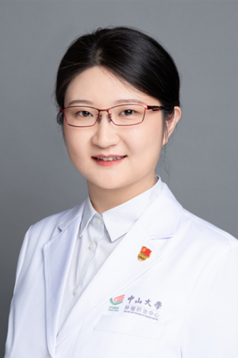

<!-- AUTO-GENERATED-BY: work/generate_obsidian_profiles.py -->

# 孔亚楠

## 基础信息

| 字段 | 内容 |
|---|---|
| 医院 | 中山大学肿瘤防治中心 |
| 姓名 | 孔亚楠 |
| 科室 | 乳腺科 |
| 职称/身份 | 主任医师 |
| 重点优先级 | 高 |
| 来源类型 | 医院官网 |
| 来源链接 | [官网原文](https://www.sysucc.org.cn/node/3745) |
| 采集日期 | 2026-08-10 |
| 复核状态 | 待人工复核 |
| 异常提示 |  |

## 简介/擅长

1.乳腺癌早期筛查与诊断，早诊率达95%以上。 2.制定个体化手术方案，寻求最佳生存。精通多种乳腺癌外科手术：乳腺癌改良根治术、保乳术、腋窝淋巴结清扫术，前哨淋巴结活检术，皮瓣修复、即刻或延期乳房重建等。 3.早期乳腺癌腔镜下保留乳头乳晕皮下腺体切除联合I期假体重建，乳房无痕化精准切除病灶。 4.局部晚期不可手术乳腺癌的个体化治疗，为患者创造外科手术机会。 5.术后全身系统治疗及全程管理（化疗、内分泌、免疫、靶向等）、不良反应处理及定期复查。 荣获2020年“羊城青年好医生”。2021年作为中山大学脱贫攻坚医疗队队长帮扶云南省凤庆县人民医院，挂职普外科主任。广东广播电台“名医面对面”节目特邀嘉宾。 二、教育及工作经历 2025.12 – 至今，中山大学肿瘤防治中心，乳腺科，主任医师 2020.12 – 2025，中山大学肿瘤防治中心，乳腺科，副主任医师 2020.05 – 2020.11，中山大学脱贫攻坚对口云南凤庆县人民医院，第二批医疗队队长，普外科，挂职主任 2015.12 – 2020，中山大学肿瘤防治中心，乳腺科，主治医师 2014.8 – 2015，中山大学肿瘤防治中心，乳腺科，医师 2009.8 – 201...

## 详情正文摘录

临床专家 面包屑 首页 / 临床科室 / 外科系列 / 乳腺科 / 临床专家 孔亚楠 职称：主任医师 专长 乳腺癌早期诊断、外科手术、美容重建及全程管理。 一、基本情况 主任医师、肿瘤学博士、硕士生导师 门诊时间： 越秀院区：周五全天 黄埔院区：周一周二上午 专业特长： 从事乳腺癌临床一线工作超过十五年，在乳腺癌早期诊断、外科手术、美容重建及全程管理中积累了丰富的临床经验。 具体擅长： 1.乳腺癌早期筛查与诊断，早诊率达95%以上。 2.制定个体化手术方案，寻求最佳生存。精通多种乳腺癌外科手术：乳腺癌改良根治术、保乳术、腋窝淋巴结清扫术，前哨淋巴结活检术，皮瓣修复、即刻或延期乳房重建等。 3.早期乳腺癌腔镜下保留乳头乳晕皮下腺体切除联合I期假体重建，乳房无痕化精准切除病灶。 4.局部晚期不可手术乳腺癌的个体化治疗，为患者创造外科手术机会。 5.术后全身系统治疗及全程管理（化疗、内分泌、免疫、靶向等）、不良反应处理及定期复查。 荣获2020年“羊城青年好医生”。2021年作为中山大学脱贫攻坚医疗队队长帮扶云南省凤庆县人民医院，挂职普外科主任。广东广播电台“名医面对面”节目特邀嘉宾。 二、教育及工作经历 2025.12 – 至今，中山大学肿瘤防治中心，乳腺科，主任医师 2020.12 – 2025，中山大学肿瘤防治中心，乳腺科，副主任医师 2020.05 – 2020.11，中山大学脱贫攻坚对口云南凤庆县人民医院，第二批医疗队队长，普外科，挂职主任 2015.12 – 2020，中山大学肿瘤防治中心，乳腺科，主治医师 2014.8 – 2015，中山大学肿瘤防治中心，乳腺科，医师 2009.8 – 2014，中山大学肿瘤防治中心，乳腺科，临床型博士 三、学术兼职 1.广东省精准医学应用学会乳腺肿瘤分会常务委员 2. 广东省抗癌协会整合肿瘤心脏病专委会常务委员 3. 广东省临床医学学会乳腺癌专委会委员 4. 广东省医疗行业协会乳腺病整形修复管理分会委员 5. 中国医促会肿瘤整形外科分会委员 四、主持科研项目 1. 国家自然科学基金-青年基金C类（2025-2027） 2.…

## 重点关注范围

- 肿瘤
- 免疫/风湿/感染
- 术后恢复/康复

## 重点疾病标签

- 肿瘤
- 癌
- 化疗
- 靶向
- 乳腺癌
- 免疫
- 术后

## 亮眼经历线索

- 主任医师 3.早期乳腺癌腔镜下保留乳头乳晕皮下腺体切除联合I期假体重建，乳房无痕化精准切除病灶。
- 荣获2020年“羊城青年好医生”。
- 2021年作为中山大学脱贫攻坚医疗队队长帮扶云南省凤庆县人民医院，挂职普外科主任。

## 异常提示

## 合规边界

- 本画像仅整理统一总底表中的医院官网公开字段。
- 不包含患者评价、排名、第三方来源内容或疗效承诺。
- 官网未展示的信息保持空白，后续如需补充须回到底表官方来源字段。
