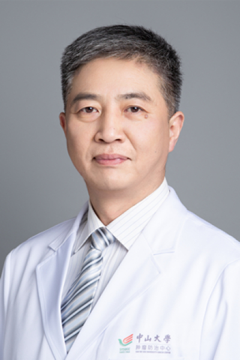

<!-- AUTO-GENERATED-BY: work/generate_obsidian_profiles.py -->

<!-- TEMPLATE: D:\workspace\信息收集整理\医生画像仓库\模板\医生画像模板.md -->

# 孙晓卫

## 基础信息

| 字段 | 内容 |
|---|---|
| 姓名 | 孙晓卫 |
| 医院 | 中山大学肿瘤防治中心 |
| 科室 | 胃外科 |
| 职称/身份 | 主任医师、硕士生导师 |
| 来源链接 | [官网原文](https://www.sysucc.org.cn/node/3657) |
| 采集日期 | 2026-08-10 |

## 简介/擅长

腹部肿瘤外科治疗的临床及研究工作。特别擅长胃肠、胰腺癌肿包括胃肠间质瘤的手术及相关辅助治疗。

## 可包装亮点

- 主任医师、硕士生导师 孙晓卫 职称：主任医师、硕士生导师 专长 腹部肿瘤外科治疗的临床及研究工作。
- 一、基本情况 职称：主任医师、硕士生导师 职务：科秘书 专家门诊时间：周四上午 专业特长：腹部肿瘤外科治疗的临床及研究工作。
- 二、学习及工作经历： 1985年—1991年：中山医科大学就读本科 1991年—1999年：连云港市第二人民医院工作 1999年—2002年：中山大学就读硕士生 2002年至今：中山大学附属肿瘤医院工作 一、基本情况 职称：主任医师、硕士生导师 职务：科秘书 专家门诊时间：周四上午 专业特长：腹部肿瘤外科治疗的临床及研究工作。

## 重点疾病/人群标签

- 慢性病：
- 肿瘤：肿瘤、癌、瘤、胃癌
- 生殖疾病：
- 免疫/风湿：
- 术后恢复/康复：
- 疑难重症：

## 证据摘录

> 只摘录官网公开信息中的短句或关键字段，不复制大段原文。

- 官网身份字段：主任医师、硕士生导师
- 官网简介/擅长：腹部肿瘤外科治疗的临床及研究工作。特别擅长胃肠、胰腺癌肿包括胃肠间质瘤的手术及相关辅助治疗。
- 官网亮眼经历线索：主任医师、硕士生导师 孙晓卫 职称：主任医师、硕士生导师 专长 腹部肿瘤外科治疗的临床及研究工作。 一、基本情况 职称：主任医师、硕士生导师 职务：科秘书 专家门诊时间：周四上午 专业特长：腹部肿瘤外科治疗的临床及研究工作。 二、学习及工作经历： 1985年—1991年：中山医科大学就读本科 1991年—1999年：连云港市第二人民医院工作 1999年—2002年：中山大学就读硕士生 2002年至今：中山大学附属肿瘤医院工作 一、基本…
- 异常提示：亮眼经历含导航文本，已清洗
- 来源链接：https://www.sysucc.org.cn/node/3657

## BD 画像摘要

孙晓卫医生可作为肿瘤方向的基础画像候选。后续 BD 使用应继续以官网来源和人工复核为准，不添加疗效承诺或无来源包装。

## 合规边界

- 仅使用医院官网、官方公众号、官方小程序等公开渠道。
- 不采集私人电话、私人微信、家庭住址、患者隐私或非公开排班信息。
- 不写“保证治愈”“疗效第一”“包治疑难杂症”等无法由官网证明的表述。
