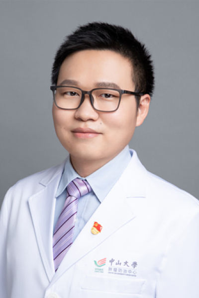

<!-- AUTO-GENERATED-BY: work/generate_obsidian_profiles.py -->

# 孙鹏

## 基础信息

| 字段 | 内容 |
|---|---|
| 医院 | 中山大学肿瘤防治中心 |
| 姓名 | 孙鹏 |
| 科室 | 内科 |
| 职称/身份 | 副主任医师，硕士研究生导师 |
| 重点优先级 | 高 |
| 来源类型 | 医院官网 |
| 来源链接 | [官网原文](https://www.sysucc.org.cn/node/1513) |
| 采集日期 | 2026-08-10 |
| 复核状态 | 待人工复核 |
| 异常提示 |  |

## 简介/擅长

肿瘤内科的综合治疗，擅长恶性淋巴瘤、鼻咽癌等头颈肿瘤的内科综合诊治，专注于肿瘤内科的相关临床研究和转化研究 肿瘤学博士，肿瘤内科副主任医师，硕士研究生导师。 2011年毕业于浙江大学临床医学七年制，同年进入中山大学肿瘤防治中心工作至今，2018年获得肿瘤学博士学位。专业领域为肿瘤内科的综合治疗，擅长恶性淋巴瘤、鼻咽癌等头颈肿瘤的内科综合诊治，专注于肿瘤内科的相关临床研究和转化研究。医疗工作中，擅长根据患者疾病特点开展针对性的个性化治疗，对于淋巴瘤大剂量化疗的全程管理、复发难治性淋巴瘤的新药临床研究及NK/T细胞淋巴瘤的免疫联合治疗有一定造诣。 主持国家自然科学基金、广东省自然科学基金等多项课题，并参与多项国家级和省部级课题。参与多项国际多中心及国内多中心临床研究，以第一作者（共同第一作者）和通讯作者（共同通讯作者）身份发表SCI收录论文20余篇。相关研究成果入选2011年度CSCO大会口头报告、中国肿瘤学大会、cancer全球会议、ASCO会议等。 参与中国抗癌协会淋巴瘤专业委员会指定专著《淋巴瘤诊疗学》的编写。获得全国淋巴瘤MDT大赛冠军、全国中青年淋巴瘤病例大赛亚军、中山大学本科生优秀带教老师、中山大学肿瘤防治中心...

## 详情正文摘录

职称：副主任医师，硕士研究生导师 专长 肿瘤内科的综合治疗，擅长恶性淋巴瘤、鼻咽癌等头颈肿瘤的内科综合诊治，专注于肿瘤内科的相关临床研究和转化研究 肿瘤学博士，肿瘤内科副主任医师，硕士研究生导师。 2011年毕业于浙江大学临床医学七年制，同年进入中山大学肿瘤防治中心工作至今，2018年获得肿瘤学博士学位。专业领域为肿瘤内科的综合治疗，擅长恶性淋巴瘤、鼻咽癌等头颈肿瘤的内科综合诊治，专注于肿瘤内科的相关临床研究和转化研究。医疗工作中，擅长根据患者疾病特点开展针对性的个性化治疗，对于淋巴瘤大剂量化疗的全程管理、复发难治性淋巴瘤的新药临床研究及NK/T细胞淋巴瘤的免疫联合治疗有一定造诣。 主持国家自然科学基金、广东省自然科学基金等多项课题，并参与多项国家级和省部级课题。参与多项国际多中心及国内多中心临床研究，以第一作者（共同第一作者）和通讯作者（共同通讯作者）身份发表SCI收录论文20余篇。相关研究成果入选2011年度CSCO大会口头报告、中国肿瘤学大会、cancer全球会议、ASCO会议等。 参与中国抗癌协会淋巴瘤专业委员会指定专著《淋巴瘤诊疗学》的编写。获得全国淋巴瘤MDT大赛冠军、全国中青年淋巴瘤病例大赛亚军、中山大学本科生优秀带教老师、中山大学肿瘤防治中心住院医师规范化培训优秀带教教师、中山大学“叶任高-李幼姬夫妇”临床医学优秀中青年教师奖教金，并于2018年度入选中国临床肿瘤学会35岁以下最具潜力青年肿瘤医师名录。 主要学术任职包括：中国抗癌协会中西医整合肿瘤专业委员会青年委员、中国抗癌协会肿瘤微生态专业委员会青年委员、广东省抗癌协会淋巴瘤专业委员会委员、广东省临床医学学会头颈肿瘤综合治疗专业委员会秘书、广东省医院协会肿瘤分子靶向治疗专业委员会委员、广东省肿瘤生育力保护专业委员会委员、《Journal of Clinical Oncology》中文版专家委员会青年委员、广东省基层医药卫生协会肿瘤靶向治疗专业委员会常务委员。 加载更多 肿瘤学博士，肿瘤内科副主任医师，硕士研究生导师…

## 重点关注范围

- 肿瘤
- 免疫/风湿/感染
- 疑难重症

## 重点疾病标签

- 肿瘤
- 癌
- 淋巴瘤
- 化疗
- 靶向
- 鼻咽癌
- 免疫
- 难治
- MDT

## 亮眼经历线索

- 副主任医师，硕士研究生导师 肿瘤内科的综合治疗，擅长恶性淋巴瘤、鼻咽癌等头颈肿瘤的内科综合诊治，专注于肿瘤内科的相关临床研究和转化研究 肿瘤学博士，肿瘤内科副主任医师，硕士研究生导师。
- 主持国家自然科学基金、广东省自然科学基金等多项课题，并参与多项国家级和省部级课题。
- 参与多项国际多中心及国内多中心临床研究，以第一作者（共同第一作者）和通讯作者（共同通讯作者）身份发表SCI收录论文20余篇。

## 异常提示

## 合规边界

- 本画像仅整理统一总底表中的医院官网公开字段。
- 不包含患者评价、排名、第三方来源内容或疗效承诺。
- 官网未展示的信息保持空白，后续如需补充须回到底表官方来源字段。
