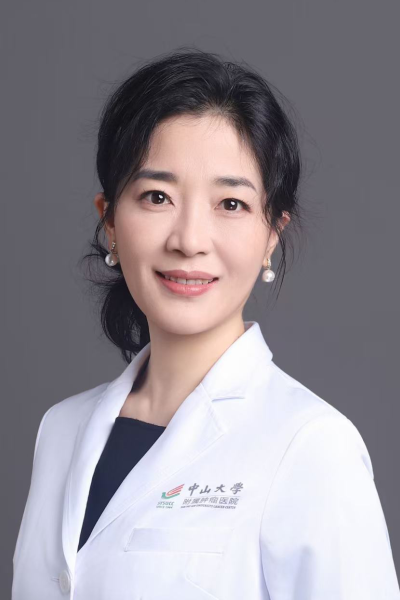

<!-- AUTO-GENERATED-BY: work/generate_obsidian_profiles.py -->

# 安欣

## 基础信息

| 字段 | 内容 |
|---|---|
| 医院 | 中山大学肿瘤防治中心 |
| 姓名 | 安欣 |
| 科室 | 内科 |
| 职称/身份 | 主任医师、医学博士、硕士生导师 |
| 重点优先级 | 高 |
| 来源类型 | 医院官网 |
| 来源链接 | [官网原文](https://www.sysucc.org.cn/node/1503) |
| 采集日期 | 2026-08-10 |
| 复核状态 | 待人工复核 |
| 异常提示 |  |

## 简介/擅长

乳腺癌和泌尿生殖系统肿瘤的内科治疗，包括化疗、靶向和内分泌治疗等。 2007年中山大学附属第一医院硕士研究生毕业后至我中心工作至今。期间获得肿瘤学博士研究生学位。2009/06－2010/6至美国纽约斯隆-凯特琳癌症中心学习。2106/1-2017/1获得国家公派留学基金资助至美国俄亥俄州立大学医学中心学习。临床专业知识扎实，经验丰富。主持或参与国家自然科学基金和省部级课题多项，以第一作者发表高水平论文20余篇。 主要学术兼职情况 中华医学乳腺肿瘤青年学会 委员 广东省医学会肿瘤内科学分会青年委员会 秘书 广东省医师协会乳腺专科医师分会 委员 广东省抗癌协会泌尿生殖系肿瘤专业委员会 委员 广东省抗癌协会遗传性肿瘤专业委员会 委员 加载更多 安欣，中山大学肿瘤医院内科主任医师、医学博士、硕士生导师。 主要研究方向： 乳腺癌和泌尿生殖系统肿瘤的内科治疗，包括化疗、靶向和内分泌治疗等。 2007年中山大学附属第一医院硕士研究生毕业后至我中心工作至今。期间获得肿瘤学博士研究生学位。2009/06－2010/6至美国纽约斯隆-凯特琳癌症中心学习。2106/1-2017/1获得国家公派留学基金资助至美国俄亥俄州立大学医学中心学习。...

## 详情正文摘录

临床专家 面包屑 首页 / 临床科室 / 内科系列 / 内科 / 临床专家 安欣 职称：主任医师、医学博士、硕士生导师 专长 乳腺癌和泌尿生殖系统肿瘤的内科治疗，包括化疗、靶向和内分泌治疗等 安欣，中山大学肿瘤医院内科主任医师、医学博士、硕士生导师。 主要研究方向： 乳腺癌和泌尿生殖系统肿瘤的内科治疗，包括化疗、靶向和内分泌治疗等。 2007年中山大学附属第一医院硕士研究生毕业后至我中心工作至今。期间获得肿瘤学博士研究生学位。2009/06－2010/6至美国纽约斯隆-凯特琳癌症中心学习。2106/1-2017/1获得国家公派留学基金资助至美国俄亥俄州立大学医学中心学习。临床专业知识扎实，经验丰富。主持或参与国家自然科学基金和省部级课题多项，以第一作者发表高水平论文20余篇。 主要学术兼职情况 中华医学乳腺肿瘤青年学会 委员 广东省医学会肿瘤内科学分会青年委员会 秘书 广东省医师协会乳腺专科医师分会 委员 广东省抗癌协会泌尿生殖系肿瘤专业委员会 委员 广东省抗癌协会遗传性肿瘤专业委员会 委员 加载更多 安欣，中山大学肿瘤医院内科主任医师、医学博士、硕士生导师。 主要研究方向： 乳腺癌和泌尿生殖系统肿瘤的内科治疗，包括化疗、靶向和内分泌治疗等。 2007年中山大学附属第一医院硕士研究生毕业后至我中心工作至今。期间获得肿瘤学博士研究生学位。2009/06－2010/6至美国纽约斯隆-凯特琳癌症中心学习。2106/1-2017/1获得国家公派留学基金资助至美国俄亥俄州立大学医学中心学习。临床专业知识扎实，经验丰富。主持或参与国家自然科学基金和省部级课题多项，以第一作者发表高水平论文20余篇。 主要学术兼职情况 中华医学乳腺肿瘤青年学会 委员 广东省医学会肿瘤内科学分会青年委员会 秘书 广东省医师协会乳腺专科医师分会 委员 广东省抗癌协会泌尿生殖系肿瘤专业委员会 委员 广东省抗癌协会遗传性肿瘤专业委员会 委员 更新日期：2023年6月30日

## 重点关注范围

- 肿瘤
- 生殖疾病

## 重点疾病标签

- 肿瘤
- 癌
- 化疗
- 靶向
- 乳腺癌
- 生殖

## 亮眼经历线索

- 主任医师、医学博士、硕士生导师 2009/06－2010/6至美国纽约斯隆-凯特琳癌症中心学习。
- 2106/1-2017/1获得国家公派留学基金资助至美国俄亥俄州立大学医学中心学习。
- 主持或参与国家自然科学基金和省部级课题多项，以第一作者发表高水平论文20余篇。

## 异常提示

## 合规边界

- 本画像仅整理统一总底表中的医院官网公开字段。
- 不包含患者评价、排名、第三方来源内容或疗效承诺。
- 官网未展示的信息保持空白，后续如需补充须回到底表官方来源字段。
