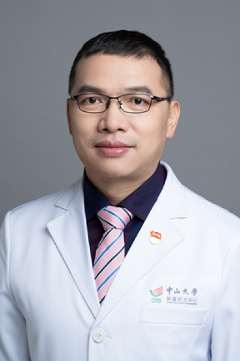

<!-- AUTO-GENERATED-BY: work/generate_obsidian_profiles.py -->

# 宋明

## 基础信息

| 字段 | 内容 |
|---|---|
| 医院 | 中山大学肿瘤防治中心 |
| 姓名 | 宋明 |
| 科室 | 头颈科 |
| 职称/身份 | 头颈科主任 职称：主任医师、博士生导师 |
| 重点优先级 | 高 |
| 来源类型 | 医院官网 |
| 来源链接 | [官网原文](https://www.sysucc.org.cn/node/3596) |
| 采集日期 | 2026-08-10 |
| 复核状态 | 待人工复核 |
| 异常提示 |  |

## 简介/擅长

头颈部肿瘤（口腔癌、口咽癌、喉癌、下咽癌、鼻腔鼻窦癌，涎腺肿瘤、颈部肿块等）和甲状腺肿瘤的诊治；经口机器人手术；肿瘤术后缺损的修复重建。 二、学习及工作经历： 学历与教育 2006.09~2009.07 博士，肿瘤学，中山大学肿瘤防治中心 2002.09~2005.07 硕士，肿瘤学，中山大学肿瘤防治中心 1991.09~1996.07 学士，医学，中山医科大学临床医学系 工作经历 2016.06~至今 博士生导师，中山大学肿瘤防治中心头颈科 2015.02~至今 科副主任，中山大学肿瘤防治中心头颈科 2013.01~至今 主任医师，中山大学肿瘤防治中心头颈科 2007.01~2012.12 副主任医师，硕士生导师，中山大学肿瘤防治中心头颈科 2002.01~2006.12 主治医师，中山大学肿瘤防治中心头颈科 1996.07~2001.12 住院医师，中山大学肿瘤防治中心头颈科 国内外学习经历 2011.11~2012.11 美国德州大学MD Anderson癌症中心头颈外科，访问学者 2005.02~2005.08 上海第九人民医院口腔颌面外科，访问学者 2017.03.28 香港 第三代达芬奇机器人Si系统学习培...

## 详情正文摘录

临床专家 面包屑 首页 / 临床科室 / 外科系列 / 头颈科 / 临床专家 宋明 职务：头颈科主任 职称：主任医师、博士生导师 专长 头颈部肿瘤（口腔癌、口咽癌、喉癌、下咽癌、鼻腔鼻窦癌，涎腺肿瘤、颈部肿块等）和甲状腺肿瘤的诊治；经口机器人手术；肿瘤术后缺损的修复重建 一、基本情况 职称： 主任医师、博士研究生导师 职位： 头颈科副主任 专家门诊时间： 周二上午、周三下午 专长： 头颈部肿瘤（口腔癌、口咽癌、喉癌、下咽癌、鼻腔鼻窦癌，涎腺肿瘤、颈部肿块等）和甲状腺肿瘤的诊治；经口机器人手术；肿瘤术后缺损的修复重建。 二、学习及工作经历： 学历与教育 2006.09~2009.07 博士，肿瘤学，中山大学肿瘤防治中心 2002.09~2005.07 硕士，肿瘤学，中山大学肿瘤防治中心 1991.09~1996.07 学士，医学，中山医科大学临床医学系 工作经历 2016.06~至今 博士生导师，中山大学肿瘤防治中心头颈科 2015.02~至今 科副主任，中山大学肿瘤防治中心头颈科 2013.01~至今 主任医师，中山大学肿瘤防治中心头颈科 2007.01~2012.12 副主任医师，硕士生导师，中山大学肿瘤防治中心头颈科 2002.01~2006.12 主治医师，中山大学肿瘤防治中心头颈科 1996.07~2001.12 住院医师，中山大学肿瘤防治中心头颈科 国内外学习经历 2011.11~2012.11 美国德州大学MD Anderson癌症中心头颈外科，访问学者 2005.02~2005.08 上海第九人民医院口腔颌面外科，访问学者 2017.03.28 香港 第三代达芬奇机器人Si系统学习培训 加载更多 主要工作与研究方向 擅长头颈部各种肿瘤诊治，特别是在口腔颌面部恶性肿瘤治疗优化方案和头颈部大型缺损组织瓣修复的合理应用等方面。近年，率先在省内外应用机器人手术辅助系统治疗口咽部肿瘤和甲状腺肿瘤，取得良好效果。长期以来深入开展对口腔癌发生发展的分子机制研究，承担了多项国家级和省级课题，并依托中山大学肿瘤防治中心研究所和华南肿瘤学国家重点实验室的平台，取得多项重要成…

## 重点关注范围

- 肿瘤
- 术后恢复/康复

## 重点疾病标签

- 肿瘤
- 癌
- 靶向
- 术后

## 亮眼经历线索

- 头颈科主任 职称：主任医师、博士生导师 二、学习及工作经历： 学历与教育 2006.09~2009.07 博士，肿瘤学，中山大学肿瘤防治中心 2002.09~2005.07 硕士，肿瘤学，中山大学肿瘤防治中心 1991.09~1996.07 学士，医学，中山医科大学临床医学系 工作经历 2016.06~至今 博士生导师，中山大学肿瘤防治中心头颈科 2015…

## 异常提示

## 合规边界

- 本画像仅整理统一总底表中的医院官网公开字段。
- 不包含患者评价、排名、第三方来源内容或疗效承诺。
- 官网未展示的信息保持空白，后续如需补充须回到底表官方来源字段。
