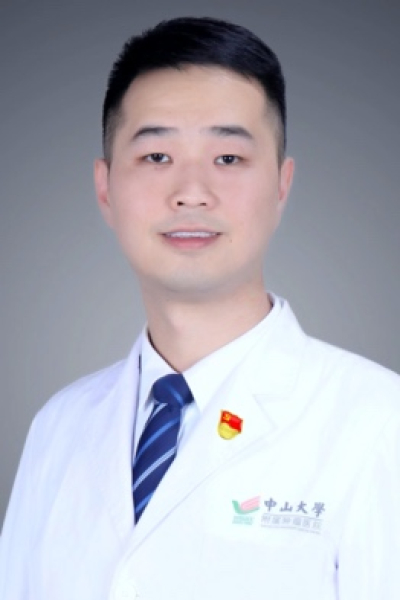

<!-- AUTO-GENERATED-BY: work/generate_obsidian_profiles.py -->

<!-- TEMPLATE: D:\workspace\信息收集整理\医生画像仓库\模板\医生画像模板.md -->

# 宋远斌

## 基础信息

| 字段 | 内容 |
|---|---|
| 姓名 | 宋远斌 |
| 医院 | 中山大学肿瘤防治中心 |
| 科室 | 血液肿瘤科 |
| 职称/身份 | 副主任医师、青年研究员、医学博士、博士生导师、博士后合作导师、华南恶性肿瘤防治全国重点实验室PI |
| 来源链接 | [官网原文](https://www.sysucc.org.cn/node/6470) |
| 采集日期 | 2026-08-10 |

## 简介/擅长

擅长骨髓增生异常综合征、急性白血病、多发性骨髓瘤、淋巴瘤等血液系统肿瘤的诊疗，包括化疗、靶向及造血干细胞移植治疗，主持多项国家及省部级基金项目。

## 教育与进修经历

- 职称：副主任医师、青年研究员、医学博士、博士生导师、博士后合作导师、华南恶性肿瘤防治全国重点实验室PI 专长 擅长骨髓增生异常综合征、急性白血病、多发性骨髓瘤、淋巴瘤等血液系统肿瘤的诊疗，包括化疗、靶向及造血干细胞移植治疗，主持多项国家及省部级基金项目。
- 一、基本情况 南方医科大学临床医学八年制博士毕业，2013-2020年于美国耶鲁大学医学院肿瘤中心血液肿瘤任博士后、助理研究员、兼职助理教授。
- 二、教育及工作经历 2021-2至今，中山大学肿瘤防治中心，血液肿瘤科，青年研究员，副主任医师 2013-7至2020-10，美国耶鲁大学医学院肿瘤中心，血液肿瘤科，博士后、兼职助理教授 2012-8至2013-7，南方医科大学，珠江医院，医师 2009-9–2012-6，南方医科大学，临床医学，博士 2004-9–2009-6，南方医科大学，临床医学，学士 三、学术兼职 广东省医学会血液病学分会青年委员、广东省精准医学应用学会单细胞科技分会委员、中国生物医学工程学会干细胞分会委员、美国血液协会会员、Chines…

## 科研项目与成果

- 职称：副主任医师、青年研究员、医学博士、博士生导师、博士后合作导师、华南恶性肿瘤防治全国重点实验室PI 专长 擅长骨髓增生异常综合征、急性白血病、多发性骨髓瘤、淋巴瘤等血液系统肿瘤的诊疗，包括化疗、靶向及造血干细胞移植治疗，主持多项国家及省部级基金项目。
- 研究工作主要聚焦于骨髓增生异常综合征、急性髓系白血病人源化小鼠模型的建立及靶向治疗的临床前研究，以第一作者（含共同）在Science、Leukemia、Nature Communications、Immunity等发表多篇论文，主持国家自然科学基金青年基金1项、面上基金1项，海外优秀青年基金1项。
- 四、主持科研项目 2019年国家自然科学基金青年基金 “异柠檬酸脱氢酶突变体特异性抑制剂靶向消除骨髓增生异常综合征干细胞的有效性研究”（81800122）， 排名第一 ，为 项目负责人 。
- 2021年国家自然科学基金面上项目 “多腺苷二磷酸多聚酶抑制剂靶向消除异柠檬酸脱氢酶突变型骨髓增生异常综合征及急性髓系白血病干细胞的有效性研究”（82170137）， 排名第一 ，为 项目负责人 。

## 论文与学术产出

- 研究工作主要聚焦于骨髓增生异常综合征、急性髓系白血病人源化小鼠模型的建立及靶向治疗的临床前研究，以第一作者（含共同）在Science、Leukemia、Nature Communications、Immunity等发表多篇论文，主持国家自然科学基金青年基金1项、面上基金1项，海外优秀青年基金1项。
- 五、代表性论著 1. Yuanbin Song , Liang Shan, Rana Gbyli, Wei Liu, Till Strowig, Amisha Patel, Xiaoying Fu, Xiaman Wang, Mina Xu, Yimeng Gao, Ashley Qin, Emanuela M Bruscia, Toma Tebaldi, Giulia Biancon, Padmavathi Mamillapalli, David Urbonas, Elizabeth Eynon, David…

## 可包装亮点

- 副主任医师、青年研究员、医学博士、博士生导师、博士后合作导师、华南恶性肿瘤防治全国重点实验室PI 宋远斌 职称：副主任医师、青年研究员、医学博士、博士生导师、博士后合作导师、华南恶性肿瘤防治全国重点实验室PI 专长 擅长骨髓增生异常综合征、急性白血病、多发性骨髓瘤、淋巴瘤等血液系统肿瘤的诊疗，包括化疗、靶向及造血干细胞移植治疗，主持多项国家及省部级基金项目。
- 一、基本情况 南方医科大学临床医学八年制博士毕业，2013-2020年于美国耶鲁大学医学院肿瘤中心血液肿瘤任博士后、助理研究员、兼职助理教授。
- 研究工作主要聚焦于骨髓增生异常综合征、急性髓系白血病人源化小鼠模型的建立及靶向治疗的临床前研究，以第一作者（含共同）在Science、Leukemia、Nature Communications、Immunity等发表多篇论文，主持国家自然科学基...

## 重点疾病/人群标签

- 慢性病：
- 肿瘤：肿瘤、瘤、淋巴瘤、白血病、化疗、靶向、免疫
- 生殖疾病：
- 免疫/风湿：肿瘤、瘤、淋巴瘤、白血病、化疗、靶向、免疫
- 术后恢复/康复：
- 疑难重症：

## 证据摘录

> 只摘录官网公开信息中的短句或关键字段，不复制大段原文。

- 官网身份字段：副主任医师、青年研究员、医学博士、博士生导师、博士后合作导师、华南恶性肿瘤防治全国重点实验室PI
- 官网简介/擅长：擅长骨髓增生异常综合征、急性白血病、多发性骨髓瘤、淋巴瘤等血液系统肿瘤的诊疗，包括化疗、靶向及造血干细胞移植治疗，主持多项国家及省部级基金项目。
- 官网亮眼经历线索：副主任医师、青年研究员、医学博士、博士生导师、博士后合作导师、华南恶性肿瘤防治全国重点实验室PI 宋远斌 职称：副主任医师、青年研究员、医学博士、博士生导师、博士后合作导师、华南恶性肿瘤防治全国重点实验室PI 专长 擅长骨髓增生异常综合征、急性白血病、多发性骨髓瘤、淋巴瘤等血液系统肿瘤的诊疗，包括化疗、靶向及造血干细胞移植治疗，主持多项国家及省部级基金项目。 一、基本情况 南方医科大学临床医学八年制博士毕业，2013-2020年于美国…
- 异常提示：亮眼经历含导航文本，已清洗
- 来源链接：https://www.sysucc.org.cn/node/6470

## BD 画像摘要

宋远斌医生可作为肿瘤、免疫/风湿/感染方向的基础画像候选。后续 BD 使用应继续以官网来源和人工复核为准，不添加疗效承诺或无来源包装。

## 合规边界

- 仅使用医院官网、官方公众号、官方小程序等公开渠道。
- 不采集私人电话、私人微信、家庭住址、患者隐私或非公开排班信息。
- 不写“保证治愈”“疗效第一”“包治疑难杂症”等无法由官网证明的表述。
