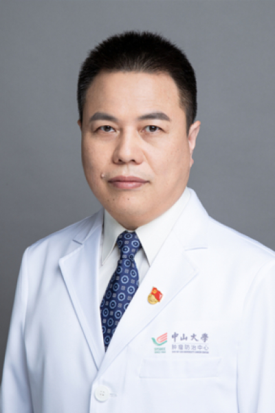

<!-- AUTO-GENERATED-BY: work/generate_obsidian_profiles.py -->

# 张东生

## 基础信息

| 字段 | 内容 |
|---|---|
| 医院 | 中山大学肿瘤防治中心 |
| 姓名 | 张东生 |
| 科室 | 内科 |
| 职称/身份 | 中山大学肿瘤防治中心内科五区区长、临床研究部I期病房II区区长（兼） 职称：主任医师，医学博士，博士研究生导师 |
| 重点优先级 | 高 |
| 来源类型 | 医院官网 |
| 来源链接 | [官网原文](https://www.sysucc.org.cn/node/1481) |
| 采集日期 | 2026-08-10 |
| 复核状态 | 待人工复核 |
| 异常提示 |  |

## 简介/擅长

消化系统肿瘤（食道癌、胃癌、肠癌、胰腺癌、肝胆癌）治疗和研究

## 详情正文摘录

张东生，主任医师，医学博士(Ph.D, M.D)，博士研究生导师，肿瘤防治中心内科主诊教授，内科五区区长、临床研究部I期病房二区区长。香港中文大学Research fellow，美国梅奥医院胃肠及癌症中心访问学者。 长期从事肿瘤内科一线临床医疗工作，专注消化系统肿瘤（食道癌、胃癌、肠癌、肝胆胰腺癌）治疗，包括化疗、分子靶向治疗和免疫治疗。对抗癌药物临床试验也有丰富经验，并参与多项临床研究。在本专业领域有重要影响力的杂志上发表高水平论文60多篇，包括以通讯作者，以及第一作者发表在Molecular cancer、J PATHOL 、BJC、Mabs等杂志论文10多篇。参编《肿瘤生物治疗学》、《临床肿瘤内科学》等多篇学术专著，主持参与国家级和部省级多项研究课题。 加载更多 职务： 中山大学肿瘤防治中心内科五区区长、临床研究部I期病房II区区长（兼） 职称： 主任医师，医学博士，博士研究生导师

## 重点关注范围

- 肿瘤
- 免疫/风湿/感染

## 重点疾病标签

- 肿瘤
- 癌
- 化疗
- 靶向
- 胃癌
- 肠癌
- 免疫

## 亮眼经历线索

- 中山大学肿瘤防治中心内科五区区长、临床研究部I期病房II区区长（兼） 职称：主任医师，医学博士，博士研究生导师 张东生，主任医师，医学博士(Ph.D, M.D)，博士研究生导师，肿瘤防治中心内科主诊教授，内科五区区长、临床研究部I期病房二区区长。
- 香港中文大学Research fellow，美国梅奥医院胃肠及癌症中心访问学者。
- 在本专业领域有重要影响力的杂志上发表高水平论文60多篇，包括以通讯作者，以及第一作者发表在Molecular cancer、J PATHOL 、BJC、Mabs等杂志论文10多篇。

## 异常提示

## 合规边界

- 本画像仅整理统一总底表中的医院官网公开字段。
- 不包含患者评价、排名、第三方来源内容或疗效承诺。
- 官网未展示的信息保持空白，后续如需补充须回到底表官方来源字段。
