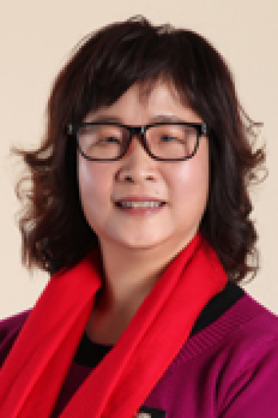

<!-- AUTO-GENERATED-BY: work/generate_obsidian_profiles.py -->

# 张丽媛

## 基础信息

| 字段 | 内容 |
|---|---|
| 医院 | 中山大学肿瘤防治中心 |
| 姓名 | 张丽媛 |
| 科室 | 超声科 |
| 职称/身份 | 副主任技师 |
| 重点优先级 | 高 |
| 来源类型 | 医院官网 |
| 来源链接 | [官网原文](https://www.sysucc.org.cn/node/3902) |
| 采集日期 | 2026-08-10 |
| 复核状态 | 待人工复核 |
| 异常提示 |  |

## 简介/擅长

心电图诊断 1984年到中山大学孙逸仙纪念医院内科工作.1987年到中山大学孙逸仙纪念医院心电图室工作，工作表现一直优秀，科研成绩突出，1998年破格晋升为主管技师.1999年作为心电图专业技术骨干调到中山大学肿瘤防治中心超声-心电科从事心电图专业技术工作，加强心电图室的技术力量，带领年轻医生提高心电图诊断技能，提高年轻医生对心律失常的诊断和鉴别诊断的能力。考取全国执业医师证，一直从事心电图诊断工作。2011年晋升为副主任技师，27年的心电图专业技术工作，积累了丰富的工作经验，有扎实的理论知识，过得硬的心电图诊断报告的经验，对复杂心律失常的诊断和鉴别有丰富的经验，能够独立解决疑难问题，在心电图室起着独当一面的技术骨干作用。 27年来，在公开出版的医学期刊和专业核心期刊发表第一作者的论著共30多篇，参加国家自然科学基金课题一项，广东省自然基金课题一项，广东省卫生厅课题。2011年4月8日参加第十三届中国南方国际心血管病学术会，并作专题发言，题目:化疗药物心肌损害的常见心电图表现。 加载更多 1984年到中山大学孙逸仙纪念医院内科工作.1987年到中山大学孙逸仙纪念医院心电图室工作，工作表现一直优秀，科研成绩突出，1998...

## 详情正文摘录

职称：副主任技师 专长 心电图诊断 1984年到中山大学孙逸仙纪念医院内科工作.1987年到中山大学孙逸仙纪念医院心电图室工作，工作表现一直优秀，科研成绩突出，1998年破格晋升为主管技师.1999年作为心电图专业技术骨干调到中山大学肿瘤防治中心超声-心电科从事心电图专业技术工作，加强心电图室的技术力量，带领年轻医生提高心电图诊断技能，提高年轻医生对心律失常的诊断和鉴别诊断的能力。考取全国执业医师证，一直从事心电图诊断工作。2011年晋升为副主任技师，27年的心电图专业技术工作，积累了丰富的工作经验，有扎实的理论知识，过得硬的心电图诊断报告的经验，对复杂心律失常的诊断和鉴别有丰富的经验，能够独立解决疑难问题，在心电图室起着独当一面的技术骨干作用。 27年来，在公开出版的医学期刊和专业核心期刊发表第一作者的论著共30多篇，参加国家自然科学基金课题一项，广东省自然基金课题一项，广东省卫生厅课题。2011年4月8日参加第十三届中国南方国际心血管病学术会，并作专题发言，题目:化疗药物心肌损害的常见心电图表现。 加载更多 1984年到中山大学孙逸仙纪念医院内科工作.1987年到中山大学孙逸仙纪念医院心电图室工作，工作表现一直优秀，科研成绩突出，1998年破格晋升为主管技师.1999年作为心电图专业技术骨干调到中山大学肿瘤防治中心超声-心电科从事心电图专业技术工作，加强心电图室的技术力量，带领年轻医生提高心电图诊断技能，提高年轻医生对心律失常的诊断和鉴别诊断的能力。考取全国执业医师证，一直从事心电图诊断工作。2011年晋升为副主任技师，27年的心电图专业技术工作，积累了丰富的工作经验，有扎实的理论知识，过得硬的心电图诊断报告的经验，对复杂心律失常的诊断和鉴别有丰富的经验，能够独立解决疑难问题，在心电图室起着独当一面的技术骨干作用。27年来，在公开出版的医学期刊和专业核心期刊发表第一作者的论著共30多篇，参加国家自然科学基金课题一项，广东省自然基金课题一项，广东省卫生厅课题。2011年4月8日参加…

## 重点关注范围

- 慢性病
- 肿瘤
- 术后恢复/康复
- 疑难重症

## 重点疾病标签

- 慢性
- 肿瘤
- 癌
- 化疗
- 鼻咽癌
- 肺癌
- 乳腺癌
- 术后
- 疑难
- 复杂

## 亮眼经历线索

- 2011年晋升为副主任技师，27年的心电图专业技术工作，积累了丰富的工作经验，有扎实的理论知识，过得硬的心电图诊断报告的经验，对复杂心律失常的诊断和鉴别有丰富的经验，能够独立解决疑难问题，在心电图室起着独当一面的技术骨干作用。
- 27年来，在公开出版的医学期刊和专业核心期刊发表第一作者的论著共30多篇，参加国家自然科学基金课题一项，广东省自然基金课题一项，广东省卫生厅课题。

## 异常提示

## 合规边界

- 本画像仅整理统一总底表中的医院官网公开字段。
- 不包含患者评价、排名、第三方来源内容或疗效承诺。
- 官网未展示的信息保持空白，后续如需补充须回到底表官方来源字段。
