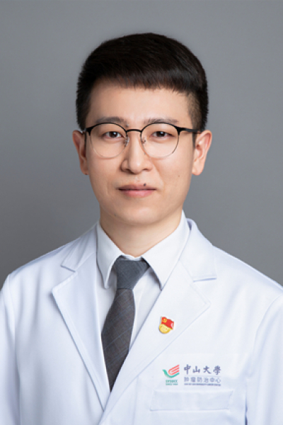

<!-- AUTO-GENERATED-BY: work/generate_obsidian_profiles.py -->

<!-- TEMPLATE: D:\workspace\信息收集整理\医生画像仓库\模板\医生画像模板.md -->

# 张亚雄

## 基础信息

| 字段 | 内容 |
|---|---|
| 姓名 | 张亚雄 |
| 医院 | 中山大学肿瘤防治中心 |
| 科室 | 内科 |
| 职称/身份 | 副主任医师、医学博士、硕士生导师 |
| 来源链接 | [官网原文](https://www.sysucc.org.cn/node/1639) |
| 采集日期 | 2026-08-10 |

## 简介/擅长

肺癌及鼻咽癌诊疗，新药临床试验

## 科研项目与成果

- 四、主持科研项目 主持国自然青年科学基金项目, 82102872, EGFR通过galectin-9改变CTL细胞功能导致肺腺癌免疫逃逸的机制研究免疫治疗原发耐药的机制研究, 主持广东省医学科研基金，A2020153，肿瘤免疫微环境在EGFR突变非小细胞肺癌中19 Del与21 L858R两种突变亚型间的差异及其对TKI原发耐药的影响 参与多项国自然面上项目，及省部级、厅局级基金项目 五、代表性论著 以第一或通讯作者在《临床肿瘤学杂志》(Journal of Clinical Oncology), 《自然通讯》(…

## 可包装亮点

- 副主任医师、医学博士、硕士生导师 张亚雄 职称：副主任医师、医学博士、硕士生导师 专长 肺癌及鼻咽癌诊疗，新药临床试验 一、基本情况 张亚雄，副主任医师、医学博士、硕士研究生导师 二、教育及工作经历 2009-09 至 2017-06, 中山大学, 临床医学八年制, 博士 2017-07 至 2018-12, 中山大学, 肿瘤防治中心, 医师 2019-0…

## 重点疾病/人群标签

- 慢性病：
- 肿瘤：肿瘤、癌、化疗、靶向、鼻咽癌、肺癌、免疫
- 生殖疾病：
- 免疫/风湿：肿瘤、癌、化疗、靶向、鼻咽癌、肺癌、免疫
- 术后恢复/康复：
- 疑难重症：

## 证据摘录

> 只摘录官网公开信息中的短句或关键字段，不复制大段原文。

- 官网身份字段：副主任医师、医学博士、硕士生导师
- 官网简介/擅长：肺癌及鼻咽癌诊疗，新药临床试验
- 官网亮眼经历线索：副主任医师、医学博士、硕士生导师 张亚雄 职称：副主任医师、医学博士、硕士生导师 专长 肺癌及鼻咽癌诊疗，新药临床试验 一、基本情况 张亚雄，副主任医师、医学博士、硕士研究生导师 二、教育及工作经历 2009-09 至 2017-06, 中山大学, 临床医学八年制, 博士 2017-07 至 2018-12, 中山大学, 肿瘤防治中心, 医师 2019-01 至 2023-12, 中山大学, 肿瘤防治中心, 主治医师 2024-01…
- 异常提示：亮眼经历含导航文本，已清洗
- 来源链接：https://www.sysucc.org.cn/node/1639

## BD 画像摘要

张亚雄医生可作为肿瘤、免疫/风湿/感染方向的基础画像候选。后续 BD 使用应继续以官网来源和人工复核为准，不添加疗效承诺或无来源包装。

## 合规边界

- 仅使用医院官网、官方公众号、官方小程序等公开渠道。
- 不采集私人电话、私人微信、家庭住址、患者隐私或非公开排班信息。
- 不写“保证治愈”“疗效第一”“包治疑难杂症”等无法由官网证明的表述。
