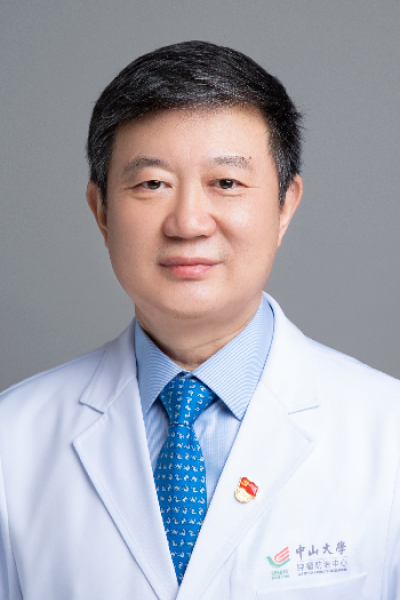

<!-- AUTO-GENERATED-BY: work/generate_obsidian_profiles.py -->

# 张兰军

## 基础信息

| 字段 | 内容 |
|---|---|
| 医院 | 中山大学肿瘤防治中心 |
| 姓名 | 张兰军 |
| 科室 | 胸科 |
| 职称/身份 | 中山大学肿瘤防治中心胸科 科主任导师 职称：教授、主任医师、博士生导师、博士后导师、肺癌首席专家 |
| 重点优先级 | 高 |
| 来源类型 | 医院官网 |
| 来源链接 | [官网原文](https://www.sysucc.org.cn/node/7371) |
| 采集日期 | 2026-08-10 |
| 复核状态 | 待人工复核 |
| 异常提示 |  |

## 简介/擅长

胸部肿瘤外科的诊断治疗及综合治疗 张兰军教授1984年毕业于第四军医大学，毕业后留校（第四军医大学）任教并在第四军医大学西京医院从事心血管外科临床工作并完成心胸外科住院医师训练。1988年师从我国著名胸外科专家刘锟教授进行食管功能研究并于1991年获得医学硕士学位。1991年任第一军医大学南方医院心胸外科讲师、主治医师。2001年师从著名胸外科专家戎铁华教授并于2004年获得医学博士学位，2004年留校（中山大学）从事胸外科临床。教学、科研工作，2006年任中山大学肿瘤医院胸外科副主任、2008年晋升为中山大学教授、主任医师、2010年任胸外科主任至今。1999年起从事生物材料人工器官的构建，先后进行了人工食管、人工肋骨、人工外科补片的研制， 2001年7月在国内外成功进行了首例生物材料人工食管人体植入术并获成功。2005年12月起先后成功运用生物材料人工胸壁对肺癌侵犯胸壁切除后巨大缺损、脓胸术后胸壁缺损、胸内肿瘤伴胸廓畸形的缺损重建成功,并于2018年在欧洲获ＥＳＴＳ－ＭＥＤＸＰＥＲＴ奖。2015年在华南地区开展首例电磁导航（ENB）肺内小结节诊断治疗术。2016年在华南地区首次开展机器人辅助肺癌根治术。2022年当...

## 详情正文摘录

临床专家 面包屑 首页 / 临床科室 / 外科系列 / 胸科 / 临床专家 张兰军 职务：中山大学肿瘤防治中心胸科 科主任导师 职称：教授、主任医师、博士生导师、博士后导师、肺癌首席专家 专长 胸部肿瘤外科的诊断治疗及综合治疗 张兰军教授1984年毕业于第四军医大学，毕业后留校（第四军医大学）任教并在第四军医大学西京医院从事心血管外科临床工作并完成心胸外科住院医师训练。1988年师从我国著名胸外科专家刘锟教授进行食管功能研究并于1991年获得医学硕士学位。1991年任第一军医大学南方医院心胸外科讲师、主治医师。2001年师从著名胸外科专家戎铁华教授并于2004年获得医学博士学位，2004年留校（中山大学）从事胸外科临床。教学、科研工作，2006年任中山大学肿瘤医院胸外科副主任、2008年晋升为中山大学教授、主任医师、2010年任胸外科主任至今。1999年起从事生物材料人工器官的构建，先后进行了人工食管、人工肋骨、人工外科补片的研制， 2001年7月在国内外成功进行了首例生物材料人工食管人体植入术并获成功。2005年12月起先后成功运用生物材料人工胸壁对肺癌侵犯胸壁切除后巨大缺损、脓胸术后胸壁缺损、胸内肿瘤伴胸廓畸形的缺损重建成功,并于2018年在欧洲获ＥＳＴＳ－ＭＥＤＸＰＥＲＴ奖。2015年在华南地区开展首例电磁导航（ENB）肺内小结节诊断治疗术。2016年在华南地区首次开展机器人辅助肺癌根治术。2022年当选美国胸科医师学会（AATS）会士，同时，自2014年起成为欧洲胸外科学会(ESTS)、国际肺癌研究会(IASLC)委员。目前主要进行肺癌的外科治疗及综合治疗研究、肺癌早筛及早诊、肺癌预后预测、肺癌的微创手术及机器人手术、肺癌分子分型及靶向治疗；生物材料人工器官的构建及应用；胸部肿瘤标本库及肿瘤信息平台建设及转化研究；肿瘤个体化治疗的分子标志物筛选；以及胸部肿瘤外科术后营养支持及营养支持对肿瘤患者的免疫功能影响等。先后承担国家863重大专项4项、广东省及广州市科技攻关及自然科学基金等课题多项，获资助近600万元。目前承担多项正在进行的国际多中心RCT临床研究及国内…

## 重点关注范围

- 肿瘤
- 免疫/风湿/感染
- 术后恢复/康复
- 疑难重症

## 重点疾病标签

- 肿瘤
- 癌
- 靶向
- 肺癌
- 免疫功能
- 术后
- 营养
- 罕见

## 亮眼经历线索

- 中山大学肿瘤防治中心胸科 科主任导师 职称：教授、主任医师、博士生导师、博士后导师、肺癌首席专家 教学、科研工作，2006年任中山大学肿瘤医院胸外科副主任、2008年晋升为中山大学教授、主任医师、2010年任胸外科主任至今。
- 2005年12月起先后成功运用生物材料人工胸壁对肺癌侵犯胸壁切除后巨大缺损、脓胸术后胸壁缺损、胸内肿瘤伴胸廓畸形的缺损重建成功,并于2018年在欧洲获ＥＳＴＳ－ＭＥＤＸＰＥＲＴ奖。
- 2022年当选美国胸科医师学会（AATS）会士，同时，自2014年起成为欧洲胸外科学会(ESTS)、国际肺癌研究会(IASLC)委员。

## 异常提示

## 合规边界

- 本画像仅整理统一总底表中的医院官网公开字段。
- 不包含患者评价、排名、第三方来源内容或疗效承诺。
- 官网未展示的信息保持空白，后续如需补充须回到底表官方来源字段。
