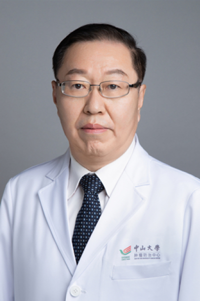

<!-- AUTO-GENERATED-BY: work/generate_obsidian_profiles.py -->

# 张力

## 基础信息

| 字段 | 内容 |
|---|---|
| 医院 | 中山大学肿瘤防治中心 |
| 姓名 | 张力 |
| 科室 | 内科 |
| 职称/身份 | 中山大学肺癌研究所副主任、科主任导师 职称：教授、主任医师、博士生导师、肺癌首席专家 |
| 重点优先级 | 高 |
| 来源类型 | 医院官网 |
| 来源链接 | [官网原文](https://www.sysucc.org.cn/node/1474) |
| 采集日期 | 2026-08-10 |
| 复核状态 | 待人工复核 |
| 异常提示 |  |

## 简介/擅长

在肺癌和鼻咽癌等实体瘤的化学治疗、靶向治疗、多学科综合治疗以及晚期癌症的姑息治疗等领域有较高造诣。对开展临床研究具有丰富的经验。

## 详情正文摘录

张力，教授、主任医师、肿瘤内科博士生导师、肺癌首席专家、中山大学名医、南粤百杰、国家重点研发计划“肺癌精准医学研究”项目（2016YFC0905500）负责人。现任中山大学肿瘤防治中心I期病房主任、中山大学肺癌研究所副主任。1996年和1998年分别赴法国IGR和美国Fox Chase肿瘤中心短期进修。2001-2002年在美国MD Anderson肿瘤中心进修。

## 重点关注范围

- 肿瘤
- 术后恢复/康复
- 疑难重症

## 重点疾病标签

- 肿瘤
- 癌
- 瘤
- 靶向
- 鼻咽癌
- 肺癌
- 姑息
- 多学科

## 亮眼经历线索

- 中山大学肺癌研究所副主任、科主任导师 职称：教授、主任医师、博士生导师、肺癌首席专家 在肺癌和鼻咽癌等实体瘤的化学治疗、靶向治疗、多学科综合治疗以及晚期癌症的姑息治疗等领域有较高造诣。
- 张力，教授、主任医师、肿瘤内科博士生导师、肺癌首席专家、中山大学名医、南粤百杰、国家重点研发计划“肺癌精准医学研究”项目（2016YFC0905500）负责人。
- 1996年和1998年分别赴法国IGR和美国Fox Chase肿瘤中心短期进修。

## 异常提示

## 合规边界

- 本画像仅整理统一总底表中的医院官网公开字段。
- 不包含患者评价、排名、第三方来源内容或疗效承诺。
- 官网未展示的信息保持空白，后续如需补充须回到底表官方来源字段。
