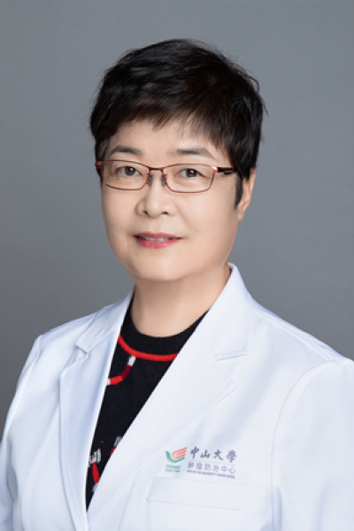

<!-- AUTO-GENERATED-BY: work/generate_obsidian_profiles.py -->

<!-- TEMPLATE: D:\workspace\信息收集整理\医生画像仓库\模板\医生画像模板.md -->

# 张彦娜

## 基础信息

| 字段 | 内容 |
|---|---|
| 姓名 | 张彦娜 |
| 医院 | 中山大学肿瘤防治中心 |
| 科室 | 妇科 |
| 职称/身份 | 主任医师、硕士生导师 |
| 来源链接 | [官网原文](https://www.sysucc.org.cn/node/3695) |
| 采集日期 | 2026-08-10 |

## 简介/擅长

妇科良恶性肿瘤的诊断与治疗

## 教育与进修经历

- 二、学习及工作经历： 1986年—1992年：中山医科大学就读 1992年—1995年：中山医科大学附属肿瘤医院就读硕士生 1992年至今：中山大学附属肿瘤医院工作 加载更多 1986年7月自中山医科大学本科毕业，分配至中山大学肿瘤防治中心妇科工作至今，于1995年7月取得中山医科大学肿瘤学硕士学位。

## 科研项目与成果

- 先后发表关于子宫恶性肿瘤及卵巢肿瘤的病因、发生发展、预后影响因素等专业论著30余篇，获得多项省部级科研基金；
- 并参与中山大学5010课题及国际多中心Ⅲ期新药临床试验项目研究；

## 论文与学术产出

- 先后发表关于子宫恶性肿瘤及卵巢肿瘤的病因、发生发展、预后影响因素等专业论著30余篇，获得多项省部级科研基金；

## 可包装亮点

- 主任医师、硕士生导师 张彦娜 职称：主任医师、硕士生导师 专长 妇科良恶性肿瘤的诊断与治疗 一、基本情况 职称：主任医师 专家门诊时间： 周二上午；
- 2001年12月获聘肿瘤学科副主任医师、副教授；
- 2013年12月获聘肿瘤学科主任医师。

## 重点疾病/人群标签

- 慢性病：
- 肿瘤：肿瘤、癌、瘤、卵巢、疑难
- 生殖疾病：肿瘤、癌、瘤、卵巢、疑难
- 免疫/风湿：
- 术后恢复/康复：
- 疑难重症：肿瘤、癌、瘤、卵巢、疑难

## 证据摘录

> 只摘录官网公开信息中的短句或关键字段，不复制大段原文。

- 官网身份字段：主任医师、硕士生导师
- 官网简介/擅长：妇科良恶性肿瘤的诊断与治疗
- 官网亮眼经历线索：主任医师、硕士生导师 张彦娜 职称：主任医师、硕士生导师 专长 妇科良恶性肿瘤的诊断与治疗 一、基本情况 职称：主任医师 专家门诊时间： 周二上午； 2001年12月获聘肿瘤学科副主任医师、副教授； 2013年12月获聘肿瘤学科主任医师。
- 异常提示：亮眼经历含导航文本，已清洗
- 来源链接：https://www.sysucc.org.cn/node/3695

## BD 画像摘要

张彦娜医生可作为肿瘤、生殖疾病、疑难重症方向的基础画像候选。后续 BD 使用应继续以官网来源和人工复核为准，不添加疗效承诺或无来源包装。

## 合规边界

- 仅使用医院官网、官方公众号、官方小程序等公开渠道。
- 不采集私人电话、私人微信、家庭住址、患者隐私或非公开排班信息。
- 不写“保证治愈”“疗效第一”“包治疑难杂症”等无法由官网证明的表述。
