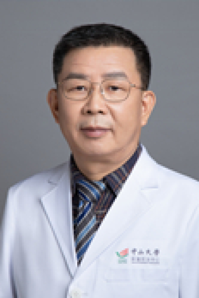

<!-- AUTO-GENERATED-BY: work/generate_obsidian_profiles.py -->

# 张惠忠

## 基础信息

| 字段 | 内容 |
|---|---|
| 医院 | 中山大学肿瘤防治中心 |
| 姓名 | 张惠忠 |
| 科室 | 病理科 |
| 职称/身份 | 科副主任 职称：主任医师、副教授、硕士生导师 |
| 重点优先级 | 高 |
| 来源类型 | 医院官网 |
| 来源链接 | [官网原文](https://www.sysucc.org.cn/node/3857) |
| 采集日期 | 2026-08-10 |
| 复核状态 | 待人工复核 |
| 异常提示 |  |

## 简介/擅长

肿瘤病理组织学及细胞学诊断 1962年出生，医学博士，1980年考入中山医科大学临床医疗系，1986年本科毕业并获医学学士学位，同年考入中山医科大学攻读医学硕士学位，毕业后留中山医科大学肿瘤医院病理科从事肿瘤病理诊断、科研及教学工作，1995年考入中山医科大学攻读病理学博士，1999年毕业并获医学博士学位。从事肿瘤病理诊断、科研及教学十多年，每年诊断的病理及细胞学病例和疑难会诊等约7000例次，对肿瘤病理组织学及细胞学诊断积累了较丰富的经验。 加载更多 1962年出生，医学博士，1980年考入中山医科大学临床医疗系，1986年本科毕业并获医学学士学位，同年考入中山医科大学攻读医学硕士学位，毕业后留中山医科大学肿瘤医院病理科从事肿瘤病理诊断、科研及教学工作，1995年考入中山医科大学攻读病理学博士，1999年毕业并获医学博士学位。从事肿瘤病理诊断、科研及教学十多年，每年诊断的病理及细胞学病例和疑难会诊等约7000例次，对肿瘤病理组织学及细胞学诊断积累了较丰富的经验。 现为科秘书，主任医师，副教授，专长于骨组织肿瘤和肝肿瘤的诊断和研究，先后承担并完成了多个科研项目，并发表多篇文章. 承担及参与的科研项目： 1．成骨性肿瘤胶...

## 详情正文摘录

职务：科副主任 职称：主任医师、副教授、硕士生导师 专长 肿瘤病理组织学及细胞学诊断 1962年出生，医学博士，1980年考入中山医科大学临床医疗系，1986年本科毕业并获医学学士学位，同年考入中山医科大学攻读医学硕士学位，毕业后留中山医科大学肿瘤医院病理科从事肿瘤病理诊断、科研及教学工作，1995年考入中山医科大学攻读病理学博士，1999年毕业并获医学博士学位。从事肿瘤病理诊断、科研及教学十多年，每年诊断的病理及细胞学病例和疑难会诊等约7000例次，对肿瘤病理组织学及细胞学诊断积累了较丰富的经验。 加载更多 1962年出生，医学博士，1980年考入中山医科大学临床医疗系，1986年本科毕业并获医学学士学位，同年考入中山医科大学攻读医学硕士学位，毕业后留中山医科大学肿瘤医院病理科从事肿瘤病理诊断、科研及教学工作，1995年考入中山医科大学攻读病理学博士，1999年毕业并获医学博士学位。从事肿瘤病理诊断、科研及教学十多年，每年诊断的病理及细胞学病例和疑难会诊等约7000例次，对肿瘤病理组织学及细胞学诊断积累了较丰富的经验。 现为科秘书，主任医师，副教授，专长于骨组织肿瘤和肝肿瘤的诊断和研究，先后承担并完成了多个科研项目，并发表多篇文章. 承担及参与的科研项目： 1．成骨性肿瘤胶原基因表达及其与分类分化和预后的关系。 2．HRG-PE重组毒素导向生物基因治疗乳腺癌的实验研究。 3．头颈癌瘤选择性颈清扫术适应症的临床及实验室研究。 4．三种不同转移潜能的皮肤肿瘤中nm23和P21蛋白的表达。 5．免疫组化法检测肝癌患者肝组织中庚型肝炎病毒。 6．骨肉瘤I型胶原表达的分子机制。 7．大肠良恶性上皮组织中端粒酶活性的原位检测及其临床意义探讨。 发表的论文： 1．骨肉瘤组织中I、II和III型胶原蛋白的表达 临床与实验病理学杂志 1999.12.28;15(6):471-473 2．成骨性肿瘤中I、II、和III型胶原蛋白的表达 癌症 1999.10.15;18(5):531-534 3．人软骨…

## 重点关注范围

- 慢性病
- 肿瘤
- 免疫/风湿/感染
- 疑难重症

## 重点疾病标签

- 慢性
- 肿瘤
- 癌
- 瘤
- 放疗
- 鼻咽癌
- 肺癌
- 肝癌
- 乳腺癌
- 免疫
- 感染
- 疑难
- 重症

## 亮眼经历线索

- 科副主任 职称：主任医师、副教授、硕士生导师 从事肿瘤病理诊断、科研及教学十多年，每年诊断的病理及细胞学病例和疑难会诊等约7000例次，对肿瘤病理组织学及细胞学诊断积累了较丰富的经验。
- 从事肿瘤病理诊断、科研及教学十多年，每年诊断的病理及细胞学病例和疑难会诊等约7000例次，对肿瘤病理组织学及细胞学诊断积累了较丰富的经验。
- 现为科秘书，主任医师，副教授，专长于骨组织肿瘤和肝肿瘤的诊断和研究，先后承担并完成了多个科研项目，并发表多篇文章. 承担及参与的科研项目： 1．成骨性肿瘤胶原基因表达及其与分类分化和预后的关系。

## 异常提示

## 合规边界

- 本画像仅整理统一总底表中的医院官网公开字段。
- 不包含患者评价、排名、第三方来源内容或疗效承诺。
- 官网未展示的信息保持空白，后续如需补充须回到底表官方来源字段。
