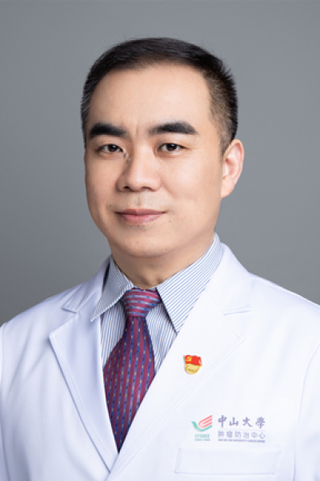

<!-- AUTO-GENERATED-BY: work/generate_obsidian_profiles.py -->

<!-- TEMPLATE: D:\workspace\信息收集整理\医生画像仓库\模板\医生画像模板.md -->

# 张玉晶

## 基础信息

| 字段 | 内容 |
|---|---|
| 姓名 | 张玉晶 |
| 医院 | 中山大学肿瘤防治中心 |
| 科室 |  |
| 职称/身份 | 张玉晶 |
| 来源链接 | [官网原文](https://www.sysucc.org.cn/node/1664) |
| 采集日期 | 2026-08-10 |

## 简介/擅长

专业特长：淋巴瘤、胃癌、胰腺癌、胆管癌和乳腺癌等肿瘤的放射治疗及综合治疗。 1. 对各型恶性淋巴瘤，包括结外鼻型NK/T细胞淋巴瘤以及淋巴结、韦氏环、胃肠、眼眶、颅脑、骨等部位原发淋巴瘤的放射治疗有较丰富的经验，在病例数和疗效方面均位于业内先进水平，有多篇研究成果进入著名的NCCN淋巴瘤诊疗指南； 2. 在胃癌的围手术期放化疗、不可手术局部晚期胃癌的根治性放化疗、局部区域复发胃癌的挽救放化疗或免疫联合放化疗方面积累了丰富的经验。参编历年的《中国临床肿瘤学会（CSCO）胃癌诊疗指南》，主持制订中山大学胃癌术前放化疗5010研究（Neo-CRAG）的放疗靶区模板和放化疗方案，参与编制国内首部《中国胃癌放疗指南》（2020版）。 3. 采用国际先进的磁共振加速器、TOMO等新型加速器治疗设备，开展胰腺癌、胆管癌、肝转移癌的调强放疗和体部立体定向放疗（SBRT），改进磁共振/笔形束CT/扇形束CT等影像引导下IGRT的放射治疗精度，大辐提高了疗效。

## 可包装亮点

- дёҙеәҠ专家 йқўеҢ…еұ‘ йҰ–йЎө / дёҙеәҠ科е®Ө / ж”ҫз–—зі»еҲ— / ж”ҫ疗科 / дёҙеәҠ专家 еј зҺүжҷ¶ иҒҢеҠЎпјҡеҢ»йҷўж·Ӣе·ҙзҳӨгҖҒиғғзҷҢгҖҒиғ°иғҶиӮҝзҳӨеҚ•з—…з§ҚMDT专家дјҡиҜҠз»„жҲҗе‘ҳп…

## 重点疾病/人群标签

- 慢性病：
- 肿瘤：肿瘤、MDT
- 生殖疾病：
- 免疫/风湿：
- 术后恢复/康复：
- 疑难重症：肿瘤、MDT

## 证据摘录

> 只摘录官网公开信息中的短句或关键字段，不复制大段原文。

- 官网身份字段：张玉晶
- 官网简介/擅长：专业特长：淋巴瘤、胃癌、胰腺癌、胆管癌和乳腺癌等肿瘤的放射治疗及综合治疗。 1. 对各型恶性淋巴瘤，包括结外鼻型NK/T细胞淋巴瘤以及淋巴结、韦氏环、胃肠、眼眶、颅脑、骨等部位原发淋巴瘤的放射治疗有较丰富的经验，在病例数和疗效方面均位于业内先进水平，有多篇研究成果进入著名的NCCN淋巴瘤诊疗指南； 2. 在胃癌的围手术期放化疗、不可手术局部晚期胃癌的根治性放化疗、局部区域复发胃癌的挽救放化疗或免疫联合放化疗方面积累了丰富的经验。参编历…
- 官网亮眼经历线索：дёҙеәҠ专家 йқўеҢ…еұ‘ йҰ–йЎө / дёҙеәҠ科е®Ө / ж”ҫз–—зі»еҲ— / ж”ҫ疗科 / дёҙеәҠ专家 еј зҺүжҷ¶ иҒҢеҠЎпјҡеҢ»йҷўж·Ӣе·ҙзҳӨгҖҒиғғзҷҢгҖҒиғ°иғҶиӮҝзҳӨеҚ•з—…з§ҚMDT专家дјҡиҜҠз»„жҲҗе‘ҳпјҢиӮҝзҳӨж”ҫз–—дё“дёҡдё»иҜҠж•ҷжҺҲ иҒҢз§°п…
- 原异常提示：科室需人工复核；职称/身份需人工复核
- 来源链接：https://www.sysucc.org.cn/node/1664

## BD 画像摘要

张玉晶医生可作为肿瘤、疑难重症方向的基础画像候选。后续 BD 使用应继续以官网来源和人工复核为准，不添加疗效承诺或无来源包装。

## 合规边界

- 仅使用医院官网、官方公众号、官方小程序等公开渠道。
- 不采集私人电话、私人微信、家庭住址、患者隐私或非公开排班信息。
- 不写“保证治愈”“疗效第一”“包治疑难杂症”等无法由官网证明的表述。
