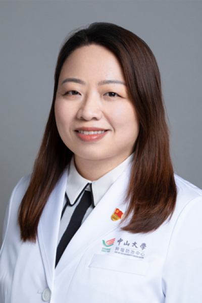

<!-- AUTO-GENERATED-BY: work/generate_obsidian_profiles.py -->

<!-- TEMPLATE: D:\workspace\信息收集整理\医生画像仓库\模板\医生画像模板.md -->

# 张琳 学历 /学位： 博士（肿瘤学） Department （

## 基础信息

| 字段 | 内容 |
|---|---|
| 姓名 | 张琳 学历 /学位： 博士（肿瘤学） Department （ |
| 医院 | 中山大学肿瘤防治中心 |
| 科室 | 检验科 |
| 职称/身份 | 主任技师、硕士生导师 |
| 来源链接 | [官网原文](https://www.sysucc.org.cn/node/3883) |
| 采集日期 | 2026-08-10 |

## 简介/擅长

胃癌和食管癌的消化道肿瘤的转化医学

## 教育与进修经历

- 临床专家 面包屑 首页 / 临床科室 / 平台科室 / 检验科 / 临床专家 张琳 职称：主任技师、硕士生导师 专长 胃癌和食管癌的消化道肿瘤的转化医学 一、基本情况： 姓名： 张琳 学历 /学位： 博士（肿瘤学） Department （科室） : 检验科 Title （职称、职务） : 主任技师、 硕士生导师、肿瘤学博士 Email: zhanglin@sysucc.org.cn 二、学习及工作经历： Education（教育背景）: 2001.09-2006.07 南华大学，医学院，临床医学检验 2010.…

## 科研项目与成果

- 2项广东省自然科学基金项目（面上项目和博士启动项目）；
- 2项广东省食管癌研究所项目（面上项目和青年项目）；
- 参加国家自然科学基金面上项目多项。
- 四、学术论文： 近 5 年承担的各类基金共5项。

## 论文与学术产出

- 四、学术论文： 近 5 年承担的各类基金共5项。
- 近5年共发表（共同）第一或通讯作者SCI论文31篇，其中10分以上SCI论文3篇；
- 5分以上SCI论文13篇。
- 包括 Gut (IF=23.0) , Journal of Experimental ＆Clinical Cancer Research (IF=11.3), NPJ Precision Oncology( IF=7.9), Journal of Translational Medicine (IF=7.4), Cancer Cell International (IF=5.8) 等期刊发表多篇研究论文，详见以下论文。

## 可包装亮点

- 主任技师、硕士生导师 张琳 职称：主任技师、硕士生导师 专长 胃癌和食管癌的消化道肿瘤的转化医学 一、基本情况： 姓名： 张琳 学历 /学位： 博士（肿瘤学） Department （科室） : 检验科 Title （职称、职务） : 主任技师、 硕士生导师、肿瘤学博士 Email: zhanglin@sysucc.org.cn 二、学习及工作经历： Ed…

## 重点疾病/人群标签

- 慢性病：
- 肿瘤：肿瘤、癌、胃癌、免疫
- 生殖疾病：
- 免疫/风湿：肿瘤、癌、胃癌、免疫
- 术后恢复/康复：
- 疑难重症：

## 证据摘录

> 只摘录官网公开信息中的短句或关键字段，不复制大段原文。

- 官网身份字段：主任技师、硕士生导师
- 官网简介/擅长：胃癌和食管癌的消化道肿瘤的转化医学
- 官网亮眼经历线索：主任技师、硕士生导师 张琳 职称：主任技师、硕士生导师 专长 胃癌和食管癌的消化道肿瘤的转化医学 一、基本情况： 姓名： 张琳 学历 /学位： 博士（肿瘤学） Department （科室） : 检验科 Title （职称、职务） : 主任技师、 硕士生导师、肿瘤学博士 Email: zhanglin@sysucc.org.cn 二、学习及工作经历： Education（教育背景）: 2001.09-2006.07 南华大学，医学院…
- 异常提示：亮眼经历含导航文本，已清洗
- 来源链接：https://www.sysucc.org.cn/node/3883

## BD 画像摘要

张琳 学历 /学位： 博士（肿瘤学） Department （医生可作为肿瘤、免疫/风湿/感染方向的基础画像候选。后续 BD 使用应继续以官网来源和人工复核为准，不添加疗效承诺或无来源包装。

## 合规边界

- 仅使用医院官网、官方公众号、官方小程序等公开渠道。
- 不采集私人电话、私人微信、家庭住址、患者隐私或非公开排班信息。
- 不写“保证治愈”“疗效第一”“包治疑难杂症”等无法由官网证明的表述。
