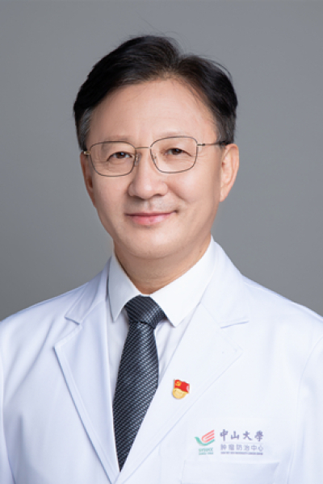

<!-- AUTO-GENERATED-BY: work/generate_obsidian_profiles.py -->

# 张福君

## 基础信息

| 字段 | 内容 |
|---|---|
| 医院 | 中山大学肿瘤防治中心 |
| 姓名 | 张福君 |
| 科室 | 微创介入治疗科 |
| 职称/身份 | 教授、主任医师、医学博士、博士生导师 |
| 重点优先级 | 高 |
| 来源类型 | 医院官网 |
| 来源链接 | [官网原文](https://www.sysucc.org.cn/node/3752) |
| 采集日期 | 2026-08-10 |
| 复核状态 | 待人工复核 |
| 异常提示 |  |

## 简介/擅长

各种实体肿瘤的125I粒子植入，消融治疗、射频、微波、冷冻治疗、PTCD治疗、靶向治疗及免疫治疗等综合治疗。 张福君，男，1963年出生，教授、主任医师、医学博士、博士研究生导师。中山大学肿瘤防治中心“特支计划”临床科学家。现担任中山大学肿瘤防治中心微创介入科副主任、中山大学放射介入研究所副所长。张福君教授主持了多项重要的临床研究项目，在多个具有广泛影响力的国际杂志上发表研究论文，获2009 “国内最具影响的百篇文章”，2009年在中国科学技术信息研究所肿瘤学科高被引作者中排名第三，获得国家发明专利1项，实用新型专利2项.近3年作为第一作者、通讯作者在国际著名学术杂志等发表论文30余篇，其中包括Ontarget, Radiology, Cancer, EJO, The Oncologist，Cancer Biology&Therapy等杂志。 主要学历 1982-09-01至1987-06-30 内蒙古医学院 临床医学本科 1994-09-01至1997-06-30 吉林大学 影像医学与核医学硕士研究生 2003-09-01至2006-06-30 第二军医大学 影像医学与核医学博士研究生 主要工作经历 1997-07-...

## 详情正文摘录

临床专家 面包屑 首页 / 临床科室 / 外科系列 / 微创介入治疗科 / 临床专家 张福君 职称：教授、主任医师、医学博士、博士生导师 专长 各种实体肿瘤的125I粒子植入，消融治疗、射频、微波、冷冻治疗、PTCD治疗、靶向治疗及免疫治疗等综合治疗。 张福君，男，1963年出生，教授、主任医师、医学博士、博士研究生导师。中山大学肿瘤防治中心“特支计划”临床科学家。现担任中山大学肿瘤防治中心微创介入科副主任、中山大学放射介入研究所副所长。张福君教授主持了多项重要的临床研究项目，在多个具有广泛影响力的国际杂志上发表研究论文，获2009 “国内最具影响的百篇文章”，2009年在中国科学技术信息研究所肿瘤学科高被引作者中排名第三，获得国家发明专利1项，实用新型专利2项.近3年作为第一作者、通讯作者在国际著名学术杂志等发表论文30余篇，其中包括Ontarget, Radiology, Cancer, EJO, The Oncologist，Cancer Biology&Therapy等杂志。 主要学历 1982-09-01至1987-06-30 内蒙古医学院 临床医学本科 1994-09-01至1997-06-30 吉林大学 影像医学与核医学硕士研究生 2003-09-01至2006-06-30 第二军医大学 影像医学与核医学博士研究生 主要工作经历 1997-07-01至至今，中山大学肿瘤防治中心，微创介入科，科副主任 2008年9-12月美国贝勒医学院放射科，访问学者 学术兼职 中山大学肿瘤防治中心“特支计划” 临床科学家 中国抗癌协会肿瘤微创治疗专业委员会 主任委员 中国医师协会介入分会粒子专委会 主任委员 中国抗癌协会肿瘤粒子治疗学会 主任委员 中国医师协会粒子治疗专家委员会 常务副主任委员 广东省抗癌协会肿瘤影像与介入诊治专业委员会 前任主任委员 广东省医师协会放射介入医师专业委员会 副主委委员 广东省医学会介入医学分会 副主任委员 科研课题 国自然 2011.1-2013.12，鼻咽癌分子靶点荧光显像与核磁共振融合模型建立的实验，编号：81071797，31万元…

## 重点关注范围

- 肿瘤
- 免疫/风湿/感染
- 术后恢复/康复

## 重点疾病标签

- 肿瘤
- 癌
- 瘤
- 放疗
- 化疗
- 靶向
- 鼻咽癌
- 肺癌
- 肝癌
- 免疫
- 术后

## 亮眼经历线索

- 教授、主任医师、医学博士、博士生导师 张福君，男，1963年出生，教授、主任医师、医学博士、博士研究生导师。
- 张福君教授主持了多项重要的临床研究项目，在多个具有广泛影响力的国际杂志上发表研究论文，获2009 “国内最具影响的百篇文章”，2009年在中国科学技术信息研究所肿瘤学科高被引作者中排名第三，获得国家发明专利1项，实用新型专利2项.近3年作为第一作者、通讯作者在国际著名学术杂志等发表论文30余篇，其中包括Ontarget, Radiology, Cancer…
- 主要学历 1982-09-01至1987-06-30 内蒙古医学院 临床医学本科 1994-09-01至1997-06-30 吉林大学 影像医学与核医学硕士研究生 2003-09-01至2006-06-30 第二军医大学 影像医学与核医学博士研究生 主要工作经历 19...

## 异常提示

## 合规边界

- 本画像仅整理统一总底表中的医院官网公开字段。
- 不包含患者评价、排名、第三方来源内容或疗效承诺。
- 官网未展示的信息保持空白，后续如需补充须回到底表官方来源字段。
