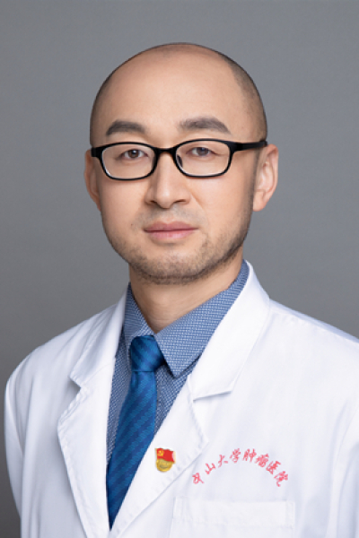

<!-- AUTO-GENERATED-BY: work/generate_obsidian_profiles.py -->

<!-- TEMPLATE: D:\workspace\信息收集整理\医生画像仓库\模板\医生画像模板.md -->

# 张继

## 基础信息

| 字段 | 内容 |
|---|---|
| 姓名 | 张继 |
| 医院 | 中山大学肿瘤防治中心 |
| 科室 | 神经外科 |
| 职称/身份 | 主任医师、博士生导师 |
| 来源链接 | [官网原文](https://www.sysucc.org.cn/node/3717) |
| 采集日期 | 2026-08-10 |

## 简介/擅长

脊柱脊髓肿瘤（神经鞘瘤、脊膜瘤、转移瘤等）及脑胶质瘤、脑膜瘤、脑转移瘤、垂体瘤等手术治疗。 职称： 医学博士、主任医师、硕士生导师

## 科研项目与成果

- 研究成果发表在ScienceAdvances,BRIEFBIOINFORM,BIOSENS BIOELECTRON,Anal.Chem等专业顶级期刊。
- 主持国家自然科学基金面上项目、广东省自然科学基金等6项。

## 论文与学术产出

- 研究成果发表在ScienceAdvances,BRIEFBIOINFORM,BIOSENS BIOELECTRON,Anal.Chem等专业顶级期刊。
- 三、发表的部分文章 1. Single-cell transcriptome-based multilayer network biomarker for predicting prognosis and therapeutic response of gliomas. Ji Zhang;

## 可包装亮点

- 主任医师、博士生导师 职称： 医学博士、主任医师、硕士生导师 张继 职称：主任医师、博士生导师 专长 脊柱脊髓肿瘤（神经鞘瘤、脊膜瘤、转移瘤等）及脑胶质瘤、脑膜瘤、脑转移瘤、垂体瘤等手术治疗。
- 职称： 医学博士、主任医师、硕士生导师 门诊时间： 周一下午 咨询网站： zhangji1685.haodf.com 一、学习及工作经历 在SeoulNationalUniversityHospital、PrinceofWalesHospital、Kaohsiung MedicalUniversity等访问学习。

## 重点疾病/人群标签

- 慢性病：
- 肿瘤：肿瘤、癌、瘤、疼痛
- 生殖疾病：
- 免疫/风湿：
- 术后恢复/康复：肿瘤、癌、瘤、疼痛
- 疑难重症：

## 证据摘录

> 只摘录官网公开信息中的短句或关键字段，不复制大段原文。

- 官网身份字段：主任医师、博士生导师
- 官网简介/擅长：脊柱脊髓肿瘤（神经鞘瘤、脊膜瘤、转移瘤等）及脑胶质瘤、脑膜瘤、脑转移瘤、垂体瘤等手术治疗。 职称： 医学博士、主任医师、硕士生导师
- 官网亮眼经历线索：主任医师、博士生导师 职称： 医学博士、主任医师、硕士生导师 张继 职称：主任医师、博士生导师 专长 脊柱脊髓肿瘤（神经鞘瘤、脊膜瘤、转移瘤等）及脑胶质瘤、脑膜瘤、脑转移瘤、垂体瘤等手术治疗。 职称： 医学博士、主任医师、硕士生导师 门诊时间： 周一下午 咨询网站： zhangji1685.haodf.com 一、学习及工作经历 在SeoulNationalUniversityHospital、PrinceofWalesHospita…
- 异常提示：亮眼经历含导航文本，已清洗
- 来源链接：https://www.sysucc.org.cn/node/3717

## BD 画像摘要

张继医生可作为肿瘤、术后恢复/康复方向的基础画像候选。后续 BD 使用应继续以官网来源和人工复核为准，不添加疗效承诺或无来源包装。

## 合规边界

- 仅使用医院官网、官方公众号、官方小程序等公开渠道。
- 不采集私人电话、私人微信、家庭住址、患者隐私或非公开排班信息。
- 不写“保证治愈”“疗效第一”“包治疑难杂症”等无法由官网证明的表述。
