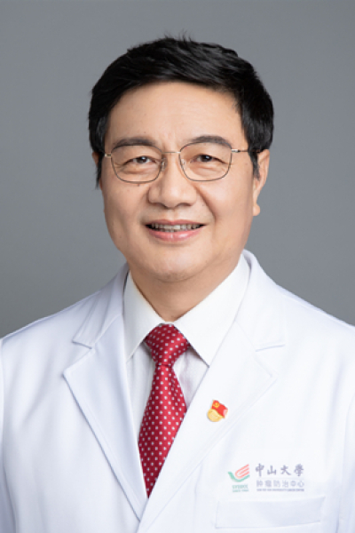

<!-- AUTO-GENERATED-BY: work/generate_obsidian_profiles.py -->

<!-- TEMPLATE: D:\workspace\信息收集整理\医生画像仓库\模板\医生画像模板.md -->

# 张诠

## 基础信息

| 字段 | 内容 |
|---|---|
| 姓名 | 张诠 |
| 医院 | 中山大学肿瘤防治中心 |
| 科室 | 头颈科 |
| 职称/身份 | 支部书记 职称：博士、主任医师、博士生导师 |
| 来源链接 | [官网原文](https://www.sysucc.org.cn/node/3595) |
| 采集日期 | 2026-08-10 |

## 简介/擅长

头颈肿瘤的诊断和治疗，在甲状腺癌的治疗、颈淋巴结清扫术、喉癌及口腔癌功能保全性治疗等方面有较深入的研究。

## 论文与学术产出

- 专家门诊 周一上午、周四下午 近年以第一作者/通讯作者身份发表的主要论文 (*为通讯作者) 01. Preoperative Serum Thyrotropin to Thyroglobulin Ratio Is Effective for Thyroid Nodule Evaluation in Euthyroid Patients. Otolaryngol Head Neck Surg. 2015 Apr 16. 02. Outcomes of Primary Squamous Cell Carcinoma…

## 可包装亮点

- 支部书记 职称：博士、主任医师、博士生导师 张诠 职务：支部书记 职称：博士、主任医师、博士生导师 专长 头颈肿瘤的诊断和治疗，在甲状腺癌的治疗、颈淋巴结清扫术、喉癌及口腔癌功能保全性治疗等方面有较深入的研究。
- 一、基本情况 职称：博士、主任医师、硕士生导师 职务：科副主任、科党支部书记 专家门诊时间：周一上午；

## 重点疾病/人群标签

- 慢性病：
- 肿瘤：肿瘤、癌、瘤、放疗、化疗、鼻咽癌、免疫、术后
- 生殖疾病：
- 免疫/风湿：肿瘤、癌、瘤、放疗、化疗、鼻咽癌、免疫、术后
- 术后恢复/康复：肿瘤、癌、瘤、放疗、化疗、鼻咽癌、免疫、术后
- 疑难重症：

## 证据摘录

> 只摘录官网公开信息中的短句或关键字段，不复制大段原文。

- 官网身份字段：支部书记 职称：博士、主任医师、博士生导师
- 官网简介/擅长：头颈肿瘤的诊断和治疗，在甲状腺癌的治疗、颈淋巴结清扫术、喉癌及口腔癌功能保全性治疗等方面有较深入的研究。
- 官网亮眼经历线索：支部书记 职称：博士、主任医师、博士生导师 张诠 职务：支部书记 职称：博士、主任医师、博士生导师 专长 头颈肿瘤的诊断和治疗，在甲状腺癌的治疗、颈淋巴结清扫术、喉癌及口腔癌功能保全性治疗等方面有较深入的研究。 一、基本情况 职称：博士、主任医师、硕士生导师 职务：科副主任、科党支部书记 专家门诊时间：周一上午；
- 异常提示：亮眼经历含导航文本，已清洗
- 来源链接：https://www.sysucc.org.cn/node/3595

## BD 画像摘要

张诠医生可作为肿瘤、免疫/风湿/感染、术后恢复/康复方向的基础画像候选。后续 BD 使用应继续以官网来源和人工复核为准，不添加疗效承诺或无来源包装。

## 合规边界

- 仅使用医院官网、官方公众号、官方小程序等公开渠道。
- 不采集私人电话、私人微信、家庭住址、患者隐私或非公开排班信息。
- 不写“保证治愈”“疗效第一”“包治疑难杂症”等无法由官网证明的表述。
