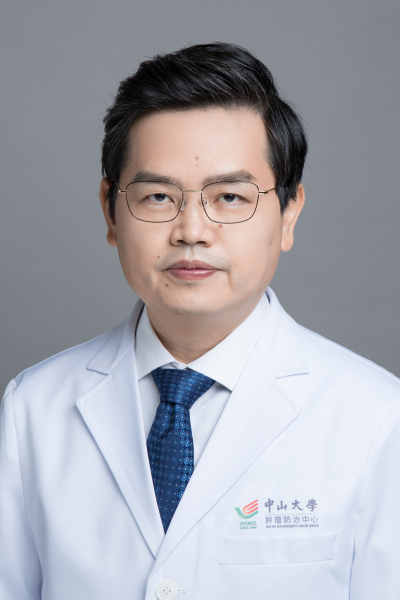

<!-- AUTO-GENERATED-BY: work/generate_obsidian_profiles.py -->

# 张阳

## 基础信息

| 字段 | 内容 |
|---|---|
| 医院 | 中山大学肿瘤防治中心 |
| 姓名 | 张阳 |
| 科室 | 内科 |
| 职称/身份 | 副主任医师 |
| 重点优先级 | 高 |
| 来源类型 | 医院官网 |
| 来源链接 | [官网原文](https://www.sysucc.org.cn/node/6899) |
| 采集日期 | 2026-08-10 |
| 复核状态 | 待人工复核 |
| 异常提示 |  |

## 简介/擅长

鼻咽癌、肺癌、胃癌、肠癌等化疗、靶向治疗、免疫治疗以及新药临床试验。

## 详情正文摘录

长期从事肿瘤内科以及药物临床研究工作。 特长： 鼻咽癌、肺癌、胃癌、肠癌等化疗、靶向治疗、免疫治疗以及新药临床试验。 更新时间：2025.02.24

## 重点关注范围

- 肿瘤
- 免疫/风湿/感染

## 重点疾病标签

- 肿瘤
- 化疗
- 靶向
- 鼻咽癌
- 肺癌
- 胃癌
- 肠癌
- 免疫

## 亮眼经历线索

- 副主任医师

## 异常提示

## 合规边界

- 本画像仅整理统一总底表中的医院官网公开字段。
- 不包含患者评价、排名、第三方来源内容或疗效承诺。
- 官网未展示的信息保持空白，后续如需补充须回到底表官方来源字段。
