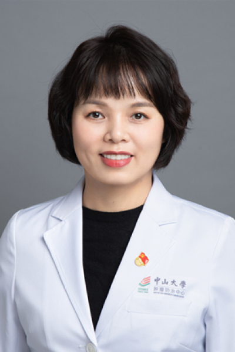

<!-- AUTO-GENERATED-BY: work/generate_obsidian_profiles.py -->

<!-- TEMPLATE: D:\workspace\信息收集整理\医生画像仓库\模板\医生画像模板.md -->

# 彭柔君

## 基础信息

| 字段 | 内容 |
|---|---|
| 姓名 | 彭柔君 |
| 医院 | 中山大学肿瘤防治中心 |
| 科室 | 综合科 |
| 职称/身份 | 主任医师 |
| 来源链接 | [官网原文](https://www.sysucc.org.cn/node/3765) |
| 采集日期 | 2026-08-10 |

## 简介/擅长

长期从事恶性肿瘤综合治疗，擅长乳腺癌及妇科恶性肿瘤（卵巢癌、子宫内膜癌、宫颈癌）的内科治疗和综合治疗。

## 教育与进修经历

- 二、教育及工作经历 2000年毕业于中山医科大学临床医学系，获学士学位 2007年毕业于中山大学，获肿瘤学硕士学位 2011年毕业于中山大学，获肿瘤学博士学位 2008年至2010年留学瑞典卡罗林斯卡医学院，中-瑞联合培养博士研究生 2000年7月至2015年7月，中山大学肿瘤防治中心内科，从事恶性肿瘤内科治疗，住院医师、主治医师及副主任医师 2015年8月至今，中山大学肿瘤防治中心综合科，从事恶性肿瘤综合治疗，副主任医师、主任医师 2016年1月起聘任为中山大学硕士研究生导师、博士研究生导师 三、学术兼职 广东…

## 可包装亮点

- 主任医师 彭柔君 职称：主任医师 专长 长期从事恶性肿瘤综合治疗，擅长乳腺癌及妇科恶性肿瘤（卵巢癌、子宫内膜癌、宫颈癌）的内科治疗和综合治疗。
- 二、教育及工作经历 2000年毕业于中山医科大学临床医学系，获学士学位 2007年毕业于中山大学，获肿瘤学硕士学位 2011年毕业于中山大学，获肿瘤学博士学位 2008年至2010年留学瑞典卡罗林斯卡医学院，中-瑞联合培养博士研究生 2000年7月至2015年7月，中山大学肿瘤防治中心内科，从事恶性肿瘤内科治疗，住院医师、主治医师及副主任医师 2015年8…

## 重点疾病/人群标签

- 慢性病：
- 肿瘤：肿瘤、癌、乳腺癌、卵巢、营养、多学科
- 生殖疾病：肿瘤、癌、乳腺癌、卵巢、营养、多学科
- 免疫/风湿：
- 术后恢复/康复：肿瘤、癌、乳腺癌、卵巢、营养、多学科
- 疑难重症：肿瘤、癌、乳腺癌、卵巢、营养、多学科

## 证据摘录

> 只摘录官网公开信息中的短句或关键字段，不复制大段原文。

- 官网身份字段：主任医师
- 官网简介/擅长：长期从事恶性肿瘤综合治疗，擅长乳腺癌及妇科恶性肿瘤（卵巢癌、子宫内膜癌、宫颈癌）的内科治疗和综合治疗。
- 官网亮眼经历线索：主任医师 彭柔君 职称：主任医师 专长 长期从事恶性肿瘤综合治疗，擅长乳腺癌及妇科恶性肿瘤（卵巢癌、子宫内膜癌、宫颈癌）的内科治疗和综合治疗。 二、教育及工作经历 2000年毕业于中山医科大学临床医学系，获学士学位 2007年毕业于中山大学，获肿瘤学硕士学位 2011年毕业于中山大学，获肿瘤学博士学位 2008年至2010年留学瑞典卡罗林斯卡医学院，中-瑞联合培养博士研究生 2000年7月至2015年7月，中山大学肿瘤防治中心内科，从…
- 异常提示：亮眼经历含导航文本，已清洗
- 来源链接：https://www.sysucc.org.cn/node/3765

## BD 画像摘要

彭柔君医生可作为肿瘤、生殖疾病、术后恢复/康复、疑难重症方向的基础画像候选。后续 BD 使用应继续以官网来源和人工复核为准，不添加疗效承诺或无来源包装。

## 合规边界

- 仅使用医院官网、官方公众号、官方小程序等公开渠道。
- 不采集私人电话、私人微信、家庭住址、患者隐私或非公开排班信息。
- 不写“保证治愈”“疗效第一”“包治疑难杂症”等无法由官网证明的表述。
