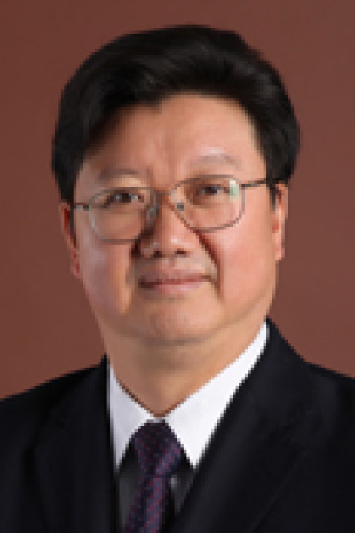

<!-- AUTO-GENERATED-BY: work/generate_obsidian_profiles.py -->

<!-- TEMPLATE: D:\workspace\信息收集整理\医生画像仓库\模板\医生画像模板.md -->

# 徐国良

## 基础信息

| 字段 | 内容 |
|---|---|
| 姓名 | 徐国良 |
| 医院 | 中山大学肿瘤防治中心 |
| 科室 | 内镜科 |
| 职称/身份 | 内镜科主任 职称：主任医师、硕士生导师 |
| 来源链接 | [官网原文](https://www.sysucc.org.cn/node/3905) |
| 采集日期 | 2026-08-10 |

## 简介/擅长

消化道肿瘤的早期诊断与治疗，进展期消化道与呼吸道肿瘤的内镜下姑息治疗。 能熟练开展胃镜,十二指肠镜,结肠镜,小肠镜,胆道镜,支气管镜，喉镜及超声内镜的检查. 本人能熟练开展常规胃镜、十二指肠镜、结肠镜、小肠镜、胆道镜、支气管镜、喉镜及超声内镜检查，并能熟练开展多项内镜下治疗，如食管静脉曲张套扎术/硬化剂注射术、食管狭窄及贲门失弛缓症探条/气囊扩张术、ERCP及乳头切开取石术、液电碎石术、胆管/胰管支架置入术、食管支架置入术、息肉切除术、内镜下黏膜切除术（EMR）、内镜黏膜下剥离术（ESD）、肠套叠内镜下复位术、各种进展期腔内肿瘤的冷冻治疗、光动力治疗、射频治疗、胰腺肿瘤的粒子植入术、射频消融治疗等。 每周

## 教育与进修经历

- 加载更多 主要学习、工作经历： 1979年9月-1984年7月，衡阳医学院学习并获医学学士学位；
- 1987年9月-1990年7月，第一军医大学南方医院学习并获内科学（消化系病学）硕士学位；
- 1999年5月至今，中山大学附属肿瘤医院内镜激光科工作，2003年曾赴日本京都第二红会医院进修超声内镜，1999年10月起担任科主任至今。

## 科研项目与成果

- 主要学术成果： 主持1.1类新药“福大赛因”的Ｉ期临床试验；
- 主持广州市科委重点课题“内镜下治疗粘膜内型早期食管癌的研究”；
- 参与多个省部级课题的研究；
- 获得超声水囊实用新型专利；

## 论文与学术产出

- 近年在国内外相关领域发表论著数十篇，并参加编写了《现代内科学》、《中国科技大词典》、《消化系病药理学》、《现代消化病》、《现代胃肠外科学》、《内镜护士手册》等著作。
- 获奖情况： 慢性结肠炎病因研究. 获中国人民解放军科技进步三等奖. 1998年. 第一作者. 色素内镜诊断食道局灶性病变的研究. 获中国人民解放军医疗成果四等奖. 1998年. 第一作者. 抗栓液治疗缺血性脑血管病的初步研究. 获中国人民解放军科技进步四等奖. 第三作者. 1986年. 原发性肝癌序贯治疗. 获第一军医大学医疗成果一等奖. 1997年. 第三作者. 近年论文发表情况： 高强度聚焦超声治疗未“开窗”肝右叶肝癌的初步研究. 临床超声医学杂志. 2005年第1期.第一作者 经内镜激光消融联合激光光动力学…

## 可包装亮点

- 内镜科主任 职称：主任医师、硕士生导师 徐国良 职务：内镜科主任 职称：主任医师、硕士生导师 专长 消化道肿瘤的早期诊断与治疗，进展期消化道与呼吸道肿瘤的内镜下姑息治疗。
- 1999年5月至今，中山大学附属肿瘤医院内镜激光科工作，2003年曾赴日本京都第二红会医院进修超声内镜，1999年10月起担任科主任至今。
- 学术任职： CSCO光动力诊断与治疗专业委员会副主任委员 广东省抗癌协会肿瘤微创治疗专业委员会副主任委员 广州市抗癌协会肿瘤热疗与消融治疗专业委员会副主任委员 广东省医师协会消化内镜医师工作委员会常委 广东省医学会消化内镜分会超声学组副组长 主要研究方向及专业特长： 消化道肿瘤的早期诊断与治疗，进展期消化道与呼吸道肿瘤的内镜下姑息治疗。

## 重点疾病/人群标签

- 慢性病：慢性、肿瘤、癌、肝癌、胃癌、姑息
- 肿瘤：慢性、肿瘤、癌、肝癌、胃癌、姑息
- 生殖疾病：
- 免疫/风湿：
- 术后恢复/康复：慢性、肿瘤、癌、肝癌、胃癌、姑息
- 疑难重症：

## 证据摘录

> 只摘录官网公开信息中的短句或关键字段，不复制大段原文。

- 官网身份字段：内镜科主任 职称：主任医师、硕士生导师
- 官网简介/擅长：消化道肿瘤的早期诊断与治疗，进展期消化道与呼吸道肿瘤的内镜下姑息治疗。 能熟练开展胃镜,十二指肠镜,结肠镜,小肠镜,胆道镜,支气管镜，喉镜及超声内镜的检查. 本人能熟练开展常规胃镜、十二指肠镜、结肠镜、小肠镜、胆道镜、支气管镜、喉镜及超声内镜检查，并能熟练开展多项内镜下治疗，如食管静脉曲张套扎术/硬化剂注射术、食管狭窄及贲门失弛缓症探条/气囊扩张术、ERCP及乳头切开取石术、液电碎石术、胆管/胰管支架置入术、食管支架置入术、息肉切除术…
- 官网亮眼经历线索：内镜科主任 职称：主任医师、硕士生导师 徐国良 职务：内镜科主任 职称：主任医师、硕士生导师 专长 消化道肿瘤的早期诊断与治疗，进展期消化道与呼吸道肿瘤的内镜下姑息治疗。 1999年5月至今，中山大学附属肿瘤医院内镜激光科工作，2003年曾赴日本京都第二红会医院进修超声内镜，1999年10月起担任科主任至今。 学术任职： CSCO光动力诊断与治疗专业委员会副主任委员 广东省抗癌协会肿瘤微创治疗专业委员会副主任委员 广州市抗癌协会肿瘤热…
- 异常提示：亮眼经历含导航文本，已清洗
- 来源链接：https://www.sysucc.org.cn/node/3905

## BD 画像摘要

徐国良医生可作为慢性病、肿瘤、术后恢复/康复方向的基础画像候选。后续 BD 使用应继续以官网来源和人工复核为准，不添加疗效承诺或无来源包装。

## 合规边界

- 仅使用医院官网、官方公众号、官方小程序等公开渠道。
- 不采集私人电话、私人微信、家庭住址、患者隐私或非公开排班信息。
- 不写“保证治愈”“疗效第一”“包治疑难杂症”等无法由官网证明的表述。
