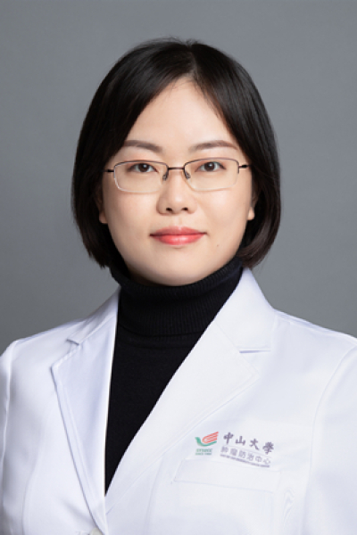

<!-- AUTO-GENERATED-BY: work/generate_obsidian_profiles.py -->

<!-- TEMPLATE: D:\workspace\信息收集整理\医生画像仓库\模板\医生画像模板.md -->

# 徐菲

## 基础信息

| 字段 | 内容 |
|---|---|
| 姓名 | 徐菲 |
| 医院 | 中山大学肿瘤防治中心 |
| 科室 | 内科 |
| 职称/身份 | 主任医师、硕士生导师 |
| 来源链接 | [官网原文](https://www.sysucc.org.cn/node/1496) |
| 采集日期 | 2026-08-10 |

## 简介/擅长

乳腺癌的诊疗及肿瘤抗癌新药研究。

## 教育与进修经历

- 2000年毕业于中山医科大学临床医学系，毕业后一直在中山大学附属肿瘤医院内科从事临床肿瘤诊疗工作，曾在香港威尔斯亲王医院临床肿瘤系工作学习。

## 可包装亮点

- 主任医师、硕士生导师 徐菲 职称：主任医师、硕士生导师 专长 乳腺癌的诊疗及肿瘤抗癌新药研究。
- 一、基本情况 专家门诊时间： 越秀院区：周二上午、周四上午 黄埔院区：周三下午、周五上午 肿瘤学博士，中国临床肿瘤学会（CSCO）青委会委员，广东省胸部肿瘤防治委员会乳腺癌专业委员会委员兼秘书长，中国南方肿瘤临床研究协会（CSWOG）青委会常委。
- 期间于2002年—2005年攻读肿瘤学研究生，于2006年—2008年攻读肿瘤学博士生 2012年—2013年：香港威尔斯亲王医院临床肿瘤系工作 2023年1月—至今：中山大学肿瘤防治中心，主任医师 三、学术兼职 中国临床肿瘤学会（CSCO）乳腺癌专委会委员 中国抗癌协会（CACA）乳腺肿瘤整合康复专委会委员 广东省抗癌协会化疗专业委员会常务委员 广东省癌…

## 重点疾病/人群标签

- 慢性病：
- 肿瘤：肿瘤、癌、化疗、乳腺癌、康复
- 生殖疾病：
- 免疫/风湿：
- 术后恢复/康复：肿瘤、癌、化疗、乳腺癌、康复
- 疑难重症：

## 证据摘录

> 只摘录官网公开信息中的短句或关键字段，不复制大段原文。

- 官网身份字段：主任医师、硕士生导师
- 官网简介/擅长：乳腺癌的诊疗及肿瘤抗癌新药研究。
- 官网亮眼经历线索：主任医师、硕士生导师 徐菲 职称：主任医师、硕士生导师 专长 乳腺癌的诊疗及肿瘤抗癌新药研究。 一、基本情况 专家门诊时间： 越秀院区：周二上午、周四上午 黄埔院区：周三下午、周五上午 肿瘤学博士，中国临床肿瘤学会（CSCO）青委会委员，广东省胸部肿瘤防治委员会乳腺癌专业委员会委员兼秘书长，中国南方肿瘤临床研究协会（CSWOG）青委会常委。 期间于2002年—2005年攻读肿瘤学研究生，于2006年—2008年攻读肿瘤学博士生 201…
- 异常提示：亮眼经历含导航文本，已清洗
- 来源链接：https://www.sysucc.org.cn/node/1496

## BD 画像摘要

徐菲医生可作为肿瘤、术后恢复/康复方向的基础画像候选。后续 BD 使用应继续以官网来源和人工复核为准，不添加疗效承诺或无来源包装。

## 合规边界

- 仅使用医院官网、官方公众号、官方小程序等公开渠道。
- 不采集私人电话、私人微信、家庭住址、患者隐私或非公开排班信息。
- 不写“保证治愈”“疗效第一”“包治疑难杂症”等无法由官网证明的表述。
