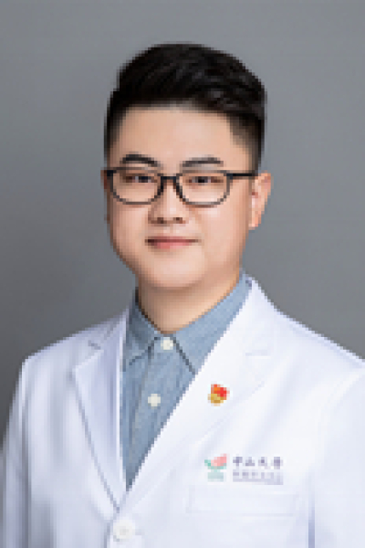

<!-- AUTO-GENERATED-BY: work/generate_obsidian_profiles.py -->

<!-- TEMPLATE: D:\workspace\信息收集整理\医生画像仓库\模板\医生画像模板.md -->

# 徐骋

## 基础信息

| 字段 | 内容 |
|---|---|
| 姓名 | 徐骋 |
| 医院 | 中山大学肿瘤防治中心 |
| 科室 | 放疗科 |
| 职称/身份 | 副主任医师 |
| 来源链接 | [官网原文](https://www.sysucc.org.cn/node/1716) |
| 采集日期 | 2026-08-10 |

## 简介/擅长

鼻咽癌、下咽癌、喉癌、牙龈癌、舌癌、扁桃体癌、鼻腔癌、口底癌等头颈肿瘤的放化疗综合治疗及免疫治疗

## 教育与进修经历

- 职称：副主任医师 专长 鼻咽癌、下咽癌、喉癌、牙龈癌、舌癌、扁桃体癌、鼻腔癌、口底癌等头颈肿瘤的放化疗综合治疗及免疫治疗 一、基本情况 职称：副主任医师 专家门诊时间：越秀院区（周四下午） 专业特长： 鼻咽癌、下咽癌、喉癌、牙龈癌、舌癌、扁桃体癌、鼻腔癌、口底癌等头颈肿瘤的放化疗综合治疗及免疫治疗 二、学习及工作经历 重庆渝北人，2010级中山大学临床医学八年制，2018年毕业于中山大学肿瘤防治中心，师从马骏教授。
- 毕业后留院工作至今。
- 加载更多 一、基本情况 职称：副主任医师 专家门诊时间：越秀院区（周四下午） 专业特长： 鼻咽癌、下咽癌、喉癌、牙龈癌、舌癌、扁桃体癌、鼻腔癌、口底癌等头颈肿瘤的放化疗综合治疗及免疫治疗 二、学习及工作经历 重庆渝北人，2010级中山大学临床医学八年制，2018年毕业于中山大学肿瘤防治中心，师从马骏教授。

## 科研项目与成果

- 三、主持科研项目 主持国家自然科学基金青年项目1项、广东省医学科研基金项目1项。

## 可包装亮点

- 副主任医师 徐骋 职称：副主任医师 专长 鼻咽癌、下咽癌、喉癌、牙龈癌、舌癌、扁桃体癌、鼻腔癌、口底癌等头颈肿瘤的放化疗综合治疗及免疫治疗 一、基本情况 职称：副主任医师 专家门诊时间：越秀院区（周四下午） 专业特长： 鼻咽癌、下咽癌、喉癌、牙龈癌、舌癌、扁桃体癌、鼻腔癌、口底癌等头颈肿瘤的放化疗综合治疗及免疫治疗 二、学习及工作经历 重庆渝北人，2010…
- 三、主持科研项目 主持国家自然科学基金青年项目1项、广东省医学科研基金项目1项。
- 一、基本情况 职称：副主任医师 专家门诊时间：越秀院区（周四下午） 专业特长： 鼻咽癌、下咽癌、喉癌、牙龈癌、舌癌、扁桃体癌、鼻腔癌、口底癌等头颈肿瘤的放化疗综合治疗及免疫治疗 二、学习及工作经历 重庆渝北人，2010级中山大...

## 重点疾病/人群标签

- 慢性病：
- 肿瘤：肿瘤、癌、放疗、化疗、鼻咽癌、免疫
- 生殖疾病：
- 免疫/风湿：肿瘤、癌、放疗、化疗、鼻咽癌、免疫
- 术后恢复/康复：
- 疑难重症：

## 证据摘录

> 只摘录官网公开信息中的短句或关键字段，不复制大段原文。

- 官网身份字段：副主任医师
- 官网简介/擅长：鼻咽癌、下咽癌、喉癌、牙龈癌、舌癌、扁桃体癌、鼻腔癌、口底癌等头颈肿瘤的放化疗综合治疗及免疫治疗
- 官网亮眼经历线索：副主任医师 徐骋 职称：副主任医师 专长 鼻咽癌、下咽癌、喉癌、牙龈癌、舌癌、扁桃体癌、鼻腔癌、口底癌等头颈肿瘤的放化疗综合治疗及免疫治疗 一、基本情况 职称：副主任医师 专家门诊时间：越秀院区（周四下午） 专业特长： 鼻咽癌、下咽癌、喉癌、牙龈癌、舌癌、扁桃体癌、鼻腔癌、口底癌等头颈肿瘤的放化疗综合治疗及免疫治疗 二、学习及工作经历 重庆渝北人，2010级中山大学临床医学八年制，2018年毕业于中山大学肿瘤防治中心，师从马骏教授…
- 异常提示：亮眼经历含导航文本，已清洗
- 来源链接：https://www.sysucc.org.cn/node/1716

## BD 画像摘要

徐骋医生可作为肿瘤、免疫/风湿/感染方向的基础画像候选。后续 BD 使用应继续以官网来源和人工复核为准，不添加疗效承诺或无来源包装。

## 合规边界

- 仅使用医院官网、官方公众号、官方小程序等公开渠道。
- 不采集私人电话、私人微信、家庭住址、患者隐私或非公开排班信息。
- 不写“保证治愈”“疗效第一”“包治疑难杂症”等无法由官网证明的表述。
