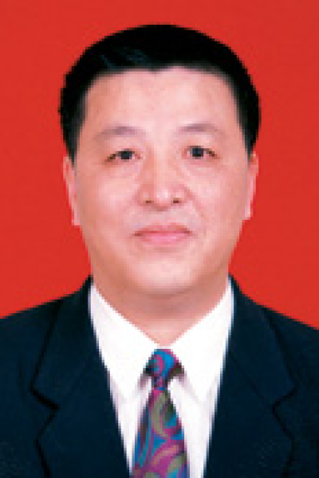

<!-- AUTO-GENERATED-BY: work/generate_obsidian_profiles.py -->

# 戎铁华

## 基础信息

| 字段 | 内容 |
|---|---|
| 医院 | 中山大学肿瘤防治中心 |
| 姓名 | 戎铁华 |
| 科室 | 胸科 |
| 职称/身份 | 教授、主任医师、博士生导师、肿瘤医院食管癌、肺癌资深首席专家 |
| 重点优先级 | 高 |
| 来源类型 | 医院官网 |
| 来源链接 | [官网原文](https://www.sysucc.org.cn/node/4663) |
| 采集日期 | 2026-08-10 |
| 复核状态 | 待人工复核 |
| 异常提示 |  |

## 简介/擅长

1. 食管癌手术治疗方法的改进; 2. 食管癌淋巴结转移规律的临床研究; 3. 食管癌淋巴结转移的分子生物学研究; 4. 食管癌个体化治疗方案的优化设计；均已取得阶段性成果。 获奖及荣誉： 1995年获国务院科技人员“政府特殊津贴”； 1996年获广东省白求恩医务工作者称号； 1998年科研成果“食管癌治疗新技术系列研究”获广东省重大科技进步三等奖及广东省医学卫生科学进步奖二等奖。 近五年所承担科研项目： （1）2006年 863重大专项 食管癌分子分型及个体化诊疗 分题：食管癌标本库建立及个体化治疗中分子标志物的筛查 （75万） 2006.12-2011.12 （2）2006年 863重大专项 肺癌分子分型及个体化诊疗 分题：多中心肺癌诊疗和随访研究 （35万） 2006.12-2011.12 发表论著 高水平收录论文（*表示通讯作者） [1] Zhang X , Lin P , Zhu ZH , Long H , Wen J , Yang H , Zhang X , Wang DF , Fu JH , Fang Y , Rong TH (*). Expression profiles of early esopha...

## 详情正文摘录

临床专家 面包屑 首页 / 临床科室 / 外科系列 / 胸科 / 临床专家 戎铁华 职称：教授、主任医师、博士生导师、肿瘤医院食管癌、肺癌资深首席专家 专长 胸部肿瘤外科治疗与临床研究，特别擅长食管肿瘤、肺肿瘤的外科治疗与研究 一、基本情况 职称：教授、主任医师、博士生导师 职务：食管癌、肺癌首席资深专家 专家门诊时间： 周三下午（单病种门诊）；周五上午 专业特长：胸部肿瘤外科治疗与临床研究，特别擅长食管肿瘤、肺肿瘤的外科治疗与研究。 二、学习及工作经历： 1965年—1970年：中山医学院就读 1970年至今：中山大学附属肿瘤医院工作，历任医师、讲师、副教授、教授及主任医师。 1991年—1992年：德国柏林HecKen Shown肺科医院做访问学者 加载更多 省级以上学术团体及国家级专业杂志任职情况： 中华医学会肿瘤学分会副主任委员（2007.1-2011.1） 中国医师协会胸外科医师分会副会长 中国抗癌协会食管癌专业委员会常务副主任委员、后任主任委员 广东省医学会理事会理事 广东省抗癌协会食管癌专业委员会名誉主任委员 广东省抗癌协会肺癌专业委员会顾问 广东省抗癌协会理事会理事 《癌症》杂志副主编 工作经历： 1970年毕业于中山医科大学临床医学系。在中山医科大学肿瘤医院从事胸部肿瘤外科临床研究与实践30余年，对胸部肿瘤如食管癌、肺癌、乳腺癌、纵隔肿瘤及胸壁巨大肿瘤等的诊断、外科手术及综合治疗有丰富的临床经验，尤其对食管癌的临床研究有更深的造诣。1991－1992年在德国柏林HecKen Shown肺科医院做访问学者。 分题主持国家恶性肿瘤九五攻关课题“广州越秀区恶性肿瘤病区防治研究”；主持卫生部课题“非小细胞肺癌纵隔淋巴清扫方法改进研究”；主持广东省科委课题“P53、PCNA、核仁旁小体等食管癌预后指标的研究”；还参与研究与食管癌、肺癌有关的多项省部级课题。 研究方向： 1. 食管癌手术治疗方法的改进; 2. 食管癌淋巴结转移规律的临床研究; 3. 食管癌淋巴结转移的分子生物学研究; 4. 食管癌个体化治疗方案的优化设计；均已取得阶段性成果。 获奖及荣誉： 19…

## 重点关注范围

- 肿瘤
- 术后恢复/康复

## 重点疾病标签

- 肿瘤
- 癌
- 瘤
- 肺癌
- 乳腺癌
- 术后

## 亮眼经历线索

- 教授、主任医师、博士生导师、肿瘤医院食管癌、肺癌资深首席专家 获奖及荣誉： 1995年获国务院科技人员“政府特殊津贴”；
- 1998年科研成果“食管癌治疗新技术系列研究”获广东省重大科技进步三等奖及广东省医学卫生科学进步奖二等奖。
- 近五年所承担科研项目： （1）2006年 863重大专项 食管癌分子分型及个体化诊疗 分题：食管癌标本库建立及个体化治疗中分子标志物的筛查 （75万） 2006.12-2011.12 （2）2006年 863重大专项 肺癌分子分型及个体化诊疗 分题：多中心肺癌诊疗和随访研究 （35万） 2006.12-2011.12 发表论著 高水平收录论文（*表示通讯作…

## 异常提示

## 合规边界

- 本画像仅整理统一总底表中的医院官网公开字段。
- 不包含患者评价、排名、第三方来源内容或疗效承诺。
- 官网未展示的信息保持空白，后续如需补充须回到底表官方来源字段。
