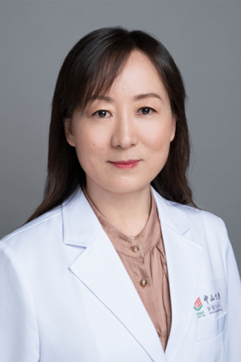

<!-- AUTO-GENERATED-BY: work/generate_obsidian_profiles.py -->

<!-- TEMPLATE: D:\workspace\信息收集整理\医生画像仓库\模板\医生画像模板.md -->

# 戴淑琴

## 基础信息

| 字段 | 内容 |
|---|---|
| 姓名 | 戴淑琴 |
| 医院 | 中山大学肿瘤防治中心 |
| 科室 | 检验科 |
| 职称/身份 | 科副主任 职称：主任技师 基本情况 主任技师，硕士生导师，检验科副主任，检验科输血科师生党支部书记。 学习及工作经历 青岛大学医学检验专业学士，中山大学免疫学专业硕士，中山大学生物与医药专业博士。2004年至今在中山大学肿瘤防治中心检验科工作。 专业特色 |
| 来源链接 | [官网原文](https://www.sysucc.org.cn/node/3875) |
| 采集日期 | 2026-08-10 |

## 简介/擅长

专业特色 擅长对影响检验数据准确性的因素进行临床研究，如标本溶血，药物交叉反应等导致的显著正向数据偏差，提出解决方案，提升检验准确性，推动行业技术进步。 体外诊断试剂的临床研究及其现场核查。

## 科研项目与成果

- 学术成果 中国发明专利：一种消除标本溶血所致血清神经特异性烯醇化酶检测阳性干扰的个体化纠正公式及其应用，专利号：ZL20211 0700925.7。

## 可包装亮点

- 科副主任 职称：主任技师 基本情况 主任技师，硕士生导师，检验科副主任，检验科输血科师生党支部书记。
- 戴淑琴 职务：科副主任 职称：主任技师 基本情况 主任技师，硕士生导师，检验科副主任，检验科输血科师生党支部书记。
- 临床研究伦理审查委员会委员。
- 学术成果 中国发明专利：一种消除标本溶血所致血清神经特异性烯醇化酶检测阳性干扰的个体化纠正公式及其应用，专利号：ZL20211 0700925.7。

## 重点疾病/人群标签

- 慢性病：
- 肿瘤：肿瘤、免疫
- 生殖疾病：
- 免疫/风湿：肿瘤、免疫
- 术后恢复/康复：
- 疑难重症：

## 证据摘录

> 只摘录官网公开信息中的短句或关键字段，不复制大段原文。

- 官网身份字段：科副主任 职称：主任技师 基本情况 主任技师，硕士生导师，检验科副主任，检验科输血科师生党支部书记。 学习及工作经历 青岛大学医学检验专业学士，中山大学免疫学专业硕士，中山大学生物与医药专业博士。2004年至今在中山大学肿瘤防治中心检验科…
- 官网简介/擅长：专业特色 擅长对影响检验数据准确性的因素进行临床研究，如标本溶血，药物交叉反应等导致的显著正向数据偏差，提出解决方案，提升检验准确性，推动行业技术进步。 体外诊断试剂的临床研究及其现场核查。
- 官网亮眼经历线索：科副主任 职称：主任技师 基本情况 主任技师，硕士生导师，检验科副主任，检验科输血科师生党支部书记。 戴淑琴 职务：科副主任 职称：主任技师 基本情况 主任技师，硕士生导师，检验科副主任，检验科输血科师生党支部书记。 临床研究伦理审查委员会委员。 学术成果 中国发明专利：一种消除标本溶血所致血清神经特异性烯醇化酶检测阳性干扰的个体化纠正公式及其应用，专利号：ZL20211 0700925.7。
- 异常提示：亮眼经历含导航文本，已清洗
- 来源链接：https://www.sysucc.org.cn/node/3875

## BD 画像摘要

戴淑琴医生可作为肿瘤、免疫/风湿/感染方向的基础画像候选。后续 BD 使用应继续以官网来源和人工复核为准，不添加疗效承诺或无来源包装。

## 合规边界

- 仅使用医院官网、官方公众号、官方小程序等公开渠道。
- 不采集私人电话、私人微信、家庭住址、患者隐私或非公开排班信息。
- 不写“保证治愈”“疗效第一”“包治疑难杂症”等无法由官网证明的表述。
