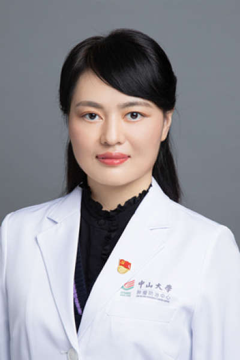

<!-- AUTO-GENERATED-BY: work/generate_obsidian_profiles.py -->

# 文习之

## 基础信息

| 字段 | 内容 |
|---|---|
| 医院 | 中山大学肿瘤防治中心 |
| 姓名 | 文习之 |
| 科室 | 生物治疗中心 |
| 职称/身份 | 副主任医师 |
| 重点优先级 | 高 |
| 来源类型 | 医院官网 |
| 来源链接 | [官网原文](https://www.sysucc.org.cn/node/3791) |
| 采集日期 | 2026-08-10 |
| 复核状态 | 待人工复核 |
| 异常提示 |  |

## 简介/擅长

黑色素瘤及肉瘤内科治疗，肿瘤免疫治疗 职称： 副主任医师 专业方向： 黑色素瘤及肉瘤内科治疗，肿瘤免疫治疗 主要学习经历 2003年8月至2010年6月，华中科技大学同济医学院临床医学七年制，获临床医学学士及硕士学位 2013年8月至2017年6月，中山大学肿瘤防治中心，获临床医学（肿瘤学）博士学位 主要工作经历 2010年8月至2015年12月，中山大学肿瘤防治中心，住院医师 2016年1月至2020年12月，中山大学肿瘤防治中心，主治医师 2021年1月至今，中山大学肿瘤防治中心，副主任医师 加载更多 职称： 副主任医师 专业方向： 黑色素瘤及肉瘤内科治疗，肿瘤免疫治疗 主要学习经历 2003年8月至2010年6月，华中科技大学同济医学院临床医学七年制，获临床医学学士及硕士学位 2013年8月至2017年6月，中山大学肿瘤防治中心，获临床医学（肿瘤学）博士学位 主要工作经历 2010年8月至2015年12月，中山大学肿瘤防治中心，住院医师 2016年1月至2020年12月，中山大学肿瘤防治中心，主治医师 2021年1月至今，中山大学肿瘤防治中心，副主任医师 更新日期：2021年11月2日

## 详情正文摘录

临床专家 面包屑 首页 / 临床科室 / 内科系列 / 生物治疗中心 / 临床专家 文习之 职称：副主任医师 专长 黑色素瘤及肉瘤内科治疗，肿瘤免疫治疗 职称： 副主任医师 专业方向： 黑色素瘤及肉瘤内科治疗，肿瘤免疫治疗 主要学习经历 2003年8月至2010年6月，华中科技大学同济医学院临床医学七年制，获临床医学学士及硕士学位 2013年8月至2017年6月，中山大学肿瘤防治中心，获临床医学（肿瘤学）博士学位 主要工作经历 2010年8月至2015年12月，中山大学肿瘤防治中心，住院医师 2016年1月至2020年12月，中山大学肿瘤防治中心，主治医师 2021年1月至今，中山大学肿瘤防治中心，副主任医师 加载更多 职称： 副主任医师 专业方向： 黑色素瘤及肉瘤内科治疗，肿瘤免疫治疗 主要学习经历 2003年8月至2010年6月，华中科技大学同济医学院临床医学七年制，获临床医学学士及硕士学位 2013年8月至2017年6月，中山大学肿瘤防治中心，获临床医学（肿瘤学）博士学位 主要工作经历 2010年8月至2015年12月，中山大学肿瘤防治中心，住院医师 2016年1月至2020年12月，中山大学肿瘤防治中心，主治医师 2021年1月至今，中山大学肿瘤防治中心，副主任医师 更新日期：2021年11月2日

## 重点关注范围

- 肿瘤
- 免疫/风湿/感染

## 重点疾病标签

- 肿瘤
- 瘤
- 免疫

## 亮眼经历线索

- 副主任医师 黑色素瘤及肉瘤内科治疗，肿瘤免疫治疗 职称： 副主任医师 专业方向： 黑色素瘤及肉瘤内科治疗，肿瘤免疫治疗 主要学习经历 2003年8月至2010年6月，华中科技大学同济医学院临床医学七年制，获临床医学学士及硕士学位 2013年8月至2017年6月，中山大学肿瘤防治中心，获临床医学（肿瘤学）博士学位 主要工作经历 2010年8月至2015年12…

## 异常提示

## 合规边界

- 本画像仅整理统一总底表中的医院官网公开字段。
- 不包含患者评价、排名、第三方来源内容或疗效承诺。
- 官网未展示的信息保持空白，后续如需补充须回到底表官方来源字段。
