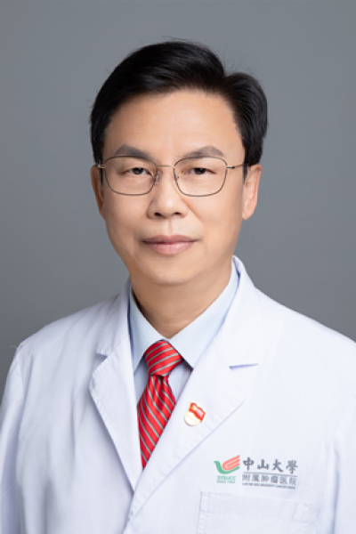

<!-- AUTO-GENERATED-BY: work/generate_obsidian_profiles.py -->

<!-- TEMPLATE: D:\workspace\信息收集整理\医生画像仓库\模板\医生画像模板.md -->

# 曹卡加

## 基础信息

| 字段 | 内容 |
|---|---|
| 姓名 | 曹卡加 |
| 医院 | 中山大学肿瘤防治中心 |
| 科室 | 鼻咽科 |
| 职称/身份 | 主任医师，硕士导师 |
| 来源链接 | [官网原文](https://www.sysucc.org.cn/node/1527) |
| 采集日期 | 2026-08-10 |

## 简介/擅长

肿瘤的放射治疗，尤其擅长鼻咽癌和肺癌的治疗。

## 教育与进修经历

- 一、基本情况 职称：主任医师，硕士生导师 专家门诊时间： 星期一、四、五上午 专业特长：恶性肿瘤的放射治疗，特别擅长鼻咽癌的诊断和治疗 二、学习及工作经历： 1975年—1977年：赤脚医生 1977年—1982年：中山医学院本科 1982年—1985年：广东省江门市中心医院工作 1985年—1988年：中山医科大学硕士 1999年—2000年：法国巴黎第十二大学HENRI MONDOR医院留学 1988年至今：中山大学肿瘤防治中心工作 加载更多 专业特长 1、鼻咽癌的诊断和综合治疗 2、肿瘤流行病学 社会任职…

## 可包装亮点

- 主任医师，硕士导师 曹卡加 职称：主任医师，硕士导师 专长 肿瘤的放射治疗，尤其擅长鼻咽癌和肺癌的治疗。
- 一、基本情况 职称：主任医师，硕士生导师 专家门诊时间： 星期一、四、五上午 专业特长：恶性肿瘤的放射治疗，特别擅长鼻咽癌的诊断和治疗 二、学习及工作经历： 1975年—1977年：赤脚医生 1977年—1982年：中山医学院本科 1982年—1985年：广东省江门市中心医院工作 1985年—1988年：中山医科大学硕士 1999年—2000年：法国巴黎第…

## 重点疾病/人群标签

- 慢性病：慢性、肿瘤、癌、瘤、淋巴瘤、放疗、化疗、鼻咽癌、肺癌、肠癌、乳腺癌、术后
- 肿瘤：慢性、肿瘤、癌、瘤、淋巴瘤、放疗、化疗、鼻咽癌、肺癌、肠癌、乳腺癌、术后
- 生殖疾病：
- 免疫/风湿：
- 术后恢复/康复：慢性、肿瘤、癌、瘤、淋巴瘤、放疗、化疗、鼻咽癌、肺癌、肠癌、乳腺癌、术后
- 疑难重症：

## 证据摘录

> 只摘录官网公开信息中的短句或关键字段，不复制大段原文。

- 官网身份字段：主任医师，硕士导师
- 官网简介/擅长：肿瘤的放射治疗，尤其擅长鼻咽癌和肺癌的治疗。
- 官网亮眼经历线索：主任医师，硕士导师 曹卡加 职称：主任医师，硕士导师 专长 肿瘤的放射治疗，尤其擅长鼻咽癌和肺癌的治疗。 一、基本情况 职称：主任医师，硕士生导师 专家门诊时间： 星期一、四、五上午 专业特长：恶性肿瘤的放射治疗，特别擅长鼻咽癌的诊断和治疗 二、学习及工作经历： 1975年—1977年：赤脚医生 1977年—1982年：中山医学院本科 1982年—1985年：广东省江门市中心医院工作 1985年—1988年：中山医科大学硕士 1999…
- 异常提示：亮眼经历含导航文本，已清洗
- 来源链接：https://www.sysucc.org.cn/node/1527

## BD 画像摘要

曹卡加医生可作为慢性病、肿瘤、术后恢复/康复方向的基础画像候选。后续 BD 使用应继续以官网来源和人工复核为准，不添加疗效承诺或无来源包装。

## 合规边界

- 仅使用医院官网、官方公众号、官方小程序等公开渠道。
- 不采集私人电话、私人微信、家庭住址、患者隐私或非公开排班信息。
- 不写“保证治愈”“疗效第一”“包治疑难杂症”等无法由官网证明的表述。
