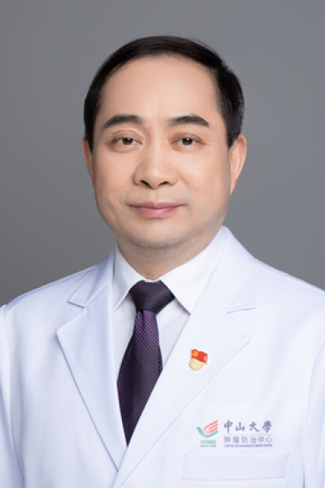

<!-- AUTO-GENERATED-BY: work/generate_obsidian_profiles.py -->

# 李俊东

## 基础信息

| 字段 | 内容 |
|---|---|
| 医院 | 中山大学肿瘤防治中心 |
| 姓名 | 李俊东 |
| 科室 | 妇科 |
| 职称/身份 | 科主任，党支部书记 职称：教授、主任医师，博士生导师，卵巢癌大PI |
| 重点优先级 | 高 |
| 来源类型 | 医院官网 |
| 来源链接 | [官网原文](https://www.sysucc.org.cn/node/3692) |
| 采集日期 | 2026-08-10 |
| 复核状态 | 待人工复核 |
| 异常提示 |  |

## 简介/擅长

擅长各种妇科肿瘤的微创手术（包括达芬奇机器人手术等）及疑难病例的多学科协作手术。致力卵巢癌单病种多学科协作（MDT）临床和科研工作。 主攻方向：卵巢癌、子宫内膜癌等妇科恶性肿瘤的诊治、临床研究。主攻卵巢癌耐药研究。 教育经历 1991年毕业于中山医科大学医疗系临床医疗专业，获学士学位； 1999年6月获中山大学肿瘤学硕士学位； 主要工作经历 1991年至今在中山大学肿瘤防治中心妇科从事妇科肿瘤临床及研究工作 2002年7月-9月在中山大学第一附属医院进行腹腔镜技术培训学习 2004年7月至12月作为访问学者赴香港大学玛丽医院进行妇科肿瘤临床工作 2006年10月至2020年6月任中山大学肿瘤防治中心妇科副主任 2007年9月至今任中山大学肿瘤防治中心妇科党支部书记 2014年9月至2016年3月到新疆医科大学附属肿瘤医院妇科进行援疆工作，任妇外一科主任 2016年6月起聘任新疆医科大学聘为肿瘤学专业学位博士生导师 2020年7月任至今任中山大学肿瘤防治中心妇科主任 2020年10月至今聘任中山大学肿瘤学专业型博士生导师 代表性文章和学术奖励情况 Yang D, Duan MH, Yuan QE, Li ZL, Luo ...

## 详情正文摘录

长期从事妇科肿瘤（卵巢癌、子宫内膜癌、子宫颈癌等）的诊治和科研工作，卵巢癌大PI，2017年6月起在国内率先开展卵巢癌单病种MDT联合

## 重点关注范围

- 肿瘤
- 生殖疾病
- 疑难重症

## 重点疾病标签

- 肿瘤
- 癌
- 化疗
- 卵巢
- 疑难
- 多学科
- MDT

## 亮眼经历线索

- 科主任，党支部书记 职称：教授、主任医师，博士生导师，卵巢癌大PI 擅长各种妇科肿瘤的微创手术（包括达芬奇机器人手术等）及疑难病例的多学科协作手术。
- 致力卵巢癌单病种多学科协作（MDT）临床和科研工作。
- 主要工作经历 1991年至今在中山大学肿瘤防治中心妇科从事妇科肿瘤临床及研究工作 2002年7月-9月在中山大学第一附属医院进行腹腔镜技术培训学习 2004年7月至12月作为访问学者赴香港大学玛丽医院进行妇科肿瘤临床工作 2006年10月至2020年6月任中山大学肿瘤防治中心妇科副主任 2007年9月至今任中山大学肿瘤防治中心妇科党支部书记 2014年9月…

## 异常提示

## 合规边界

- 本画像仅整理统一总底表中的医院官网公开字段。
- 不包含患者评价、排名、第三方来源内容或疗效承诺。
- 官网未展示的信息保持空白，后续如需补充须回到底表官方来源字段。
