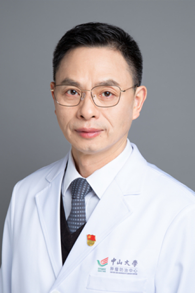

<!-- AUTO-GENERATED-BY: work/generate_obsidian_profiles.py -->

<!-- TEMPLATE: D:\workspace\信息收集整理\医生画像仓库\模板\医生画像模板.md -->

# 李升平

## 基础信息

| 字段 | 内容 |
|---|---|
| 姓名 | 李升平 |
| 医院 | 中山大学肿瘤防治中心 |
| 科室 | 胰胆外科 |
| 职称/身份 | 科主任导师 职称：教授，主任医师，博士生导师，胰腺癌首席专家 |
| 来源链接 | [官网原文](https://www.sysucc.org.cn/node/3649) |
| 采集日期 | 2026-08-10 |

## 简介/擅长

对胆道、胰腺及肝脏肿瘤的外科手术、纳米刀消融、微创介入及综合治疗具有丰富的临床经验，尤其擅长胆管癌及胆囊癌的根治性切除；各种胆道重建及体内外引流手术；胰头及壶腹周围癌的胰十二指肠根治性切除及扩大淋巴结清扫术；局部晚期胰腺癌的纳米刀消融术。

## 教育与进修经历

- 二、学习及工作经历 1981年-1986年：南华大学医学院医疗系 医学学士 1986年-1988年：南华大学附属第二医院外科 工作 1988年-1991年：中山医科大学附属第一医院肝胆外科 医学硕士 1991年-1995年：广州市第一人民医院外科 工作 1995年-1998年：中山医科大学附属第一医院胃肠胰外科 医学博士 1998年-2000年：中山大学附属肿瘤医院 工作 2001年-2003年：美国Michigan大学癌症中心 博士后研究员 2004年-至今：中山大学附属肿瘤医院 工作 2009年-2019年：…

## 科研项目与成果

- 应用纳米刀治疗局部进展期胰腺癌在基础和临床研究领域都取得了一系列的成果。

## 可包装亮点

- 科主任导师 职称：教授，主任医师，博士生导师，胰腺癌首席专家 李升平 职务：科主任导师 职称：教授，主任医师，博士生导师，胰腺癌首席专家 专长 对胆道、胰腺及肝脏肿瘤的外科手术、纳米刀消融、微创介入及综合治疗具有丰富的临床经验，尤其擅长胆管癌及胆囊癌的根治性切除；
- 一、基本情况 职务： 科主任导师 职称： 教授，主任医师，博士生导师，胰腺癌首席专家 门诊： 越秀：周一上午；

## 重点疾病/人群标签

- 慢性病：
- 肿瘤：肿瘤、癌、瘤、放疗、化疗、靶向、肝癌、免疫、多学科、MDT
- 生殖疾病：
- 免疫/风湿：肿瘤、癌、瘤、放疗、化疗、靶向、肝癌、免疫、多学科、MDT
- 术后恢复/康复：
- 疑难重症：肿瘤、癌、瘤、放疗、化疗、靶向、肝癌、免疫、多学科、MDT

## 证据摘录

> 只摘录官网公开信息中的短句或关键字段，不复制大段原文。

- 官网身份字段：科主任导师 职称：教授，主任医师，博士生导师，胰腺癌首席专家
- 官网简介/擅长：对胆道、胰腺及肝脏肿瘤的外科手术、纳米刀消融、微创介入及综合治疗具有丰富的临床经验，尤其擅长胆管癌及胆囊癌的根治性切除；各种胆道重建及体内外引流手术；胰头及壶腹周围癌的胰十二指肠根治性切除及扩大淋巴结清扫术；局部晚期胰腺癌的纳米刀消融术。
- 官网亮眼经历线索：科主任导师 职称：教授，主任医师，博士生导师，胰腺癌首席专家 李升平 职务：科主任导师 职称：教授，主任医师，博士生导师，胰腺癌首席专家 专长 对胆道、胰腺及肝脏肿瘤的外科手术、纳米刀消融、微创介入及综合治疗具有丰富的临床经验，尤其擅长胆管癌及胆囊癌的根治性切除； 一、基本情况 职务： 科主任导师 职称： 教授，主任医师，博士生导师，胰腺癌首席专家 门诊： 越秀：周一上午；
- 异常提示：亮眼经历含导航文本，已清洗
- 来源链接：https://www.sysucc.org.cn/node/3649

## BD 画像摘要

李升平医生可作为肿瘤、免疫/风湿/感染、疑难重症方向的基础画像候选。后续 BD 使用应继续以官网来源和人工复核为准，不添加疗效承诺或无来源包装。

## 合规边界

- 仅使用医院官网、官方公众号、官方小程序等公开渠道。
- 不采集私人电话、私人微信、家庭住址、患者隐私或非公开排班信息。
- 不写“保证治愈”“疗效第一”“包治疑难杂症”等无法由官网证明的表述。
