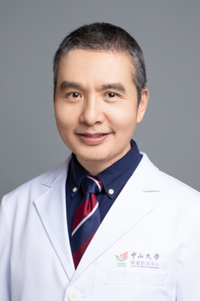

<!-- AUTO-GENERATED-BY: work/generate_obsidian_profiles.py -->

# 李小东

## 基础信息

| 字段 | 内容 |
|---|---|
| 医院 | 中山大学肿瘤防治中心 |
| 姓名 | 李小东 |
| 科室 | 胸科 |
| 职称/身份 | 副教授、副主任医师、肿瘤学博士 |
| 重点优先级 | 高 |
| 来源类型 | 医院官网 |
| 来源链接 | [官网原文](https://www.sysucc.org.cn/node/3622) |
| 采集日期 | 2026-08-10 |
| 复核状态 | 待人工复核 |
| 异常提示 |  |

## 简介/擅长

肺癌、食管癌和纵隔肿瘤的外科技术、标准及个体化治疗 加载更多 学术兼职： 国家自然科学基金委、评审专家 学习工作经历： 工作于中山大学肿瘤防治中心胸科、华南肿瘤学国家重点实验室。 学习经历 ：1994年毕业于上海医科大学（现复旦大学医学院），获学士学位；1999年获中山医科大学（现中山大学医学部）肿瘤学硕士学位，2004年获中山大学肿瘤学博士学位。 工作经历 ：1999年至今：一直在中山大学肿瘤防治中心胸科，主要研究方向是胸部肿瘤外科治疗及肿瘤病因学研究。 学术交流 ：2003年并在中国医学科学院分子肿瘤学国家重点实验室进行分子生物学学习和工作，2007年在耶鲁大学和佛罗里达大学开展博士后研究。熟悉细胞培养，荧光定量RT-PCR，Northern blot，SSCP，LOH以及转染等一系列实验技能。主持和参加过多项国家和省级科研课题。目前是国家自然科学基金评委。 主要研究方向/专长： 肺癌、食管癌和纵隔肿瘤的外科技术、标准及个体化治疗 承担科研课题情况： 1、5q23.1-q23.2区域食管癌相关基因的筛选和初步鉴定(第一负责人 国家自然科学基金（2007－2009） 项目编号：30600731) 2、5q23.1-2...

## 详情正文摘录

临床专家 面包屑 首页 / 临床科室 / 外科系列 / 胸科 / 临床专家 李小东 职称：副教授、副主任医师、肿瘤学博士 专长 肺癌、食管癌和纵隔肿瘤的外科技术、标准及个体化治疗 学习经历：1994年毕业于上海医科大学（现复旦大学医学院），获学士学位；1999年获中山医科大学（现中山大学医学部）肿瘤学硕士学位，2004年获中山大学肿瘤学博士学位。 工作经历：1999年至今：一直在中山大学肿瘤防治中心胸科，主要研究方向是胸部肿瘤外科治疗及肿瘤病因学研究。 专长： 肺癌、食管癌和纵隔肿瘤的外科技术、标准及个体化治疗 加载更多 学术兼职： 国家自然科学基金委、评审专家 学习工作经历： 工作于中山大学肿瘤防治中心胸科、华南肿瘤学国家重点实验室。 学习经历 ：1994年毕业于上海医科大学（现复旦大学医学院），获学士学位；1999年获中山医科大学（现中山大学医学部）肿瘤学硕士学位，2004年获中山大学肿瘤学博士学位。 工作经历 ：1999年至今：一直在中山大学肿瘤防治中心胸科，主要研究方向是胸部肿瘤外科治疗及肿瘤病因学研究。 学术交流 ：2003年并在中国医学科学院分子肿瘤学国家重点实验室进行分子生物学学习和工作，2007年在耶鲁大学和佛罗里达大学开展博士后研究。熟悉细胞培养，荧光定量RT-PCR，Northern blot，SSCP，LOH以及转染等一系列实验技能。主持和参加过多项国家和省级科研课题。目前是国家自然科学基金评委。 主要研究方向/专长： 肺癌、食管癌和纵隔肿瘤的外科技术、标准及个体化治疗 承担科研课题情况： 1、5q23.1-q23.2区域食管癌相关基因的筛选和初步鉴定(第一负责人 国家自然科学基金（2007－2009） 项目编号：30600731) 2、5q23.1-23.2区域食管癌抑癌基因的筛选和鉴定第一负责人 广东省自然科学基金项目编号：04009346） 3、5q23.1-q23.2区域食管癌相关基因的筛选和初步鉴定(分题负责人中山大学985二期工程) 4、肺癌早期诊断技术与方法的研究 （第一负责人 国家十五重大科技攻关分题 项目编号：2001BA703…

## 重点关注范围

- 肿瘤
- 术后恢复/康复

## 重点疾病标签

- 肿瘤
- 癌
- 肺癌
- 乳腺癌
- 术后

## 亮眼经历线索

- 副教授、副主任医师、肿瘤学博士 肺癌、食管癌和纵隔肿瘤的外科技术、标准及个体化治疗 加载更多 学术兼职： 国家自然科学基金委、评审专家 学习工作经历： 工作于中山大学肿瘤防治中心胸科、华南肿瘤学国家重点实验室。
- 目前是国家自然科学基金评委。
- 主要研究方向/专长： 肺癌、食管癌和纵隔肿瘤的外科技术、标准及个体化治疗 承担科研课题情况： 1、5q23.1-q23.2区域食管癌相关基因的筛选和初步鉴定(第一负责人 国家自然科学基金（2007－2009） 项目编号：30600731) 2、5q23.1-23.2区域食管癌抑癌基因的筛选和鉴定第一负责人 广东省自然科学基金项目编号：04009346） 3…

## 异常提示

## 合规边界

- 本画像仅整理统一总底表中的医院官网公开字段。
- 不包含患者评价、排名、第三方来源内容或疗效承诺。
- 官网未展示的信息保持空白，后续如需补充须回到底表官方来源字段。
