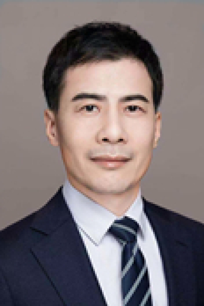

<!-- AUTO-GENERATED-BY: work/generate_obsidian_profiles.py -->

<!-- TEMPLATE: D:\workspace\信息收集整理\医生画像仓库\模板\医生画像模板.md -->

# 李强

## 基础信息

| 字段 | 内容 |
|---|---|
| 姓名 | 李强 |
| 医院 | 中山大学肿瘤防治中心 |
| 科室 | 手术麻醉科 |
| 职称/身份 | 主任医师 |
| 来源链接 | [官网原文](https://www.sysucc.org.cn/node/3820) |
| 采集日期 | 2026-08-10 |

## 简介/擅长

围术期危重病人的诊疗及疼痛管理 加载更多

## 可包装亮点

- 主任医师 围术期危重病人的诊疗及疼痛管理 李强 职称：主任医师 专长 围术期危重病人的诊疗及疼痛管理

## 重点疾病/人群标签

- 慢性病：
- 肿瘤：肿瘤、疼痛、危重
- 生殖疾病：
- 免疫/风湿：
- 术后恢复/康复：肿瘤、疼痛、危重
- 疑难重症：肿瘤、疼痛、危重

## 证据摘录

> 只摘录官网公开信息中的短句或关键字段，不复制大段原文。

- 官网身份字段：主任医师
- 官网简介/擅长：围术期危重病人的诊疗及疼痛管理 加载更多
- 官网亮眼经历线索：主任医师 围术期危重病人的诊疗及疼痛管理 李强 职称：主任医师 专长 围术期危重病人的诊疗及疼痛管理
- 异常提示：亮眼经历含导航文本，已清洗
- 来源链接：https://www.sysucc.org.cn/node/3820

## BD 画像摘要

李强医生可作为肿瘤、术后恢复/康复、疑难重症方向的基础画像候选。后续 BD 使用应继续以官网来源和人工复核为准，不添加疗效承诺或无来源包装。

## 合规边界

- 仅使用医院官网、官方公众号、官方小程序等公开渠道。
- 不采集私人电话、私人微信、家庭住址、患者隐私或非公开排班信息。
- 不写“保证治愈”“疗效第一”“包治疑难杂症”等无法由官网证明的表述。
