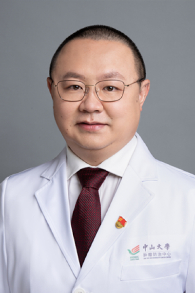

<!-- AUTO-GENERATED-BY: work/generate_obsidian_profiles.py -->

<!-- TEMPLATE: D:\workspace\信息收集整理\医生画像仓库\模板\医生画像模板.md -->

# 李志铭

## 基础信息

| 字段 | 内容 |
|---|---|
| 姓名 | 李志铭 |
| 医院 | 中山大学肿瘤防治中心 |
| 科室 | 内科 |
| 职称/身份 | 科秘书 职称：教授、博士生导师 |
| 来源链接 | [官网原文](https://www.sysucc.org.cn/node/1483) |
| 采集日期 | 2026-08-10 |

## 简介/擅长

主要擅长淋巴瘤等实体肿瘤的内科治疗。

## 教育与进修经历

- 二、学习及工作经历： 1992年—1997年：中山医科大学本科 1997年—2002年：中山大学附属肿瘤医院硕博连读 2002年—2004年：中山大学附属肿瘤医院博士后 2004年至今：中山大学附属肿瘤医院工作 2011年—2012年：南瑞士肿瘤研究所访问学者 加载更多 1997年毕业于中山医科大学临床医学本科，2002年获中山大学肿瘤学博士学位，2004年中山大学博士后出站。
- 承担国家自然科学基金、中国博士后基金、广东省自然科学基金等课题，参与主编《肿瘤生物治疗学》。

## 科研项目与成果

- 承担国家自然科学基金、中国博士后基金、广东省自然科学基金等课题，参与主编《肿瘤生物治疗学》。
- 门诊时间： 周一下午、周五上午 获得主要科研基金： 1. BAFF/NF-κB/Bcl-xL通路诱导弥漫大B细胞性淋巴瘤对抗CD20单抗联合化疗的方案耐药的机制及干预研究。
- 国家自然科学基金, 2011-2013, 81071950，课题负责人 2. Bcl-xL抑制剂左旋棉酚抗非霍奇金淋巴瘤的实验研究。
- 国家自然科学基金, 2005-2007, 30400589，课题负责人 3. PLGA纳米粒子介导RNA干扰抗套细胞淋巴瘤的实验研究。

## 论文与学术产出

- 承担国家自然科学基金、中国博士后基金、广东省自然科学基金等课题，参与主编《肿瘤生物治疗学》。

## 可包装亮点

- 科秘书 职称：教授、博士生导师 李志铭 职务：科秘书 职称：教授、博士生导师 专长 主要擅长淋巴瘤等实体肿瘤的内科治疗。
- 二、学习及工作经历： 1992年—1997年：中山医科大学本科 1997年—2002年：中山大学附属肿瘤医院硕博连读 2002年—2004年：中山大学附属肿瘤医院博士后 2004年至今：中山大学附属肿瘤医院工作 2011年—2012年：南瑞士肿瘤研究所访问学者 1997年毕业于中山医科大学临床医学本科，2002年获中山大学肿瘤学博士学位，2004年中山大学…
- 现任中国抗癌协会淋巴瘤专业委员会秘书和广东省抗癌协会化疗专业委员会秘书。

## 重点疾病/人群标签

- 慢性病：
- 肿瘤：肿瘤、癌、瘤、淋巴瘤、化疗、靶向、鼻咽癌、免疫
- 生殖疾病：
- 免疫/风湿：肿瘤、癌、瘤、淋巴瘤、化疗、靶向、鼻咽癌、免疫
- 术后恢复/康复：
- 疑难重症：

## 证据摘录

> 只摘录官网公开信息中的短句或关键字段，不复制大段原文。

- 官网身份字段：科秘书 职称：教授、博士生导师
- 官网简介/擅长：主要擅长淋巴瘤等实体肿瘤的内科治疗。
- 官网亮眼经历线索：科秘书 职称：教授、博士生导师 李志铭 职务：科秘书 职称：教授、博士生导师 专长 主要擅长淋巴瘤等实体肿瘤的内科治疗。 二、学习及工作经历： 1992年—1997年：中山医科大学本科 1997年—2002年：中山大学附属肿瘤医院硕博连读 2002年—2004年：中山大学附属肿瘤医院博士后 2004年至今：中山大学附属肿瘤医院工作 2011年—2012年：南瑞士肿瘤研究所访问学者 1997年毕业于中山医科大学临床医学本科，2002年获…
- 异常提示：亮眼经历含导航文本，已清洗
- 来源链接：https://www.sysucc.org.cn/node/1483

## BD 画像摘要

李志铭医生可作为肿瘤、免疫/风湿/感染方向的基础画像候选。后续 BD 使用应继续以官网来源和人工复核为准，不添加疗效承诺或无来源包装。

## 合规边界

- 仅使用医院官网、官方公众号、官方小程序等公开渠道。
- 不采集私人电话、私人微信、家庭住址、患者隐私或非公开排班信息。
- 不写“保证治愈”“疗效第一”“包治疑难杂症”等无法由官网证明的表述。
