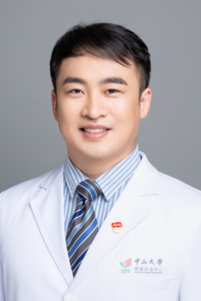

<!-- AUTO-GENERATED-BY: work/generate_obsidian_profiles.py -->

# 李欢

## 基础信息

| 字段 | 内容 |
|---|---|
| 医院 | 中山大学肿瘤防治中心 |
| 姓名 | 李欢 |
| 科室 | 重症医学科 |
| 职称/身份 | 重症医学科主任兼医院感染管理科科长 职称：副主任医师 教育背景： 2006.09-2011.06 中山大学中山医学院 临床医学学士 2011.09-2014.06 中山大学肿瘤防治中心 临床医学硕士 2019.09-2023.06 中山大学肿瘤防治中心 临床医学博士 工作背景： 2014.07-2017.12 中山大学肿瘤防治中心 住院医师 2018.01-2021-12 中山大学肿瘤防治中心 主治医师 2020.08-2022.05 中山大学肿瘤防治中心 医院感染管理科 副科长 2022.01-至今 中山大学肿瘤防治中心 副主任医师 2022.06-2026.05 中山大学肿瘤防治中心 医院感染管理科 科长 2026.06-至今 重症医学科主任兼医院感染管理科科长 学术研究： 近年来围绕肿瘤基础、临床相关研究，以及重症感染临床诊治经验先后在 《Nature Reviews Disease Primers》、《Leukemia 》、《Frontiers In Immunology》、《Journal of Experimental &Clinical Cancer Researc... |
| 重点优先级 | 高 |
| 来源类型 | 医院官网 |
| 来源链接 | [官网原文](https://www.sysucc.org.cn/node/12823) |
| 采集日期 | 2026-08-10 |
| 复核状态 | 待人工复核 |
| 异常提示 |  |

## 简介/擅长

重症医学科主任兼医院感染管理科科长 职称：副主任医师 教育背景： 2006.09-2011.06 中山大学中山医学院 临床医学学士 2011.09-2014.06 中山大学肿瘤防治中心 临床医学硕士 2019.09-2023.06 中山大学肿瘤防治中心 临床医学博士 工作背景： 2014.07-2017.12 中山大学肿瘤防治中心 住院医师 2018.01-2021-12 中山大学肿瘤防治中心 主治医师 2020.08-2022.05 中山大学肿瘤防治中心 医院感染管理科 副科长 2022.01-至今 中山大学肿瘤防治中心 副主任医师 2022.06-2026.05 中山大学肿瘤防治中心 医院感染管理科 科长 2026.06-至今 重症医学科主任兼医院感染管理科科长 学术研究： 近年来围绕肿瘤基础、临床相关研究，以及重症感染临床诊治经验先后在 《Nature Reviews Disease Primers》、《Leukemia 》、《Frontiers In Immunology》、《Journal of Experimental &Clinical Cancer Research》、《Molecular Oncolo...

## 详情正文摘录

临床专家 面包屑 首页 / 临床科室 / 平台科室 / 重症医学科 / 临床专家 李欢 职务：重症医学科主任兼医院感染管理科科长 职称：副主任医师 教育背景： 2006.09-2011.06 中山大学中山医学院 临床医学学士 2011.09-2014.06 中山大学肿瘤防治中心 临床医学硕士 2019.09-2023.06 中山大学肿瘤防治中心 临床医学博士 工作背景： 2014.07-2017.12 中山大学肿瘤防治中心 住院医师 2018.01-2021-12 中山大学肿瘤防治中心 主治医师 2020.08-2022.05 中山大学肿瘤防治中心 医院感染管理科 副科长 2022.01-至今 中山大学肿瘤防治中心 副主任医师 2022.06-2026.05 中山大学肿瘤防治中心 医院感染管理科 科长 2026.06-至今 重症医学科主任兼医院感染管理科科长 学术研究： 近年来围绕肿瘤基础、临床相关研究，以及重症感染临床诊治经验先后在 《Nature Reviews Disease Primers》、《Leukemia 》、《Frontiers In Immunology》、《Journal of Experimental &Clinical Cancer Research》、《Molecular Oncology》和《Journal of translational medicine》 等期刊发表 SCI 论文 40 篇，其中 IF＞10 者 5篇，单篇最高影响因子 81。其中2篇关于糖皮质激素和JAK抑制剂在COVID-19诊疗过程中的研究论文入选“SCI高被引论文”。曾主持广东省医学科学基金1项，参与国家自然科学基金3项。 Li H, Hu F, Gale RP, Sekeres MA, Liang Y. Myelodysplastic syndromes. Nat Rev Dis Primers. 2022 Nov 17;8(1):74. （第一作者，IF:81.5） Li H, Chen C, Hu F, Wang J, Zhao Q, Gale RP, L…

## 重点关注范围

- 肿瘤
- 免疫/风湿/感染
- 疑难重症

## 重点疾病标签

- 肿瘤
- 感染
- 重症

## 亮眼经历线索

- 重症医学科主任兼医院感染管理科科长 职称：副主任医师 教育背景： 2006.09-2011.06 中山大学中山医学院 临床医学学士 2011.09-2014.06 中山大学肿瘤防治中心 临床医学硕士 2019.09-2023.06 中山大学肿瘤防治中心 临床医学博士 工作背景： 2014.07-2017.12 中山大学肿瘤防治中心 住院医师 2018.01…

## 异常提示

## 合规边界

- 本画像仅整理统一总底表中的医院官网公开字段。
- 不包含患者评价、排名、第三方来源内容或疗效承诺。
- 官网未展示的信息保持空白，后续如需补充须回到底表官方来源字段。
