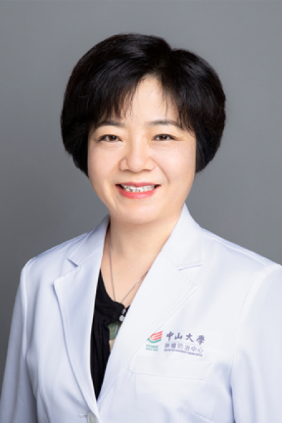

<!-- AUTO-GENERATED-BY: work/generate_obsidian_profiles.py -->

# 李疆

## 基础信息

| 字段 | 内容 |
|---|---|
| 医院 | 中山大学肿瘤防治中心 |
| 姓名 | 李疆 |
| 科室 | 生物治疗中心 |
| 职称/身份 | 研究员、教授、博士生导师 教育经历（按时间倒排序）： 1999/9-2002/7，中山大学，博士，导师：张清炯 1992/9-1995/7，中山医科大学，硕士，导师：曾瑞萍 1987/9-1992/7，重庆医科大学，临床医学系，学士 工作经历（科研与学术工作经历，按时间倒排序） ： 2015/1-至今，中山大学，肿瘤防治中心，生物治疗中心，研究员 2006/01-2014//12，中山大学，肿瘤防治中心，生物治疗中心，副研究员 2008/11-2010/03,美国BylorCollegeofMedicine，CenterforCellandGeneTherapy（Rong-FuWang实验室），博士后 2004/09－2005/03,瑞典Karolinska大学微生物与肿瘤生物学中心MariaGMasucci教授课题组,访问学者 2002/07-2005/12，中山大附属肿瘤医院，生物治疗中心，助理研究员 1995/07－1999/09,广东省人民医院老年医学研究所，助理研究员。 加载更多 教育经历（按时间倒排序）： 1999/9-2002/7，中山大学，博士，导师：张清炯 19... |
| 重点优先级 | 高 |
| 来源类型 | 医院官网 |
| 来源链接 | [官网原文](https://www.sysucc.org.cn/node/3784) |
| 采集日期 | 2026-08-10 |
| 复核状态 | 待人工复核 |
| 异常提示 |  |

## 简介/擅长

生物治疗中心 研究员、教授、博士生导师 教育经历（按时间倒排序）： 1999/9-2002/7，中山大学，博士，导师：张清炯 1992/9-1995/7，中山医科大学，硕士，导师：曾瑞萍 1987/9-1992/7，重庆医科大学，临床医学系，学士 工作经历（科研与学术工作经历，按时间倒排序） ： 2015/1-至今，中山大学，肿瘤防治中心，生物治疗中心，研究员 2006/01-2014//12，中山大学，肿瘤防治中心，生物治疗中心，副研究员 2008/11-2010/03,美国BylorCollegeofMedicine，CenterforCellandGeneTherapy（Rong-FuWang实验室），博士后 2004/09－2005/03,瑞典Karolinska大学微生物与肿瘤生物学中心MariaGMasucci教授课题组,访问学者 2002/07-2005/12，中山大附属肿瘤医院，生物治疗中心，助理研究员 1995/07－1999/09,广东省人民医院老年医学研究所，助理研究员。 加载更多 教育经历（按时间倒排序）： 1999/9-2002/7，中山大学，博士，导师：张清炯 1992/9-1995/7，中...

## 详情正文摘录

临床专家 面包屑 首页 / 临床科室 / 内科系列 / 生物治疗中心 / 临床专家 李疆 职称：研究员、教授、博士生导师 教育经历（按时间倒排序）： 1999/9-2002/7，中山大学，博士，导师：张清炯 1992/9-1995/7，中山医科大学，硕士，导师：曾瑞萍 1987/9-1992/7，重庆医科大学，临床医学系，学士 工作经历（科研与学术工作经历，按时间倒排序） ： 2015/1-至今，中山大学，肿瘤防治中心，生物治疗中心，研究员 2006/01-2014//12，中山大学，肿瘤防治中心，生物治疗中心，副研究员 2008/11-2010/03,美国BylorCollegeofMedicine，CenterforCellandGeneTherapy（Rong-FuWang实验室），博士后 2004/09－2005/03,瑞典Karolinska大学微生物与肿瘤生物学中心MariaGMasucci教授课题组,访问学者 2002/07-2005/12，中山大附属肿瘤医院，生物治疗中心，助理研究员 1995/07－1999/09,广东省人民医院老年医学研究所，助理研究员。 加载更多 教育经历（按时间倒排序）： 1999/9-2002/7，中山大学，博士，导师：张清炯 1992/9-1995/7，中山医科大学，硕士，导师：曾瑞萍 1987/9-1992/7，重庆医科大学，临床医学系，学士 工作经历（科研与学术工作经历，按时间倒排序）： 2015/1-至今，中山大学，肿瘤防治中心，生物治疗中心，研究员 2006/01-2014//12，中山大学，肿瘤防治中心，生物治疗中心，副研究员 2008/11-2010/03,美国BylorCollegeofMedicine，CenterforCellandGeneTherapy（Rong-FuWang实验室），博士后 2004/09－2005/03,瑞典Karolinska大学微生物与肿瘤生物学中心MariaGMasucci教授课题组,访问学者 2002/07-2005/12，中山大附属肿瘤医院，生物治疗中心，助理研究员 1995…

## 重点关注范围

- 肿瘤
- 免疫/风湿/感染

## 重点疾病标签

- 肿瘤
- 癌
- 鼻咽癌
- 免疫

## 亮眼经历线索

- 研究员、教授、博士生导师 教育经历（按时间倒排序）： 1999/9-2002/7，中山大学，博士，导师：张清炯 1992/9-1995/7，中山医科大学，硕士，导师：曾瑞萍 1987/9-1992/7，重庆医科大学，临床医学系，学士 工作经历（科研与学术工作经历，按时间倒排序） ： 2015/1-至今，中山大学，肿瘤防治中心，生物治疗中心，研究员 2006…

## 异常提示

## 合规边界

- 本画像仅整理统一总底表中的医院官网公开字段。
- 不包含患者评价、排名、第三方来源内容或疗效承诺。
- 官网未展示的信息保持空白，后续如需补充须回到底表官方来源字段。
