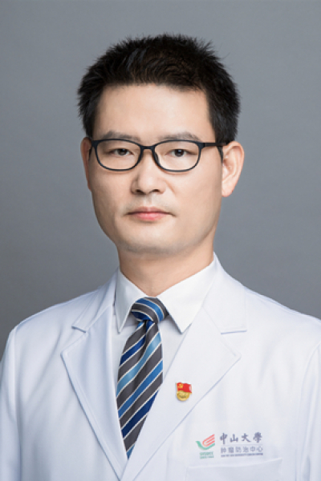

<!-- AUTO-GENERATED-BY: work/generate_obsidian_profiles.py -->

# 李秋梨

## 基础信息

| 字段 | 内容 |
|---|---|
| 医院 | 中山大学肿瘤防治中心 |
| 姓名 | 李秋梨 |
| 科室 | 头颈科 |
| 职称/身份 | 副主任医师、硕士生导师 |
| 重点优先级 | 高 |
| 来源类型 | 医院官网 |
| 来源链接 | [官网原文](https://www.sysucc.org.cn/node/3604) |
| 采集日期 | 2026-08-10 |
| 复核状态 | 待人工复核 |
| 异常提示 |  |

## 简介/擅长

头颈部肿瘤的诊断和外科治疗、头颈部癌的综合治疗、头颈部肿瘤术后缺损的修复重建 二、学习与工作经历 （一）、学历教育 1、1994-9至1999-6 中山医科大学本科获学士学位 2、1999-9至2002-6 中山大学肿瘤防治中心研究生获硕士学位 3、2005-9至2008-6 中山大学肿瘤防治中心研究生获博士学位 （二）、非学历学习 1、2009-6至2009-8 香港大学玛丽医院整形外科、头颈外科和耳鼻咽喉科访问学者 进修学习头颈部肿瘤术后缺损的修复重建、鼻咽癌的挽救性手术和头颈部肿瘤的内镜微创手术治疗 2、2009-10至2009-11 香港中文大学威尔士亲王医院耳鼻咽喉-头颈外科访问学者 进修学习头颈部肿瘤的早期诊断和和内镜微创治疗 3、2014-9至2016-8 美国得州大学MD Anderson 癌症中心头颈外科访问学者 接受正规系统的肿瘤学科研培训，学习头颈部癌的转化医学研究，学习MD Anderson在头颈部肿瘤诊治和MDT方面的新理念和新技术 （三）、工作经历 1、2002-7至2004-12 中山大学肿瘤防治中心头颈科 住院医师 2、2004-12至2012-12 中山大学肿瘤防治中心头颈科 主治医师...

## 详情正文摘录

职称：副主任医师、硕士生导师 专长 头颈部肿瘤的诊断和外科治疗、头颈部癌的综合治疗、头颈部肿瘤术后缺损的修复重建 一、基本情况 学位：医学博士 职称：副主任医师、硕士生导师 专家门诊时间：周三上午 专长：头颈部肿瘤的诊断和外科治疗、头颈部癌的综合治疗、头颈部肿瘤术后缺损的修复重建 二、学习与工作经历 （一）、学历教育 1、1994-9至1999-6 中山医科大学本科获学士学位 2、1999-9至2002-6 中山大学肿瘤防治中心研究生获硕士学位 3、2005-9至2008-6 中山大学肿瘤防治中心研究生获博士学位 （二）、非学历学习 1、2009-6至2009-8 香港大学玛丽医院整形外科、头颈外科和耳鼻咽喉科访问学者 进修学习头颈部肿瘤术后缺损的修复重建、鼻咽癌的挽救性手术和头颈部肿瘤的内镜微创手术治疗 2、2009-10至2009-11 香港中文大学威尔士亲王医院耳鼻咽喉-头颈外科访问学者 进修学习头颈部肿瘤的早期诊断和和内镜微创治疗 3、2014-9至2016-8 美国得州大学MD Anderson 癌症中心头颈外科访问学者 接受正规系统的肿瘤学科研培训，学习头颈部癌的转化医学研究，学习MD Anderson在头颈部肿瘤诊治和MDT方面的新理念和新技术 （三）、工作经历 1、2002-7至2004-12 中山大学肿瘤防治中心头颈科 住院医师 2、2004-12至2012-12 中山大学肿瘤防治中心头颈科 主治医师 3、2012-12至今 中山大学肿瘤防治中心头颈科 副主任医师 加载更多 一、基本情况 学位：医学博士 职称：副主任医师、硕士生导师 专家门诊时间：周三上午 专长：头颈部肿瘤的诊断和外科治疗、头颈部癌的综合治疗、头颈部肿瘤术后缺损的修复重建 二、学习与工作经历 （一）、学历教育 1、1994-9至1999-6 中山医科大学本科获学士学位 2、1999-9至2002-6 中山大学肿瘤防治中心研究生获硕士学位 3、2005-9至2008-6 中山大学肿瘤防治中心研究生获博…

## 重点关注范围

- 肿瘤
- 术后恢复/康复
- 疑难重症

## 重点疾病标签

- 肿瘤
- 癌
- 瘤
- 鼻咽癌
- 术后
- 疑难
- 难治
- MDT

## 亮眼经历线索

- 副主任医师、硕士生导师 头颈部肿瘤的诊断和外科治疗、头颈部癌的综合治疗、头颈部肿瘤术后缺损的修复重建 二、学习与工作经历 （一）、学历教育 1、1994-9至1999-6 中山医科大学本科获学士学位 2、1999-9至2002-6 中山大学肿瘤防治中心研究生获硕士学位 3、2005-9至2008-6 中山大学肿瘤防治中心研究生获博士学位 （二）、非学历学习…

## 异常提示

## 合规边界

- 本画像仅整理统一总底表中的医院官网公开字段。
- 不包含患者评价、排名、第三方来源内容或疗效承诺。
- 官网未展示的信息保持空白，后续如需补充须回到底表官方来源字段。
