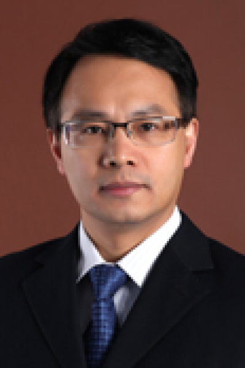

<!-- AUTO-GENERATED-BY: work/generate_obsidian_profiles.py -->

# 李立

## 基础信息

| 字段 | 内容 |
|---|---|
| 医院 | 中山大学肿瘤防治中心 |
| 姓名 | 李立 |
| 科室 | 影像科 |
| 职称/身份 | 教授、主任医师、博士生导师 |
| 重点优先级 | 高 |
| 来源类型 | 医院官网 |
| 来源链接 | [官网原文](https://www.sysucc.org.cn/node/3840) |
| 采集日期 | 2026-08-10 |
| 复核状态 | 待人工复核 |
| 异常提示 |  |

## 简介/擅长

医学影像诊断和分子影像学研究 主要研究方向为定量化影像学诊断与分子影像研究，具备深厚的医学影像学基础及分子生物学研究背景，在磁共振分子影像学研究方面，如磁共振标记基因显像研究、新型磁共振纳米造影剂研发，多模态分子成像理论与模型建立等取得了一定成绩。 现任中山大学附属肿瘤医院影像与微创介入中心教授/主任医师，博士生导师。华南肿瘤学国家重点实验室（2004DA105074）课题组负责人。广东省高等学校“千百十工程”第七批省级培养对象。 加载更多 现任中山大学附属肿瘤医院影像与微创介入中心教授/主任医师，博士生导师。华南肿瘤学国家重点实验室（2004DA105074）课题组负责人。广东省高等学校“千百十工程”第七批省级培养对象。 专业学会兼职 ： 中国生物物理学会分子影像学专业委员会第一届委员 中国抗癌协会大肠癌专业委员会肝转移学组第一届委员 广东省抗癌协会大肠癌专业委员会常务委员 广东省放射学会心胸学组委员 临床医疗与科学研究经验 ： 李立教授长期从事医学影像诊断和分子影像学研究工作，在智能磁共振造影剂研制、新型纳米探针研发、肿瘤分子分期、多模态分子成像理论与动物模型研究取得了重要成果。发表通讯作者/第一作者高水平收录论著...

## 详情正文摘录

临床专家 面包屑 首页 / 临床科室 / 平台科室 / 影像科 / 临床专家 李立 职称：教授、主任医师、博士生导师 专长 医学影像诊断和分子影像学研究 主要研究方向为定量化影像学诊断与分子影像研究，具备深厚的医学影像学基础及分子生物学研究背景，在磁共振分子影像学研究方面，如磁共振标记基因显像研究、新型磁共振纳米造影剂研发，多模态分子成像理论与模型建立等取得了一定成绩。 现任中山大学附属肿瘤医院影像与微创介入中心教授/主任医师，博士生导师。华南肿瘤学国家重点实验室（2004DA105074）课题组负责人。广东省高等学校“千百十工程”第七批省级培养对象。 加载更多 现任中山大学附属肿瘤医院影像与微创介入中心教授/主任医师，博士生导师。华南肿瘤学国家重点实验室（2004DA105074）课题组负责人。广东省高等学校“千百十工程”第七批省级培养对象。 专业学会兼职 ： 中国生物物理学会分子影像学专业委员会第一届委员 中国抗癌协会大肠癌专业委员会肝转移学组第一届委员 广东省抗癌协会大肠癌专业委员会常务委员 广东省放射学会心胸学组委员 临床医疗与科学研究经验 ： 李立教授长期从事医学影像诊断和分子影像学研究工作，在智能磁共振造影剂研制、新型纳米探针研发、肿瘤分子分期、多模态分子成像理论与动物模型研究取得了重要成果。发表通讯作者/第一作者高水平收录论著24篇，其中，通讯作者（或共同通讯作者）论著发表在Scientific Reports, Biomaterials, Clinical Cancer Research, Nanoscale, Cancer, Contrast Media & Molecular Imaging等国际著名期刊。以第一发明人获得新型钆纳米造影剂、乳腺影像CAD系统、稳定表达Tet-off Advanced鼻咽癌细胞模型发明专利3项，申报多模态分子成像探针发明专利1项。 科研基金 ： 1、国家自然科学基金面上项目，81271622、钆-纳米金双模态分子成像探针及其成像相互影响机制的研究、2013/01－2016/12、85万元、主持。 2、国家自然科学基金…

## 重点关注范围

- 肿瘤

## 重点疾病标签

- 肿瘤
- 癌
- 鼻咽癌
- 肠癌

## 亮眼经历线索

- 教授、主任医师、博士生导师 现任中山大学附属肿瘤医院影像与微创介入中心教授/主任医师，博士生导师。
- 加载更多 现任中山大学附属肿瘤医院影像与微创介入中心教授/主任医师，博士生导师。
- 专业学会兼职 ： 中国生物物理学会分子影像学专业委员会第一届委员 中国抗癌协会大肠癌专业委员会肝转移学组第一届委员 广东省抗癌协会大肠癌专业委员会常务委员 广东省放射学会心胸学组委员 临床医疗与科学研究经验 ： 李立教授长期从事医学影像诊断和分子影像学研究工作，在智能磁共振造影剂研制、新型纳米探针研发、肿瘤分子分期、多模态分子成像理论与动物模型研究取得了重…

## 异常提示

## 合规边界

- 本画像仅整理统一总底表中的医院官网公开字段。
- 不包含患者评价、排名、第三方来源内容或疗效承诺。
- 官网未展示的信息保持空白，后续如需补充须回到底表官方来源字段。
