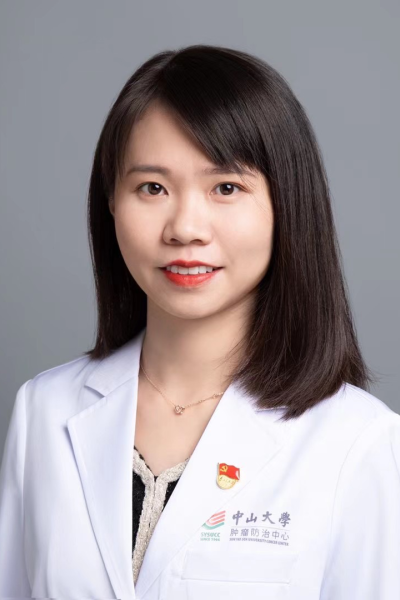

<!-- AUTO-GENERATED-BY: work/generate_obsidian_profiles.py -->

<!-- TEMPLATE: D:\workspace\信息收集整理\医生画像仓库\模板\医生画像模板.md -->

# 束玲玲

## 基础信息

| 字段 | 内容 |
|---|---|
| 姓名 | 束玲玲 |
| 医院 | 中山大学肿瘤防治中心 |
| 科室 | 血液肿瘤科 |
| 职称/身份 | 副主任医师、副研究员、医学博士、硕士研究生导师 |
| 来源链接 | [官网原文](https://www.sysucc.org.cn/node/6481) |
| 采集日期 | 2026-08-10 |

## 简介/擅长

擅长多发性骨髓瘤、淋巴瘤、白血病等恶性血液肿瘤的精准诊治包括传统化疗、免疫靶向治疗、CAR-T细胞治疗等，作为sub-PI 参与多项血液肿瘤新药临床研究。

## 教育与进修经历

- 二、教育及工作经历 中山大学肿瘤防治中心副研究员、副主任医师 中山大学肿瘤防治中心副研究员、主治医师 香港大学李嘉诚医学院博士、博士后 南方医科大学第一临床医学院学士 三、学术兼职 广东省健康管理学会干细胞与再生医学专业委员会常委 广东省精准医学应用学会单细胞科技分会委员 亚太肥胖与肌肉衰减代谢联盟理事 华南生物物理学会代谢生物学分会委员 Life medicine杂志青年编委 Advanced Science/oncogene等杂志审稿人 四、主持科研项目 主持国家自然科学青年基金、广东省自然科学基金面上项目…

## 科研项目与成果

- 一、基本情况 束玲玲副主任医师/副研究员获中大百人计划人才项目支持，从事多发性骨髓瘤、淋巴瘤、白血病等恶性血液肿瘤的精准诊治，在血液肿瘤代谢免疫、药物耐药及机制等领域取得多项成果。
- 二、教育及工作经历 中山大学肿瘤防治中心副研究员、副主任医师 中山大学肿瘤防治中心副研究员、主治医师 香港大学李嘉诚医学院博士、博士后 南方医科大学第一临床医学院学士 三、学术兼职 广东省健康管理学会干细胞与再生医学专业委员会常委 广东省精准医学应用学会单细胞科技分会委员 亚太肥胖与肌肉衰减代谢联盟理事 华南生物物理学会代谢生物学分会委员 Life medicine杂志青年编委 Advanced Science/oncogene等杂志审稿人 四、主持科研项目 主持国家自然科学青年基金、广东省自然科学基金面上项目…
- 六、获奖及荣誉 1. 2025年中山大学首届科研新声演讲比赛优胜奖 2. 2024年中山大学肿瘤防治中心教学比赛三等奖 3. 第29届香港医学研究会议（Medical Research Conference Hong Kong）获「基础科学与转化研究优异奖」，香港，2024 4. 2024年李嘉诚医学院最佳研究成果奖获得者之一，香港，2024 5. 2022年李嘉诚医学院最佳研究成果奖获得者之一，香港，2022 6. 第24届香港大学医学研究会议“基础及转化研究”口头汇报第一名，香港，2019. 7. 第13届W…

## 论文与学术产出

- 二、教育及工作经历 中山大学肿瘤防治中心副研究员、副主任医师 中山大学肿瘤防治中心副研究员、主治医师 香港大学李嘉诚医学院博士、博士后 南方医科大学第一临床医学院学士 三、学术兼职 广东省健康管理学会干细胞与再生医学专业委员会常委 广东省精准医学应用学会单细胞科技分会委员 亚太肥胖与肌肉衰减代谢联盟理事 华南生物物理学会代谢生物学分会委员 Life medicine杂志青年编委 Advanced Science/oncogene等杂志审稿人 四、主持科研项目 主持国家自然科学青年基金、广东省自然科学基金面上项目…
- 五、代表性论著 发表Advanced Science、Nature Communications、JCI Insight、 Cell Death & Diseases等多篇论著。

## 可包装亮点

- 副主任医师、副研究员、医学博士、硕士研究生导师 擅长多发性骨髓瘤、淋巴瘤、白血病等恶性血液肿瘤的精准诊治包括传统化疗、免疫靶向治疗、CAR-T细胞治疗等，作为sub-PI 参与多项血液肿瘤新药临床研究。
- 束玲玲 职称：副主任医师、副研究员、医学博士、硕士研究生导师 专长 擅长多发性骨髓瘤、淋巴瘤、白血病等恶性血液肿瘤的精准诊治包括传统化疗、免疫靶向治疗、CAR-T细胞治疗等，作为sub-PI 参与多项血液肿瘤新药临床研究。
- 一、基本情况 束玲玲副主任医师/副研究员获中大百人计划人才项目支持，从事多发性骨髓瘤、淋巴瘤、白血病等恶性血液肿瘤的精准诊治，在血液肿瘤代谢免疫、药物耐药及机制等领域取得多项成果。

## 重点疾病/人群标签

- 慢性病：代谢、肿瘤、瘤、淋巴瘤、白血病、化疗、靶向、免疫
- 肿瘤：代谢、肿瘤、瘤、淋巴瘤、白血病、化疗、靶向、免疫
- 生殖疾病：
- 免疫/风湿：代谢、肿瘤、瘤、淋巴瘤、白血病、化疗、靶向、免疫
- 术后恢复/康复：
- 疑难重症：

## 证据摘录

> 只摘录官网公开信息中的短句或关键字段，不复制大段原文。

- 官网身份字段：副主任医师、副研究员、医学博士、硕士研究生导师
- 官网简介/擅长：擅长多发性骨髓瘤、淋巴瘤、白血病等恶性血液肿瘤的精准诊治包括传统化疗、免疫靶向治疗、CAR-T细胞治疗等，作为sub-PI 参与多项血液肿瘤新药临床研究。
- 官网亮眼经历线索：副主任医师、副研究员、医学博士、硕士研究生导师 擅长多发性骨髓瘤、淋巴瘤、白血病等恶性血液肿瘤的精准诊治包括传统化疗、免疫靶向治疗、CAR-T细胞治疗等，作为sub-PI 参与多项血液肿瘤新药临床研究。 束玲玲 职称：副主任医师、副研究员、医学博士、硕士研究生导师 专长 擅长多发性骨髓瘤、淋巴瘤、白血病等恶性血液肿瘤的精准诊治包括传统化疗、免疫靶向治疗、CAR-T细胞治疗等，作为sub-PI 参与多项血液肿瘤新药临床研究。 一、基本情…
- 异常提示：亮眼经历含导航文本，已清洗
- 来源链接：https://www.sysucc.org.cn/node/6481

## BD 画像摘要

束玲玲医生可作为慢性病、肿瘤、免疫/风湿/感染方向的基础画像候选。后续 BD 使用应继续以官网来源和人工复核为准，不添加疗效承诺或无来源包装。

## 合规边界

- 仅使用医院官网、官方公众号、官方小程序等公开渠道。
- 不采集私人电话、私人微信、家庭住址、患者隐私或非公开排班信息。
- 不写“保证治愈”“疗效第一”“包治疑难杂症”等无法由官网证明的表述。
