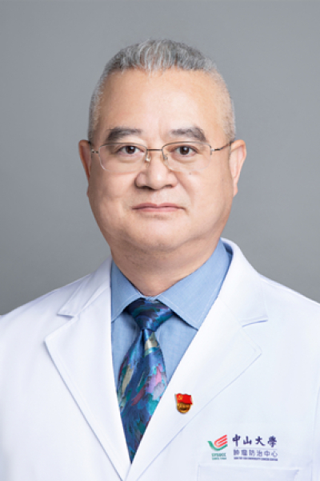

<!-- AUTO-GENERATED-BY: work/generate_obsidian_profiles.py -->

<!-- TEMPLATE: D:\workspace\信息收集整理\医生画像仓库\模板\医生画像模板.md -->

# 杨安奎

## 基础信息

| 字段 | 内容 |
|---|---|
| 姓名 | 杨安奎 |
| 医院 | 中山大学肿瘤防治中心 |
| 科室 | 头颈肿瘤的诊断和综合治疗 |
| 职称/身份 | 教授、主任医师、博士生导师、甲状腺癌首席专家 |
| 来源链接 | [官网原文](https://www.sysucc.org.cn/node/3594) |
| 采集日期 | 2026-08-10 |

## 简介/擅长

头颈恶性肿瘤外科治疗（舌癌、甲状腺癌、涎腺恶性肿瘤、喉癌、副鼻窦癌外科治疗及其它治疗） 主要研究方向： 口腔颌面部肿瘤 专家

## 教育与进修经历

- 周三上午 专业特长：头颈恶性肿瘤外科治疗（舌癌、甲状腺癌、涎腺恶性肿瘤、喉癌、副鼻窦癌外科治疗及其它治疗） 二、学习及工作经历： 1981年—1987年：中山医科大学本科生 1995年—1998年：中山医科大学硕士生 1987年—至今： 中山大学附属肿瘤医院工作 2009年—2015.1：中山大学附属肿瘤医院头颈科副主任 2015.1—至今： 中山大学附属肿瘤医院头颈科主任 加载更多 1987年6月毕业于中山医科大学医学系六年制全日制本科，获中山医科大学医学学士学位。
- 1998年6月中山医科大学肿瘤学临床医学三年制在职硕士毕业，获中山医科大学肿瘤学临床医学硕士学位。

## 可包装亮点

- 教授、主任医师、博士生导师、甲状腺癌首席专家 杨安奎 职称：教授、主任医师、博士生导师、甲状腺癌首席专家 专长 头颈恶性肿瘤外科治疗（舌癌、甲状腺癌、涎腺恶性肿瘤、喉癌、副鼻窦癌外科治疗及其它治疗） 一、基本情况 姓名：杨安奎 职称：教授、主任医师、博士生导师、甲状腺癌首席专家 职务：科主任 专家门诊时间： 周一上午；
- 周三上午 专业特长：头颈恶性肿瘤外科治疗（舌癌、甲状腺癌、涎腺恶性肿瘤、喉癌、副鼻窦癌外科治疗及其它治疗） 二、学习及工作经历： 1981年—1987年：中山医科大学本科生 1995年—1998年：中山医科大学硕士生 1987年—至今： 中山大学附属肿瘤医院工作 2009年—2015.1：中山大学附属肿瘤医院头颈科副主任 2015.1—至今： 中山大学附属…

## 重点疾病/人群标签

- 慢性病：
- 肿瘤：肿瘤、癌
- 生殖疾病：
- 免疫/风湿：
- 术后恢复/康复：
- 疑难重症：

## 证据摘录

> 只摘录官网公开信息中的短句或关键字段，不复制大段原文。

- 官网身份字段：教授、主任医师、博士生导师、甲状腺癌首席专家
- 官网简介/擅长：头颈恶性肿瘤外科治疗（舌癌、甲状腺癌、涎腺恶性肿瘤、喉癌、副鼻窦癌外科治疗及其它治疗） 主要研究方向： 口腔颌面部肿瘤 专家
- 官网亮眼经历线索：教授、主任医师、博士生导师、甲状腺癌首席专家 杨安奎 职称：教授、主任医师、博士生导师、甲状腺癌首席专家 专长 头颈恶性肿瘤外科治疗（舌癌、甲状腺癌、涎腺恶性肿瘤、喉癌、副鼻窦癌外科治疗及其它治疗） 一、基本情况 姓名：杨安奎 职称：教授、主任医师、博士生导师、甲状腺癌首席专家 职务：科主任 专家门诊时间： 周一上午； 周三上午 专业特长：头颈恶性肿瘤外科治疗（舌癌、甲状腺癌、涎腺恶性肿瘤、喉癌、副鼻窦癌外科治疗及其它治疗） 二、学习…
- 异常提示：亮眼经历含导航文本，已清洗
- 来源链接：https://www.sysucc.org.cn/node/3594

## BD 画像摘要

杨安奎医生可作为肿瘤方向的基础画像候选。后续 BD 使用应继续以官网来源和人工复核为准，不添加疗效承诺或无来源包装。

## 合规边界

- 仅使用医院官网、官方公众号、官方小程序等公开渠道。
- 不采集私人电话、私人微信、家庭住址、患者隐私或非公开排班信息。
- 不写“保证治愈”“疗效第一”“包治疑难杂症”等无法由官网证明的表述。
