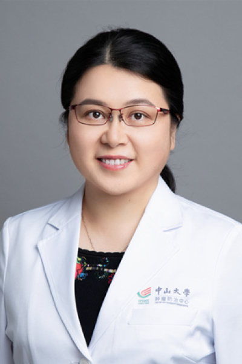

<!-- AUTO-GENERATED-BY: work/generate_obsidian_profiles.py -->

<!-- TEMPLATE: D:\workspace\信息收集整理\医生画像仓库\模板\医生画像模板.md -->

# 杨群英

## 基础信息

| 字段 | 内容 |
|---|---|
| 姓名 | 杨群英 |
| 医院 | 中山大学肿瘤防治中心 |
| 科室 | 神经外科 |
| 职称/身份 | 主任医师 |
| 来源链接 | [官网原文](https://www.sysucc.org.cn/node/3712) |
| 采集日期 | 2026-08-10 |

## 简介/擅长

脑和脊髓胶质瘤、脑生殖细胞肿瘤、髓母细胞瘤、室管膜瘤、脑转移瘤、中枢罕见恶性肿瘤等的化疗和靶向免疫药物治疗。

## 科研项目与成果

- 主持包括国家自然科学基金在内的5项科研项目。
- 二、教育及工作经历 教育经历： (1) 2011-09至2017-12，中山大学，肿瘤学，博士 (2) 2002-09至2005-07，中山大学，肿瘤学，硕士 (3) 1989-09至1994-07，南华大学（原衡阳医学院），临床医疗，学士 科研与学术工作经历： (1) 2023-12至今，中山大学，肿瘤防治中心，神经外科，主任医师 (2) 2022-03至2023-07，新疆医科大学，附属肿瘤医院，神经外科，副主任医师/神经外科科主任（援疆） (3) 2013-12至2022-02，中山大学，肿瘤防治中心，神经…
- 2. 北京市希思科临床肿瘤学研究基金会项目（Y-HR2020MS-0802）.卡瑞利珠单抗联合阿帕替尼新辅助及辅助治疗复发性高级别脑胶质瘤的临床研究和对胶质瘤免疫微环境影响机制的探讨. 2022.08-2024,08.主持，15万。
- 3. 广东省中医药局项目（项目编号20151169，批准号粤中医[2015]11号）.新诊断的高级别胶质瘤规范化治疗后榄香烯维持治疗的多中心历史对照临床研究. 2015.10-2017.10. 主持，1万。

## 论文与学术产出

- 主编《神经系统肿瘤化疗手册》，副主编《脑胶质瘤科普教育手册》。
- 以第一/通讯作者在Neuro Oncol等高水平SCI及核心期刊上发表论文30余篇。
- 执笔参编神经肿瘤专家共识/指南8项。
- 五、代表性论著 主编/参编书籍： 1. 陈忠平,杨群英主编.神经系统肿瘤化疗手册.北京大学医学出版社，2012年2月第1版. 2. 杨群英副主编.脑胶质瘤科普教育手册/牟永告等主编.北京： 人民卫生出版社，...

## 可包装亮点

- 主任医师 杨群英 职称：主任医师 专长 脑和脊髓胶质瘤、脑生殖细胞肿瘤、髓母细胞瘤、室管膜瘤、脑转移瘤、中枢罕见恶性肿瘤等的化疗和靶向免疫药物治疗。
- 一、基本情况 杨群英 中山大学肿瘤防治中心神经外科主任医师 医学博士，硕士生导师，神经肿瘤化疗主诊教授 门诊时间： 周二上午、周三下午 从事神经肿瘤临床化疗工作二十余年，是我国最早专职从事神经肿瘤化疗工作的专科医生之一。
- 2012年至2013年先后在美国M.D. Anderson癌症中心、香港中文大学威尔士亲王医院研修。

## 重点疾病/人群标签

- 慢性病：
- 肿瘤：肿瘤、癌、瘤、化疗、靶向、生殖、免疫、术后、多学科、罕见
- 生殖疾病：肿瘤、癌、瘤、化疗、靶向、生殖、免疫、术后、多学科、罕见
- 免疫/风湿：肿瘤、癌、瘤、化疗、靶向、生殖、免疫、术后、多学科、罕见
- 术后恢复/康复：肿瘤、癌、瘤、化疗、靶向、生殖、免疫、术后、多学科、罕见
- 疑难重症：肿瘤、癌、瘤、化疗、靶向、生殖、免疫、术后、多学科、罕见

## 证据摘录

> 只摘录官网公开信息中的短句或关键字段，不复制大段原文。

- 官网身份字段：主任医师
- 官网简介/擅长：脑和脊髓胶质瘤、脑生殖细胞肿瘤、髓母细胞瘤、室管膜瘤、脑转移瘤、中枢罕见恶性肿瘤等的化疗和靶向免疫药物治疗。
- 官网亮眼经历线索：主任医师 杨群英 职称：主任医师 专长 脑和脊髓胶质瘤、脑生殖细胞肿瘤、髓母细胞瘤、室管膜瘤、脑转移瘤、中枢罕见恶性肿瘤等的化疗和靶向免疫药物治疗。 一、基本情况 杨群英 中山大学肿瘤防治中心神经外科主任医师 医学博士，硕士生导师，神经肿瘤化疗主诊教授 门诊时间： 周二上午、周三下午 从事神经肿瘤临床化疗工作二十余年，是我国最早专职从事神经肿瘤化疗工作的专科医生之一。 2012年至2013年先后在美国M.D. Anderson癌症中心…
- 异常提示：亮眼经历含导航文本，已清洗
- 来源链接：https://www.sysucc.org.cn/node/3712

## BD 画像摘要

杨群英医生可作为肿瘤、生殖疾病、免疫/风湿/感染、术后恢复/康复、疑难重症方向的基础画像候选。后续 BD 使用应继续以官网来源和人工复核为准，不添加疗效承诺或无来源包装。

## 合规边界

- 仅使用医院官网、官方公众号、官方小程序等公开渠道。
- 不采集私人电话、私人微信、家庭住址、患者隐私或非公开排班信息。
- 不写“保证治愈”“疗效第一”“包治疑难杂症”等无法由官网证明的表述。
